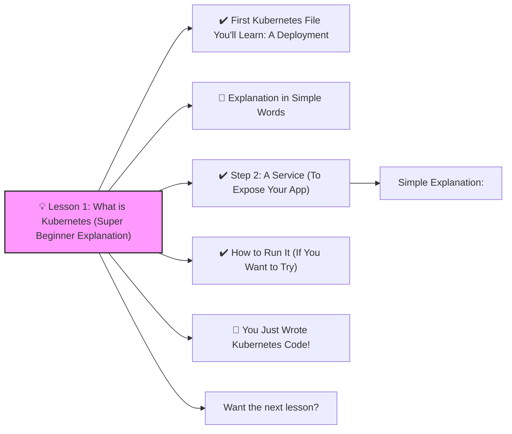

# 💡 Lesson 1: What is Kubernetes (Super Beginner Explanation)



Kubernetes (often called **K8s**) is a tool that helps you run applications in **containers** (like Docker) and makes sure they stay running.

Imagine:

-   You have an app
-   Kubernetes makes copies of it
-   If one crashes, Kubernetes restarts it
-   It can scale it (add more copies), expose it to the internet, and keep everything healthy
    

And you write _YAML files_ to tell Kubernetes what you want.

----------

# ✔️ First Kubernetes File You'll Learn: A **Deployment**


This YAML file tells Kubernetes:

> “Run my app and keep 2 copies of it alive.”

Here’s a complete beginner-friendly Kubernetes Deployment file:

```yaml
apiVersion: apps/v1
kind: Deployment
metadata:
  name: hello-app
spec:
  replicas: 2
  selector:
    matchLabels:
      app: hello-app
  template:
    metadata:
      labels:
        app: hello-app
    spec:
      containers:
        - name: hello-container
          image: nginx:latest
          ports:
            - containerPort: 80

```

----------

# 🧠 Explanation in Simple Words

Kubernetes Word

Meaning

> `Deployment`

A blueprint telling Kubernetes how many copies of your app to run

> `replicas: 2`

Run **two** copies of the container

> `nginx:latest`

The container image. A tiny web server app

> `containerPort: 80`

The port inside the container

----------

# ✔️ Step 2: A Service (To Expose Your App)

A Service lets you open your app so people can access it.

```yaml
apiVersion: v1
kind: Service
metadata:
  name: hello-service
spec:
  type: NodePort
  selector:
    app: hello-app
  ports:
    - port: 80
      targetPort: 80
      nodePort: 30007

```

### Simple Explanation:

-   `NodePort` → Makes your app reachable in the browser
-   `nodePort: 30007` → You will access it at this port
-   Connects the service to all pods labeled `app: hello-app`

----------

# ✔️ How to Run It (If You Want to Try)

If you have Kubernetes installed (like Minikube):

```bash
kubectl apply -f deployment.yaml
kubectl apply -f service.yaml
```

Check everything:
```bash
kubectl get pods
kubectl get svc
```

Open the app:

```bash
minikube service hello-service
```

----------

# 🎉 You Just Wrote Kubernetes Code!

You created:

1.  A Deployment (runs the containers)
2.  A Service (exposes them)

This is 80% of what beginners need to deploy apps in Kubernetes.

----------

# Want the next lesson?

I can teach you:

-   Pods vs Deployments 🤔
-   ConfigMaps & Secrets 🔐
-   Ingress (real web access) 🌍
-   Auto-scaling ⚡
-   Building your first Docker image 🐳
-   Full DevOps CI/CD 🛠️

What do you want to learn next?
