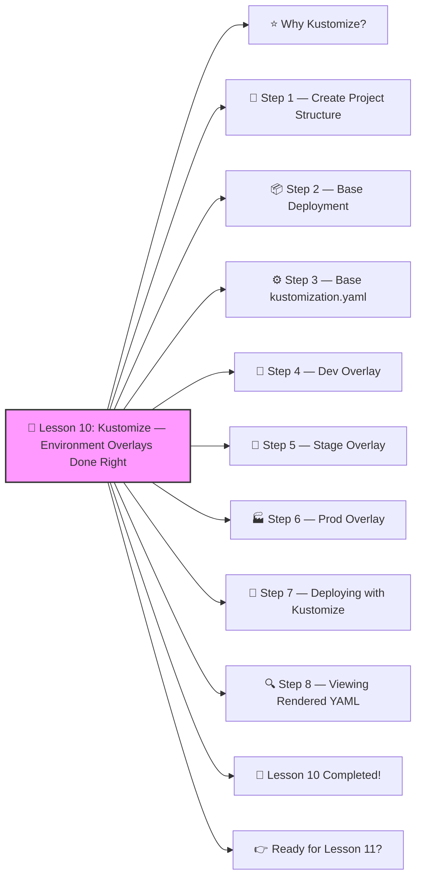

# 🎨 Lesson 10: **Kustomize — Environment Overlays Done Right**




Perfect! ✔️

Welcome to **Lesson 10**, and this one is ESSENTIAL for *real DevOps work* — especially when managing **Dev / Stage / Prod** environments.

Kustomize lets you take a **base** Kubernetes config and create **overlays** like:

- dev
- stage
- prod

…each with different settings, without duplicating YAML files.
 It’s built directly into kubectl. 🔨🤖🔧

------

# ⭐ Why Kustomize?

Without Kustomize, companies end up with:

```
deployment-dev.yaml
deployment-stage.yaml
deployment-prod.yaml
```

😩 3 files to maintain
 😩 lots of copy-paste
 😩 hard to update
 😩 prone to mistakes

Kustomize solves all of this by giving you:

✔️ One base
 ✔️ Multiple overlays
 ✔️ Clean structure
 ✔️ Easy environment management

------

# 🧱 Step 1 — Create Project Structure

You will create this:

```
k8s/
 ├── base/
 │    ├── deployment.yaml
 │    ├── service.yaml
 │    └── kustomization.yaml
 └── overlays/
       ├── dev/
       │    └── kustomization.yaml
       ├── stage/
       │    └── kustomization.yaml
       └── prod/
            └── kustomization.yaml
```

Let’s build it step by step 👇

------

# 📦 Step 2 — Base Deployment

**k8s/base/deployment.yaml**

```yaml
apiVersion: apps/v1
kind: Deployment
metadata:
  name: demo-app
spec:
  replicas: 1
  selector:
    matchLabels:
      app: demo-app
  template:
    metadata:
      labels:
        app: demo-app
    spec:
      containers:
        - name: demo
          image: nginx:latest
          ports:
            - containerPort: 80
```

**k8s/base/service.yaml**

```yaml
apiVersion: v1
kind: Service
metadata:
  name: demo-app
spec:
  selector:
    app: demo-app
  ports:
    - port: 80
      targetPort: 80
  type: NodePort
```

------

# ⚙️ Step 3 — Base kustomization.yaml

**k8s/base/kustomization.yaml**

```yaml
resources:
  - deployment.yaml
  - service.yaml
```

This tells Kustomize:
 “These are the core files all environments share.”

------

# 🧩 Step 4 — Dev Overlay

**k8s/overlays/dev/kustomization.yaml**

```yaml
resources:
  - ../../base

nameSuffix: -dev

images:
  - name: nginx
    newTag: "1.23"

replicas:
  - name: demo-app
    count: 1

namespace: dev
```

Meaning:

✔️ App name becomes `demo-app-dev`
 ✔️ Use nginx:1.23
 ✔️ 1 replica
 ✔️ Deploy into `dev` namespace

------

# 🧪 Step 5 — Stage Overlay

**k8s/overlays/stage/kustomization.yaml**

```yaml
resources:
  - ../../base

nameSuffix: -stage

images:
  - name: nginx
    newTag: "1.25"

replicas:
  - name: demo-app
    count: 2

namespace: stage
```

✔️ Stage has newer version
 ✔️ 2 replicas

------

# 🏭 Step 6 — Prod Overlay

**k8s/overlays/prod/kustomization.yaml**

```yaml
resources:
  - ../../base

nameSuffix: -prod

images:
  - name: nginx
    newTag: "stable"

replicas:
  - name: demo-app
    count: 4

namespace: prod
```

✔️ 4 replicas
 ✔️ Uses the stable image
 ✔️ Production namespace

------

# 🚀 Step 7 — Deploying with Kustomize

Deploy dev:

```bash
kubectl apply -k k8s/overlays/dev
```

Deploy stage:

```bash
kubectl apply -k k8s/overlays/stage
```

Deploy prod:

```bash
kubectl apply -k k8s/overlays/prod
```

------

# 🔍 Step 8 — Viewing Rendered YAML

To see what Kubernetes will apply:

```bash
kubectl kustomize k8s/overlays/dev
```

This shows the fully generated YAML — super useful for debugging.

------

# 🎉 Lesson 10 Completed!

You now understand how to:

✔️ Separate Dev / Stage / Prod
 ✔️ Avoid duplicating YAML
 ✔️ Use environment-specific overrides
 ✔️ Manage replicas per environment
 ✔️ Change images per environment
 ✔️ Add namespaces automatically
 ✔️ Use Kustomize with kubectl

This is REAL DevOps architecture. 💪🔥
 You’re leveling up at an amazing pace!

------

# 👉 Ready for Lesson 11?

Choose your next topic:

1. **StatefulSets (Databases the correct way)**
2. **CI/CD Pipeline (GitHub Actions → Docker → Kubernetes)**
3. **Network Policies (Cluster firewalls)**
4. **Secrets with KMS Encryption**
5. **Full Production-Grade Project Build-Out** (big, advanced 😎)

Which one should we do next?