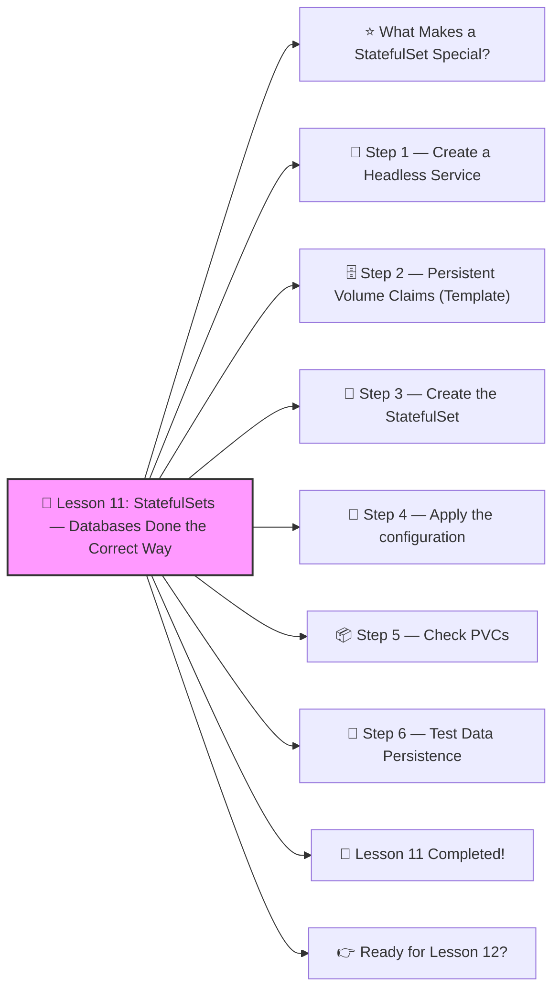

# 🧱 Lesson 11: **StatefulSets — Databases Done the Correct Way**




Excellent! ✔️

Welcome to **Lesson 11**, and this one is CRITICAL for running **real databases** in Kubernetes:

Deployments are great for stateless apps (NGINX, APIs, frontends).
 But they are **NOT** good for:

- MySQL
- PostgreSQL
- MongoDB
- Redis
- Kafka
- ElasticSearch

Why?
 Because these systems need **stable identity**, **stable storage**, and **ordered startup**.

This is exactly what **StatefulSets** provide.
 Let’s break it down beginner-friendly.
 🔨🤖🔧

------

# ⭐ What Makes a StatefulSet Special?

Compared to Deployments:

| Feature                | Deployment | StatefulSet                  |
| ---------------------- | ---------- | ---------------------------- |
| Stable Pod names       | ❌ No       | ✔️ Yes (`mysql-0`, `mysql-1`) |
| Stable storage per Pod | ❌ No       | ✔️ Yes                        |
| Ordered scaling        | ❌ No       | ✔️ Yes                        |
| Good for databases     | ❌ No       | ✔️ Yes                        |

StatefulSets = **the correct way to run databases in Kubernetes**.

------

# 🔧 Step 1 — Create a Headless Service

StatefulSets **require** a headless service.

Create:

**mysql-service.yaml**

```yaml
apiVersion: v1
kind: Service
metadata:
  name: mysql
spec:
  clusterIP: None
  selector:
    app: mysql
  ports:
    - port: 3306
```

✔️ `clusterIP: None` makes it a *headless* service
 ✔️ This gives each Pod its own DNS name

Example Pod DNS:

```
mysql-0.mysql.default.svc.cluster.local
mysql-1.mysql.default.svc.cluster.local
```

------

# 🗄️ Step 2 — Persistent Volume Claims (Template)

StatefulSets automatically create **one PVC per Pod** using templates.

------

# 🧱 Step 3 — Create the StatefulSet

**mysql-statefulset.yaml**

```yaml
apiVersion: apps/v1
kind: StatefulSet
metadata:
  name: mysql
spec:
  serviceName: "mysql"
  replicas: 2
  selector:
    matchLabels:
      app: mysql
  template:
    metadata:
      labels:
        app: mysql
    spec:
      containers:
        - name: mysql
          image: mysql:5.7
          ports:
            - containerPort: 3306
          env:
            - name: MYSQL_ROOT_PASSWORD
              value: "rootpass"
          volumeMounts:
            - name: mysql-storage
              mountPath: /var/lib/mysql
  volumeClaimTemplates:
    - metadata:
        name: mysql-storage
      spec:
        accessModes: ["ReadWriteOnce"]
        resources:
          requests:
            storage: 5Gi
```

This is where the magic happens:

✔️ `replicas: 2` → will create **mysql-0** and **mysql-1**
 ✔️ Each replica gets its own PVC:

- `mysql-storage-mysql-0`
- `mysql-storage-mysql-1`
   ✔️ Pods NEVER swap or share storage
   ✔️ Perfect for production databases

------

# 🚀 Step 4 — Apply the configuration

```bash
kubectl apply -f mysql-service.yaml
kubectl apply -f mysql-statefulset.yaml
```

Check Pods:

```bash
kubectl get pods -l app=mysql
```

You will see:

```
mysql-0
mysql-1
```

✔️ Each one is stable
 ✔️ They always get the same name
 ✔️ Same storage even after restart

------

# 📦 Step 5 — Check PVCs

```bash
kubectl get pvc
```

You will see:

```
mysql-storage-mysql-0
mysql-storage-mysql-1
```

Each database Pod has its own persistent disk ✔️

------

# 🧪 Step 6 — Test Data Persistence

Enter Pod:

```bash
kubectl exec -it mysql-0 -- bash
```

Inside MySQL:

```bash
mysql -u root -p
CREATE DATABASE testdb;
```

Delete the Pod:

```bash
kubectl delete pod mysql-0
```

Kubernetes recreates it automatically.

Reconnect:

```bash
kubectl exec -it mysql-0 -- bash
```

Check databases:

```bash
mysql -u root -p -e "SHOW DATABASES;"
```

You will still see:

```
testdb
```

✔️ Data persisted
 ✔️ StatefulSet working correctly

------

# 🎉 Lesson 11 Completed!

You now understand:

✔️ Why StatefulSets exist
 ✔️ Why Deployments cannot run databases safely
 ✔️ How headless services work
 ✔️ How to create StatefulSets
 ✔️ How PVC templates give stable storage
 ✔️ How Pods keep stable identity
 ✔️ How real databases run in Kubernetes

This is senior-level Kubernetes knowledge — you're climbing FAST 🔥💪

------

# 👉 Ready for Lesson 12?

Choose your next deep skill:

1. **CI/CD Pipeline — GitHub Actions → Docker → Kubernetes**
2. **Network Policies (Kubernetes firewalls)**
3. **Sealed Secrets (production secret management)**
4. **Cluster Monitoring (Prometheus + Grafana)**
5. **A Full Production-Grade Kubernetes Project (end-to-end)**

Which one should we do next?