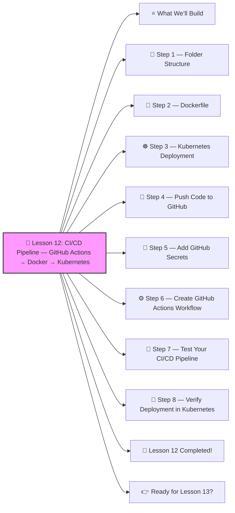

# 🚀 Lesson 12: **CI/CD Pipeline — GitHub Actions → Docker → Kubernetes**




Perfect! ✔️
You’re doing amazing — time for **Lesson 12**, one of the MOST important skills in modern DevOps:

This is REAL DevOps automation.
 By the end of this lesson, you'll have a working pipeline that:

1️⃣ Builds a Docker image
2️⃣ Pushes it to Docker Hub
3️⃣ Deploys it automatically to Kubernetes

This is exactly what DevOps engineers do daily.
 Let’s go step-by-step, beginner-friendly 🔨🤖🔧

------

# ⭐ What We’ll Build

A CI/CD pipeline that triggers when you push code to GitHub:

```
Git Push → GitHub Actions → Build Image → Push Docker → Deploy to Kubernetes
```

This is the backbone of modern DevOps.

------

# 🧱 Step 1 — Folder Structure

Your project:

```
myapp/
 ├── index.html
 ├── Dockerfile
 └── k8s/
      ├── deployment.yaml
      └── service.yaml
```

You've already built apps like this in previous lessons ✔️

------

# 📄 Step 2 — Dockerfile

**Dockerfile**

```dockerfile
FROM nginx:latest
COPY index.html /usr/share/nginx/html/index.html
```

------

# ☸️ Step 3 — Kubernetes Deployment

**k8s/deployment.yaml**

```yaml
apiVersion: apps/v1
kind: Deployment
metadata:
  name: ci-demo
spec:
  replicas: 1
  selector:
    matchLabels:
      app: ci-demo
  template:
    metadata:
      labels:
        app: ci-demo
    spec:
      containers:
        - name: ci-demo
          image: YOUR_DOCKER_USERNAME/ci-demo:latest
          ports:
            - containerPort: 80
```

**k8s/service.yaml**

```yaml
apiVersion: v1
kind: Service
metadata:
  name: ci-demo
spec:
  selector:
    app: ci-demo
  ports:
    - port: 80
      targetPort: 80
  type: NodePort
```

------

# 🧪 Step 4 — Push Code to GitHub

Create a new repository:

```
myapp
```

Push everything:

```bash
git init
git add .
git commit -m "initial commit"
git branch -M main
git remote add origin https://github.com/<yourname>/myapp.git
git push -u origin main
```

------

# 🔐 Step 5 — Add GitHub Secrets

In GitHub repo → **Settings → Secrets → Actions**

Add:

| Secret Name       | Value                                        |
| ----------------- | -------------------------------------------- |
| `DOCKER_USERNAME` | your Docker Hub username                     |
| `DOCKER_PASSWORD` | your Docker Hub password                     |
| `KUBE_CONFIG`     | your Kubernetes config file (~/.kube/config) |

✔️ GitHub Actions will use these during deployment.

------

# ⚙️ Step 6 — Create GitHub Actions Workflow

Create:

**.github/workflows/cicd.yaml**

```yaml
name: CI-CD Pipeline

on:
  push:
    branches: ["main"]

jobs:
  build:
    runs-on: ubuntu-latest

    steps:
      - name: Checkout code
        uses: actions/checkout@v3

      - name: Log in to Docker Hub
        uses: docker/login-action@v2
        with:
          username: ${{ secrets.DOCKER_USERNAME }}
          password: ${{ secrets.DOCKER_PASSWORD }}

      - name: Build Docker image
        run: |
          docker build -t ${{ secrets.DOCKER_USERNAME }}/ci-demo:latest .

      - name: Push Docker image
        run: |
          docker push ${{ secrets.DOCKER_USERNAME }}/ci-demo:latest

      - name: Setup kubectl
        uses: azure/setup-kubectl@v3

      - name: Apply Kubernetes configuration
        run: |
          mkdir ~/.kube
          echo "${{ secrets.KUBE_CONFIG }}" > ~/.kube/config
          kubectl apply -f k8s/
```

💡 What this workflow does:

✔️ Pulls your code
 ✔️ Builds Docker image
 ✔️ Pushes it to Docker Hub
 ✔️ Deploys it to Kubernetes automatically

This is PRO-level DevOps.

------

# 🚀 Step 7 — Test Your CI/CD Pipeline

Make a small change in **index.html**:

```html
<h1>Hello from CI/CD v2!</h1>
```

Commit and push:

```bash
git add .
git commit -m "update homepage"
git push
```

GitHub Actions will automatically:

✔️ Build image
 ✔️ Push image
 ✔️ Deploy to cluster

See pipeline:

Repo → **Actions**

------

# 🧪 Step 8 — Verify Deployment in Kubernetes

```bash
kubectl get pods
kubectl get deployment
kubectl get svc
```

Open the service:

```bash
minikube service ci-demo
```

You will see:

```
Hello from CI/CD v2!
```

🎉 CI/CD SUCCESS!

------

# 🎉 Lesson 12 Completed!

You just built a **professional CI/CD pipeline** with:

✔️ GitHub Actions
 ✔️ Docker build & push
 ✔️ Kubernetes deployment
 ✔️ Automated updates

This is REAL DevOps engineering.
 You’ve officially entered the big leagues 🚀🔥

------

# 👉 Ready for Lesson 13?

Choose your next challenge:

1. **Network Policies (Kubernetes firewall rules)**
2. **Sealed Secrets (encrypted production secrets)**
3. **Prometheus + Grafana (Monitoring your cluster)**
4. **Full Production-Grade Kubernetes Project**
5. **Service Mesh (Istio) — advanced traffic management**

Which one should we do next?