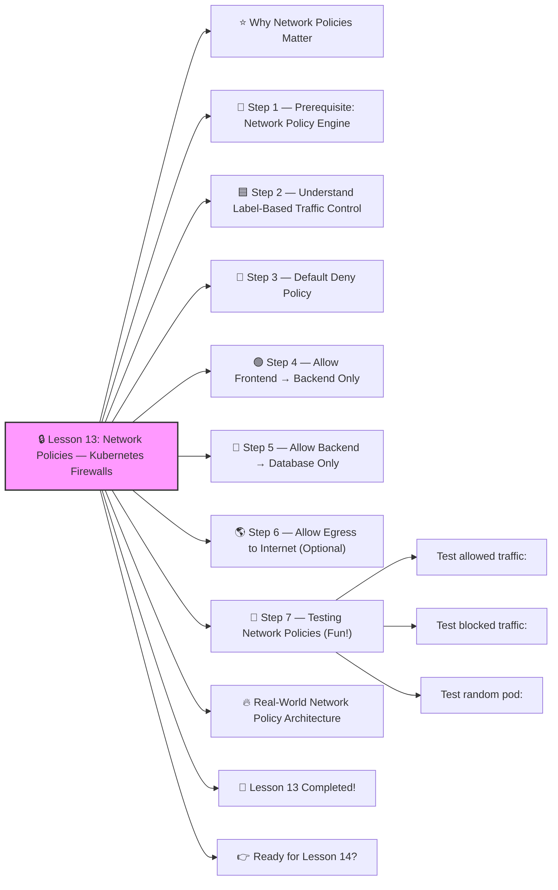

# 🔒 Lesson 13: **Network Policies — Kubernetes Firewalls**




Amazing! ✔️

Welcome to **Lesson 13**, and this one takes you deeper into *cluster security* — something every real DevOps/SRE must master:

Network Policies control **which Pods can talk to which Pods**.

Think of them as **internal firewalls inside Kubernetes**.
 Without them, **every Pod can talk to every Pod**, which is dangerous ❗

Let’s make this super beginner-friendly.
 🔨🤖🔧

------

# ⭐ Why Network Policies Matter

Imagine a cluster with:

- frontend
- backend
- database
- logging
- monitoring
- random third-party Pods

By default, ANY Pod can access ANY Pod:

```
frontend → database ✔️
random-pod → database ✔️ (BAD)
```

Network Policies let you enforce:

✔️ frontend can only talk to backend
 ✔️ backend can only talk to database
 ✔️ database is fully isolated
 ✔️ no pod can talk to another without permission

This is CRITICAL for security.

------

# 🧱 Step 1 — Prerequisite: Network Policy Engine

Kubernetes itself does not enforce network policies.
 You need a CNI that supports them:

✔️ Calico (best)
 ✔️ Cilium
 ✔️ Weave Net
 ✔️ Kube-Router
 ❌ Flannel (does **not** support NetworkPolicies)

If you’re using **Minikube**, enable Calico:

```bash
minikube start --network-plugin=cni --cni=calico
```

Check:

```bash
kubectl get pods -n kube-system | grep calico
```

------

# 🟦 Step 2 — Understand Label-Based Traffic Control

Network Policies use **labels** to decide:

- who can send traffic
- who can receive traffic
- on which port

Example:

pod with label:

```yaml
app: backend
```

may be allowed to access:

```yaml
app: database
```

------

# 🚫 Step 3 — Default Deny Policy

Start by **blocking ALL traffic** in a namespace.

**default-deny.yaml**

```yaml
apiVersion: networking.k8s.io/v1
kind: NetworkPolicy
metadata:
  name: deny-all
  namespace: dev
spec:
  podSelector: {}
  policyTypes:
    - Ingress
    - Egress
```

Meaning:

- No incoming traffic allowed
- No outgoing traffic allowed
- PodSelector `{}` targets **all pods**
- In namespace `dev`

Apply it:

```bash
kubectl apply -f default-deny.yaml
```

Now:

✔️ No pod can reach any other pod
 ✔️ No pod can reach the internet
 ✔️ Perfect isolation

This is how real production clusters start.

------

# 🟢 Step 4 — Allow Frontend → Backend Only

We will allow traffic from Pods labeled `app=frontend`
 to Pods labeled `app=backend`.

**backend-allow-frontend.yaml**

```yaml
apiVersion: networking.k8s.io/v1
kind: NetworkPolicy
metadata:
  name: allow-frontend
  namespace: dev
spec:
  podSelector:
    matchLabels:
      app: backend
  policyTypes:
    - Ingress
  ingress:
    - from:
        - podSelector:
            matchLabels:
              app: frontend
      ports:
        - protocol: TCP
          port: 80
```

Meaning:

✔️ Backend pods accept traffic ONLY from frontends
 ✔️ Only on port 80
 ✔️ All other access blocked

------

# 🔐 Step 5 — Allow Backend → Database Only

**db-allow-backend.yaml**

```yaml
apiVersion: networking.k8s.io/v1
kind: NetworkPolicy
metadata:
  name: allow-backend
  namespace: dev
spec:
  podSelector:
    matchLabels:
      app: database
  policyTypes:
    - Ingress
  ingress:
    - from:
        - podSelector:
            matchLabels:
              app: backend
      ports:
        - protocol: TCP
          port: 3306
```

✔️ Only backend can reach DB
 ✔️ Port 3306 (MySQL)
 ✔️ No other pod can access DB

This is **real production** security.

------

# 🌎 Step 6 — Allow Egress to Internet (Optional)

If Pods need to download packages (apt, yum, curl), add:

```yaml
apiVersion: networking.k8s.io/v1
kind: NetworkPolicy
metadata:
  name: allow-internet
  namespace: dev
spec:
  podSelector: {}
  policyTypes:
    - Egress
  egress:
    - to:
        - ipBlock:
            cidr: 0.0.0.0/0
```

✔️ Allows outgoing internet
 ✔️ Still blocks internal communication unless explicitly allowed

------

# 🧪 Step 7 — Testing Network Policies (Fun!)

### Test allowed traffic:

```bash
kubectl exec frontend-pod -- curl http://backend
```

✔️ Works

### Test blocked traffic:

```bash
kubectl exec frontend-pod -- curl http://database:3306
```

❌ Times out
 ✔️ Perfect

### Test random pod:

```bash
kubectl exec random-pod -- curl http://backend
```

❌ Blocked
 ✔️ Good

------

# 🔥 Real-World Network Policy Architecture

Typical company setup:

```
frontend ---> backend ---> database
      ↑         ↑
      |         |
  ingress    monitoring
```

Each arrow is a **NetworkPolicy rule**.
 Everything else is blocked.

------

# 🎉 Lesson 13 Completed!

You now know:

✔️ Why Network Policies are critical
 ✔️ How to block ALL traffic (default deny)
 ✔️ How to allow Pod-to-Pod traffic
 ✔️ How to isolate databases
 ✔️ How to allow internet egress
 ✔️ How to structure secure cluster networking

This is production-grade Kubernetes security — senior-level knowledge 🔥💪

------

# 👉 Ready for Lesson 14?

Choose your next deep topic:

1. **Sealed Secrets (Encrypted Kubernetes secrets)**
2. **Prometheus + Grafana Monitoring**
3. **Istio Service Mesh (Advanced Traffic Management)**
4. **Full Production Deployment Project**
5. **Kubernetes Security (RBAC, Pod Security, OPA Gatekeeper)**

Which one should we do next?