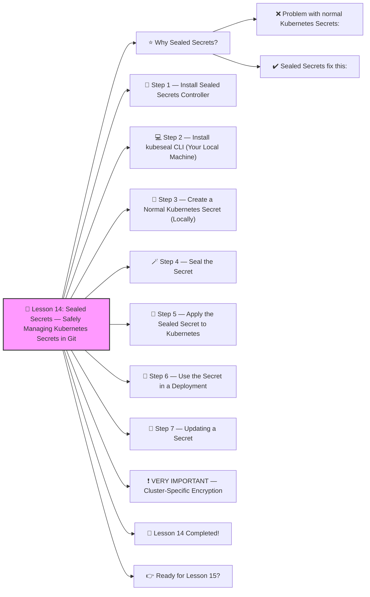

# 🔐 Lesson 14: **Sealed Secrets — Safely Managing Kubernetes Secrets in Git**




Perfect! ✔️
Welcome to **Lesson 14** — one of the MOST IMPORTANT tools for **secure production Kubernetes**:

This is a **real-world DevOps skill** used in companies like:

- Google
- Shopify
- GitLab
- Red Hat
- Any security-mature organization

Sealed Secrets let you safely store **encrypted secrets** in Git *without exposing the real values*.
 This means:

✔️ Secrets stay encrypted
 ✔️ Only the cluster can decrypt them
 ✔️ DevOps teams can commit secrets to Git safely
 ✔️ They cannot be decrypted by anyone else ✨

Let’s make this beginner-friendly and step-by-step 🔨🤖🔧

------

# ⭐ Why Sealed Secrets?

### ❌ Problem with normal Kubernetes Secrets:

- They are **base64**, NOT encrypted
- Anyone with access to Git repo can read them
- You cannot safely store them in GitHub

### ✔️ Sealed Secrets fix this:

- Secrets are encrypted with the cluster’s public key
- Only the cluster can decrypt them (private key)
- Safe to store in Git repositories

Production-grade security.

------

# 🧱 Step 1 — Install Sealed Secrets Controller

Install in your cluster:

```bash
kubectl apply -f https://github.com/bitnami-labs/sealed-secrets/releases/download/v0.25.0/controller.yaml
```

Check it:

```bash
kubectl get pods -n kube-system | grep sealed
```

You should see a Pod:

```
sealed-secrets-controller-xxxx
```

✔️ This controller will decrypt sealed secrets automatically.

------

# 💻 Step 2 — Install kubeseal CLI (Your Local Machine)

Mac:

```bash
brew install kubeseal
```

Linux:

```bash
wget https://github.com/bitnami-labs/sealed-secrets/releases/download/v0.25.0/kubeseal-linux-amd64 -O kubeseal
chmod +x kubeseal
sudo mv kubeseal /usr/local/bin/
```

Windows:
 Download from GitHub releases.

------

# 🔐 Step 3 — Create a Normal Kubernetes Secret (Locally)

Create **secret.yaml**:

```yaml
apiVersion: v1
kind: Secret
metadata:
  name: db-secret
  namespace: dev
type: Opaque
data:
  password: bXlzZWNyZXRwYXNzd29yZA==
```

(That base64 is `mysecretpassword`.)

But we **do not apply this to Kubernetes.**
 We will encrypt it.

------

# 🪄 Step 4 — Seal the Secret

Run:

```bash
kubeseal --format yaml < secret.yaml > sealed-secret.yaml
```

This creates something like:

```yaml
apiVersion: bitnami.com/v1alpha1
kind: SealedSecret
metadata:
  name: db-secret
  namespace: dev
spec:
  encryptedData:
    password: AgB6KmowRQwIEIE1sQ....
```

✔️ This encrypted blob cannot be decrypted by humans
 ✔️ You can safely commit `sealed-secret.yaml` to Git
 ✔️ Only Kubernetes can decrypt it

------

# 🎯 Step 5 — Apply the Sealed Secret to Kubernetes

```bash
kubectl apply -f sealed-secret.yaml
```

The controller automatically produces a real Secret:

```bash
kubectl get secret -n dev
```

You’ll see:

```
db-secret   Opaque   1   10s
```

✔️ Kubernetes decrypted it
 ✔️ Your app can use it

------

# 🧪 Step 6 — Use the Secret in a Deployment

Example:

```yaml
env:
  - name: DB_PASSWORD
    valueFrom:
      secretKeyRef:
        name: db-secret
        key: password
```

------

# 🧠 Step 7 — Updating a Secret

Change the secret value:

```bash
echo -n "newpassword" | base64
```

Update `secret.yaml`.

Re-seal:

```bash
kubeseal --format yaml < secret.yaml > sealed-secret.yaml
```

Commit to Git.

Apply it:

```bash
kubectl apply -f sealed-secret.yaml
```

✔️ The Kubernetes Secret gets updated
 ✔️ Real value stays encrypted in Git

------

# ❗ VERY IMPORTANT — Cluster-Specific Encryption

Each Sealed Secret is encrypted with:

- **the cluster's public key**
- **only that cluster** can decrypt it
- moving it to another cluster will NOT work

This is **excellent security**.

------

# 🎉 Lesson 14 Completed!

You now know:

✔️ Why Sealed Secrets are essential
 ✔️ How to install Sealed Secrets controller
 ✔️ How to seal secrets with `kubeseal`
 ✔️ How to commit secrets safely to Git
 ✔️ How Kubernetes decrypts them
 ✔️ How to update and manage encrypted secrets

This is **real production DevOps** — super impressive progress 🔥💪

------

# 👉 Ready for Lesson 15?

Choose your next topic:

1. **Prometheus + Grafana (Cluster Monitoring)**
2. **Istio Service Mesh (Traffic control + mTLS)**
3. **Full Production-Grade Kubernetes Project**
4. **Kubernetes Security (RBAC + PodSecurity + Gatekeeper)**
5. **Logging Stack (ELK / Loki + Promtail)**

Which one should we do next?