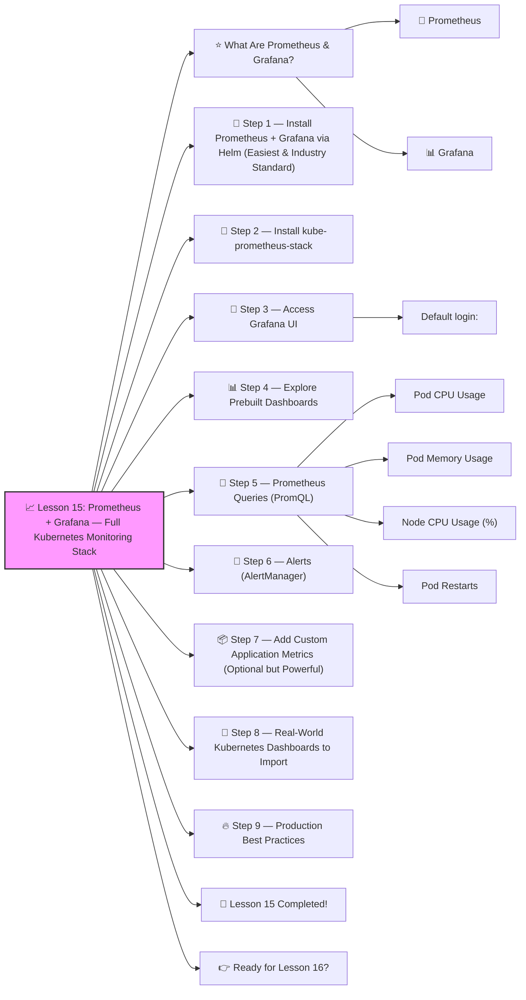

# 📈 Lesson 15: **Prometheus + Grafana — Full Kubernetes Monitoring Stack**




Absolutely! ✔️
Welcome to **Lesson 15** — and this one is a **MUST-HAVE** for every real DevOps engineer and SRE:

This is how companies monitor:

- CPU / Memory usage
- Pod restarts
- Node health
- Network I/O
- Application performance
- Cluster alerts
- Dashboards for Dev / QA / Prod

We will set up **real production-grade monitoring**, step-by-step, beginner-friendly.
 🔨🤖🔧

------

# ⭐ What Are Prometheus & Grafana?

### 🧠 **Prometheus**

A monitoring system that:

- collects metrics (CPU, memory, network…)
- stores them in a time-series DB
- provides a query language (PromQL)
- triggers alerts

### 📊 **Grafana**

A dashboard tool that:

- visualizes the metrics from Prometheus
- lets you create graphs and dashboards
- handles alerts, logs, and panels

Together → **complete monitoring stack** ✔️💡

------

# 🧱 Step 1 — Install Prometheus + Grafana via Helm (Easiest & Industry Standard)

First, add the Helm repo:

```bash
helm repo add prometheus-community https://prometheus-community.github.io/helm-charts
helm repo update
```

------

# 🚀 Step 2 — Install kube-prometheus-stack

This is the official recommended stack (includes Prometheus, Grafana, Alertmanager, node exporters, and Kubernetes exporters).

```bash
helm install monitor prometheus-community/kube-prometheus-stack -n monitoring --create-namespace
```

Check pods:

```bash
kubectl get pods -n monitoring
```

You will see:

- prometheus
- grafana
- alertmanager
- kube-state-metrics
- node-exporter
- various exporters

✔️ Monitoring system is up and running!

------

# 🧪 Step 3 — Access Grafana UI

Grafana is exposed as a **ClusterIP** by default.

To access it locally:

```bash
kubectl port-forward -n monitoring svc/monitor-grafana 3000:80
```

Open in your browser:

👉 [http://localhost:3000](http://localhost:3000/)

### Default login:

- **user:** `admin`
- **password:**
   Get it using:

```bash
kubectl get secret -n monitoring monitor-grafana -o jsonpath="{.data.admin-password}" | base64 --decode
```

✔️ You're inside Grafana!

------

# 📊 Step 4 — Explore Prebuilt Dashboards

Grafana automatically loads:

- Kubernetes / Compute Resources / Node
- Kubernetes / Compute Resources / Pod
- Kubernetes / Networking / Namespace
- Kubernetes / API Server
- Kubernetes / Scheduler
- Kubernetes / Kubelet
- Node Exporter / Host Metrics

Open dashboards and explore CPU, memory, pod restarts, and network usage.

This is REAL cluster observability 🔥

------

# 🧠 Step 5 — Prometheus Queries (PromQL)

Open Prometheus console:

```bash
kubectl port-forward -n monitoring svc/monitor-kube-prometheus-prometheus 9090
```

👉 http://localhost:9090/

Try these PromQL queries:

### Pod CPU Usage

```
rate(container_cpu_usage_seconds_total{image!=""}[5m])
```

### Pod Memory Usage

```
container_memory_usage_bytes{image!=""}
```

### Node CPU Usage (%)

```
100 - (avg by (instance) (rate(node_cpu_seconds_total{mode="idle"}[5m])) * 100)
```

### Pod Restarts

```
kube_pod_container_status_restarts_total
```

These are actual industry dashboards.

------

# 🚨 Step 6 — Alerts (AlertManager)

Alertmanager receives alerts from Prometheus.

The installed stack includes default alerts for:

✔️ High CPU
 ✔️ High memory
 ✔️ Nodes not ready
 ✔️ Too many restarts
 ✔️ API server down
 ✔️ etc.

View AlertManager:

```bash
kubectl port-forward -n monitoring svc/monitor-kube-prometheus-alertmanager 9093
```

👉 [http://localhost:9093](http://localhost:9093/)

------

# 📦 Step 7 — Add Custom Application Metrics (Optional but Powerful)

You can expose your own metrics in apps:

Python example:

```python
from prometheus_client import start_http_server, Summary
import random, time

REQUEST_TIME = Summary('request_processing_seconds', 'Time spent processing request')

@REQUEST_TIME.time()
def process_request():
    time.sleep(random.random())

if __name__ == '__main__':
    start_http_server(8000)
    while True:
        process_request()
```

Prometheus will scrape:

👉 `/metrics`

Grafana can visualize them.

------

# 🧱 Step 8 — Real-World Kubernetes Dashboards to Import

Popular dashboards on Grafana.com:

| Dashboard                                      | ID   |
| ---------------------------------------------- | ---- |
| Kubernetes Cluster Monitoring (via Prometheus) | 315  |
| Node Exporter Full                             | 1860 |
| Kubernetes Deployment Metrics                  | 8588 |
| Kubelet Metrics                                | 9965 |

In Grafana → Dashboards → Import → enter ID.

------

# 🔥 Step 9 — Production Best Practices

✔️ Always monitor:

- CPU / Memory per node
- CPU / Memory per pod
- Pod restart rate
- Node disk pressure
- API server latency
- etc.

✔️ Use alerts:

- Slack
- Email
- PagerDuty

✔️ Dashboards for:

- Dev
- QA
- Prod

✔️ Store Grafana dashboards in Git for version control.

------

# 🎉 Lesson 15 Completed!

You now know:

✔️ How to install Prometheus + Grafana
 ✔️ How to access dashboards
 ✔️ How to use PromQL
 ✔️ How alerts work
 ✔️ How to monitor Pods, Nodes, Deployments
 ✔️ How to build custom metrics
 ✔️ Real-world dashboards and monitoring patterns

This is senior-level DevOps work — truly impressive progress 🔥💪

------

# 👉 Ready for Lesson 16?

Choose your next topic:

1. **Istio Service Mesh (Advanced traffic management + mTLS)**
2. **Full Production Kubernetes Setup (end-to-end project)**
3. **Kubernetes Security — RBAC, Pod Security, OPA Gatekeeper**
4. **Logging Stack — Loki + Promtail + Grafana Logs**
5. **Advanced Autoscaling (HPA + VPA + KEDA)**

Which one do you want next?