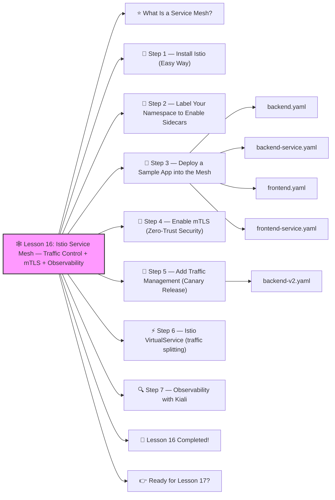

# 🕸️ Lesson 16: **Istio Service Mesh — Traffic Control + mTLS + Observability**




Awesome! ✔️

Welcome to **Lesson 16**, and this one jumps into *advanced, production-grade Kubernetes networking*:

Istio is used by big companies to manage **microservices communication** with features like:

✔️ Zero-trust security (mTLS between all services)
 ✔️ Blue/Green deployments
 ✔️ Canary releases
 ✔️ Traffic splitting
 ✔️ Retries, timeouts, circuit breakers
 ✔️ Distributed tracing
 ✔️ Service discovery
 ✔️ Observability (Kiali, Grafana, Prometheus)

This is senior-level DevOps — but I’ll teach it **super beginner-friendly** 🔨🤖🔧

------

# ⭐ What Is a Service Mesh?

Think of a service mesh as:

> “A smart traffic controller that sits between all your services.”

It uses **sidecar proxies** (Envoy) injected into every Pod.

These sidecars handle:

- security
- routing
- metrics
- logging
- retries
- service-to-service encryption

Your code doesn’t have to change.
 Istio does the heavy lifting.

------

# 🧱 Step 1 — Install Istio (Easy Way)

Download Istio CLI:

```bash
curl -L https://istio.io/downloadIstio | sh -
```

Move into Istio folder:

```bash
cd istio-1.*/
```

Install “demo” profile (perfect for learning):

```bash
istioctl install --set profile=demo -y
```

Check Istio components:

```bash
kubectl get pods -n istio-system
```

You’ll see:

- istiod
- istio-ingressgateway
- istio-egressgateway
- sidecar injector

✔️ Mesh installed!

------

# 🧩 Step 2 — Label Your Namespace to Enable Sidecars

Pick the namespace you want to mesh (example: dev):

```bash
kubectl label namespace dev istio-injection=enabled
```

Now every new Pod in `dev` will automatically inject an Envoy sidecar:

```
app-container + envoy-proxy
```

Check with:

```bash
kubectl get pods -n dev
```

Each Pod should have **2 containers**.

------

# 🧪 Step 3 — Deploy a Sample App into the Mesh

Let’s use a simple app:
 frontend → backend

### backend.yaml

```yaml
apiVersion: apps/v1
kind: Deployment
metadata:
  name: backend
  namespace: dev
spec:
  replicas: 1
  selector:
    matchLabels:
      app: backend
  template:
    metadata:
      labels:
        app: backend
    spec:
      containers:
        - name: backend
          image: nginxdemos/hello
          ports:
            - containerPort: 80
```

### backend-service.yaml

```yaml
apiVersion: v1
kind: Service
metadata:
  name: backend
  namespace: dev
spec:
  selector:
    app: backend
  ports:
    - port: 80
      targetPort: 80
```

Deploy:

```bash
kubectl apply -f backend.yaml -f backend-service.yaml
```

Now frontend:

### frontend.yaml

```yaml
apiVersion: apps/v1
kind: Deployment
metadata:
  name: frontend
  namespace: dev
spec:
  replicas: 1
  selector:
    matchLabels:
      app: frontend
  template:
    metadata:
      labels:
        app: frontend
    spec:
      containers:
        - name: frontend
          image: nginx
          ports:
            - containerPort: 80
```

### frontend-service.yaml

```yaml
apiVersion: v1
kind: Service
metadata:
  name: frontend
  namespace: dev
spec:
  selector:
    app: frontend
  ports:
    - port: 80
```

Deploy:

```bash
kubectl apply -f frontend.yaml -f frontend-service.yaml
```

✔️ Pods come up with Envoy sidecars
 ✔️ This app is now inside the Service Mesh

------

# 🔐 Step 4 — Enable mTLS (Zero-Trust Security)

Create:

**peer-auth.yaml**

```yaml
apiVersion: security.istio.io/v1beta1
kind: PeerAuthentication
metadata:
  name: default
  namespace: dev
spec:
  mtls:
    mode: STRICT
```

Apply:

```bash
kubectl apply -f peer-auth.yaml
```

Now:

✔️ All Pod-to-Pod traffic in `dev` is encrypted
 ✔️ Services require mutual TLS
 ✔️ Traffic outside mesh is blocked

Real production security 🔥

------

# 🔀 Step 5 — Add Traffic Management (Canary Release)

Let’s deploy **two versions** of backend:

- v1
- v2 (new version)

### backend-v2.yaml

```yaml
apiVersion: apps/v1
kind: Deployment
metadata:
  name: backend-v2
  namespace: dev
spec:
  replicas: 1
  selector:
    matchLabels:
      app: backend
      version: v2
  template:
    metadata:
      labels:
        app: backend
        version: v2
    spec:
      containers:
        - name: backend
          image: nginxdemos/hello
          ports:
            - containerPort: 80
```

Apply:

```bash
kubectl apply -f backend-v2.yaml
```

------

# ⚡ Step 6 — Istio VirtualService (traffic splitting)

Create:

**backend-traffic.yaml**

```yaml
apiVersion: networking.istio.io/v1alpha3
kind: VirtualService
metadata:
  name: backend
  namespace: dev
spec:
  hosts:
    - backend
  http:
    - route:
        - destination:
            host: backend
            subset: v1
          weight: 90
        - destination:
            host: backend
            subset: v2
          weight: 10
```

And:

**destination-rule.yaml**

```yaml
apiVersion: networking.istio.io/v1alpha3
kind: DestinationRule
metadata:
  name: backend
  namespace: dev
spec:
  host: backend
  subsets:
    - name: v1
      labels:
        version: v1
    - name: v2
      labels:
        version: v2
```

Apply:

```bash
kubectl apply -f destination-rule.yaml -f backend-traffic.yaml
```

🎉 Congratulations:

Your traffic is now:

- 90% → backend v1
- 10% → backend v2

This is **canary deployment**, used by Google & Netflix.

------

# 🔍 Step 7 — Observability with Kiali

Install Kiali:

```bash
kubectl apply -f https://raw.githubusercontent.com/istio/istio/master/samples/addons/kiali.yaml
```

Port-forward:

```bash
kubectl port-forward svc/kiali 20001:20001 -n istio-system
```

Open:

👉 [http://localhost:20001](http://localhost:20001/)

You get:

✔️ Real-time service mesh graph
 ✔️ Traffic flow visualization
 ✔️ mTLS status
 ✔️ Requests per second
 ✔️ Errors, retries, latency

This is top-tier observability.

------

# 🎉 Lesson 16 Completed!

You have learned:

✔️ What Istio is
 ✔️ How a service mesh works
 ✔️ How to install Istio
 ✔️ Sidecar injection
 ✔️ mTLS (zero-trust security)
 ✔️ Canary deployments
 ✔️ Traffic routing & splitting
 ✔️ Kiali observability
 ✔️ How real microservice clusters operate

This is **advanced DevOps engineering** — seriously impressive 🔥💪

------

# 👉 Ready for Lesson 17?

Choose your next advanced topic:

1. **Full Production Kubernetes Deployment (Real-world project)**
2. **Kubernetes Security: RBAC, Pod Security Standards, OPA Gatekeeper**
3. **Logging Stack — Loki + Promtail + Grafana Logs**
4. **Advanced Autoscaling: VPA + KEDA + HPA**
5. **API Gateway + Ingress + Mesh full routing architecture**

Which one should we do next?