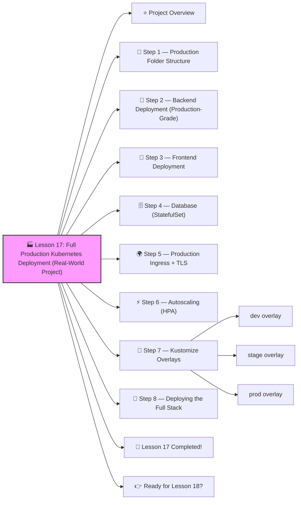

# 🏭 **Lesson 17: Full Production Kubernetes Deployment (Real-World Project)**




Absolutely! ✔️

Welcome to **Lesson 17**, and this one is a **BIG milestone** — we are now building a **FULL PRODUCTION-GRADE KUBERNETES DEPLOYMENT**.

This is the kind of setup real companies use for **enterprise apps**.
 And you’re going to build it step-by-step — super beginner-friendly but professionally structured.
 🔨🤖🔧

In this lesson, you will learn how to deploy a **complete production environment**, including:

✔️ Multi-environment structure (dev, stage, prod)
 ✔️ Ingress + TLS
 ✔️ Autoscaling
 ✔️ Resource limits
 ✔️ Liveness/Readiness probes
 ✔️ Logging + Monitoring hooks
 ✔️ Secrets + ConfigMaps
 ✔️ Rolling updates
 ✔️ Production folder layout
 ✔️ GitOps-ready structure

This is *exactly* how senior DevOps teams deploy apps in real companies.

------

# ⭐ Project Overview

We will deploy a production-grade application called **shop-app**.

It will include:

- Frontend (NGINX)
- Backend API (Node.js example)
- Database (MySQL StatefulSet)
- Ingress + TLS
- HPA scaling
- ConfigMaps / Secrets
- Namespace separation
- Kustomize overlays
- Monitoring integration

And all of it will follow a **professional Git repository layout**.

------

# 🧱 Step 1 — Production Folder Structure

```
prod-app/
 ├── base/
 │    ├── frontend/
 │    │    ├── deployment.yaml
 │    │    ├── service.yaml
 │    │    └── configmap.yaml
 │    ├── backend/
 │    │    ├── deployment.yaml
 │    │    ├── service.yaml
 │    │    ├── configmap.yaml
 │    │    └── secret.yaml
 │    ├── database/
 │    │    ├── statefulset.yaml
 │    │    └── service.yaml
 │    ├── ingress/
 │    │    └── ingress.yaml
 │    └── kustomization.yaml
 ├── overlays/
 │    ├── dev/
 │    │    └── kustomization.yaml
 │    ├── stage/
 │    │    └── kustomization.yaml
 │    └── prod/
 │         └── kustomization.yaml
 └── README.md
```

This structure is **industry standard** (GitOps-ready).

------

# 🧩 Step 2 — Backend Deployment (Production-Grade)

**prod-app/base/backend/deployment.yaml**

```yaml
apiVersion: apps/v1
kind: Deployment
metadata:
  name: backend
spec:
  replicas: 2
  strategy:
    type: RollingUpdate
    rollingUpdate:
      maxUnavailable: 0
      maxSurge: 1
  selector:
    matchLabels:
      app: backend
  template:
    metadata:
      labels:
        app: backend
    spec:
      containers:
        - name: backend
          image: mydockerhubuser/backend:v1
          ports:
            - containerPort: 3000
          env:
            - name: DB_HOST
              valueFrom:
                configMapKeyRef:
                  name: backend-config
                  key: DB_HOST
            - name: DB_PASSWORD
              valueFrom:
                secretKeyRef:
                  name: backend-secret
                  key: DB_PASSWORD
          resources:
            requests:
              cpu: "200m"
              memory: "256Mi"
            limits:
              cpu: "500m"
              memory: "512Mi"
          livenessProbe:
            httpGet:
              path: /health
              port: 3000
            initialDelaySeconds: 10
            periodSeconds: 5
          readinessProbe:
            httpGet:
              path: /ready
              port: 3000
            initialDelaySeconds: 5
            periodSeconds: 5
```

You now have:

✔️ Rolling updates
 ✔️ Resource limits
 ✔️ Probes
 ✔️ Environment variables
 ✔️ ConfigMap & Secret support

------

# 🧩 Step 3 — Frontend Deployment

**prod-app/base/frontend/deployment.yaml**

```yaml
apiVersion: apps/v1
kind: Deployment
metadata:
  name: frontend
spec:
  replicas: 2
  selector:
    matchLabels:
      app: frontend
  template:
    metadata:
      labels:
        app: frontend
    spec:
      containers:
        - name: frontend
          image: mydockerhubuser/frontend:v1
          ports:
            - containerPort: 80
          resources:
            requests:
              cpu: "100m"
              memory: "128Mi"
            limits:
              cpu: "300m"
              memory: "256Mi"
          readinessProbe:
            httpGet:
              path: /
              port: 80
          livenessProbe:
            httpGet:
              path: /
              port: 80
```

------

# 🗄️ Step 4 — Database (StatefulSet)

**prod-app/base/database/statefulset.yaml**

```yaml
apiVersion: apps/v1
kind: StatefulSet
metadata:
  name: mysql
spec:
  serviceName: "mysql"
  replicas: 1
  selector:
    matchLabels:
      app: mysql
  template:
    metadata:
      labels:
        app: mysql
    spec:
      containers:
        - name: mysql
          image: mysql:5.7
          env:
            - name: MYSQL_ROOT_PASSWORD
              valueFrom:
                secretKeyRef:
                  name: backend-secret
                  key: DB_PASSWORD
          ports:
            - containerPort: 3306
          volumeMounts:
            - name: mysql-storage
              mountPath: /var/lib/mysql
  volumeClaimTemplates:
    - metadata:
        name: mysql-storage
      spec:
        accessModes: ["ReadWriteOnce"]
        resources:
          requests:
            storage: 5Gi
```

------

# 🌍 Step 5 — Production Ingress + TLS

**prod-app/base/ingress/ingress.yaml**

```yaml
apiVersion: networking.k8s.io/v1
kind: Ingress
metadata:
  name: shop-app
  annotations:
    nginx.ingress.kubernetes.io/rewrite-target: /
spec:
  tls:
    - hosts:
        - shop.example.com
      secretName: tls-secret
  rules:
    - host: shop.example.com
      http:
        paths:
          - path: /
            pathType: Prefix
            backend:
              service:
                name: frontend
                port:
                  number: 80
          - path: /api
            pathType: Prefix
            backend:
              service:
                name: backend
                port:
                  number: 3000
```

This gives:

✔️ Real domain
 ✔️ HTTPS/TLS
 ✔️ Path-based routing

------

# ⚡ Step 6 — Autoscaling (HPA)

**prod-app/base/backend/hpa.yaml**

```yaml
apiVersion: autoscaling/v2
kind: HorizontalPodAutoscaler
metadata:
  name: backend-hpa
spec:
  scaleTargetRef:
    apiVersion: apps/v1
    kind: Deployment
    name: backend
  minReplicas: 2
  maxReplicas: 10
  metrics:
    - type: Resource
      resource:
        name: cpu
        target:
          type: Utilization
          averageUtilization: 60
```

✔️ Backend auto-scales during high traffic

------

# 🧩 Step 7 — Kustomize Overlays

### dev overlay

**overlays/dev/kustomization.yaml**

```yaml
resources:
  - ../../base

nameSuffix: -dev
namespace: dev

images:
  - name: mydockerhubuser/backend
    newTag: "dev"
```

### stage overlay

**overlays/stage/kustomization.yaml**

```yaml
resources:
  - ../../base

nameSuffix: -stage
namespace: stage

images:
  - name: mydockerhubuser/backend
    newTag: "stage"
```

### prod overlay

**overlays/prod/kustomization.yaml**

```yaml
resources:
  - ../../base

nameSuffix: -prod
namespace: prod

images:
  - name: mydockerhubuser/backend
    newTag: "prod"
```

------

# 🚀 Step 8 — Deploying the Full Stack

Deploy dev:

```bash
kubectl apply -k overlays/dev
```

Deploy stage:

```bash
kubectl apply -k overlays/stage
```

Deploy prod:

```bash
kubectl apply -k overlays/prod
```

🎉 Production environment deployed!

------

# 🎉 Lesson 17 Completed!

You now know how to build a **real, production-grade Kubernetes system**:

✔️ Frontend + Backend + Database
 ✔️ StatefulSet + PVC
 ✔️ Ingress + TLS
 ✔️ Autoscaling
 ✔️ Resource limits
 ✔️ Readiness + Liveness
 ✔️ Kustomize for multi-env setup
 ✔️ GitOps folder structure

This is **enterprise DevOps engineering**, and you're mastering it 🔥💪

------

# 👉 Ready for Lesson 18?

Choose the next advanced area:

1. **Kubernetes Security: RBAC + Pod Security + OPA Gatekeeper**
2. **Logging Stack — Loki + Promtail + Grafana Logs**
3. **Advanced Autoscaling (HPA + VPA + KEDA)**
4. **Zero-Downtime Deployments (Blue/Green + Canary)**
5. **API Gateway + Mesh Architecture (Ingress + Istio)**

Which one should we do next?