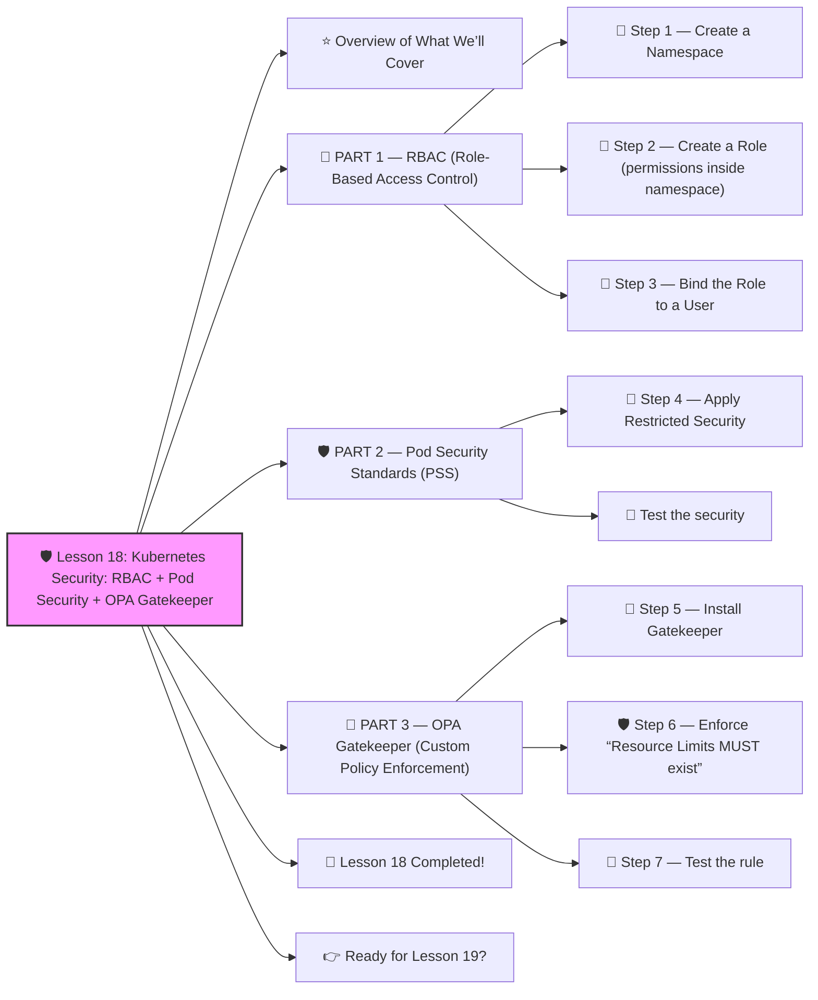

# 🛡️ Lesson 18: **Kubernetes Security: RBAC + Pod Security + OPA Gatekeeper**




Absolutely! ✔️

Welcome to **Lesson 18** — this one is CRITICAL for running **secure production Kubernetes** clusters:

This is ADVANCED DevOps/SRE knowledge — used in real companies to control:

- Who can access the cluster
- What deployments are allowed
- What security rules must be followed
- Preventing bad configurations
- Enforcing compliance

You’ll learn it all in a **simple, beginner-friendly way** 🔨🤖🔧

------

# ⭐ Overview of What We’ll Cover

1️⃣ **RBAC (Role-Based Access Control)**
 2️⃣ **Pod Security Admission (baseline / restricted)**
 3️⃣ **OPA Gatekeeper (Custom cluster-wide policies)**

By the end, you will know how real production clusters enforce strict security.

------

# 🔐 PART 1 — RBAC (Role-Based Access Control)

RBAC controls:

✔️ WHO can access WHAT
 ✔️ Which actions they can perform
 ✔️ In which namespaces

Think of it like:

> Kubernetes permissions = “Who can do what”

------

## 🧱 Step 1 — Create a Namespace

```yaml
apiVersion: v1
kind: Namespace
metadata:
  name: dev
```

------

## 🧱 Step 2 — Create a Role (permissions inside namespace)

**dev-role.yaml**

```yaml
apiVersion: rbac.authorization.k8s.io/v1
kind: Role
metadata:
  namespace: dev
  name: developer-role
rules:
  - apiGroups: [""]
    resources: ["pods", "services"]
    verbs: ["get", "list", "create", "delete"]
  - apiGroups: ["apps"]
    resources: ["deployments"]
    verbs: ["get", "list", "create", "update"]
```

Meaning:

✔️ Can list/create/delete Pods
 ✔️ Can deploy apps
 ✔️ Can NOT touch cluster-wide settings
 ✔️ Only inside namespace `dev`

------

## 🧱 Step 3 — Bind the Role to a User

**rolebinding.yaml**

```yaml
apiVersion: rbac.authorization.k8s.io/v1
kind: RoleBinding
metadata:
  name: dev-binding
  namespace: dev
subjects:
  - kind: User
    name: john      # example developer
roleRef:
  kind: Role
  name: developer-role
  apiGroup: rbac.authorization.k8s.io
```

✔️ User "john" now has dev permissions
 ✔️ But only in namespace `dev`

------

# 🛡️ PART 2 — Pod Security Standards (PSS)

Kubernetes provides 3 built-in security levels:

| Profile        | Level                  |
| -------------- | ---------------------- |
| **privileged** | ❌ dangerous, avoid     |
| **baseline**   | ✔️ safe default         |
| **restricted** | ✔️ recommended for prod |

We enforce these at the *namespace* level.

------

## 🧱 Step 4 — Apply Restricted Security

**restricted-namespace.yaml**

```yaml
apiVersion: v1
kind: Namespace
metadata:
  name: prod
  labels:
    pod-security.kubernetes.io/enforce: "restricted"
```

This prevents:

❌ privileged containers
 ❌ running as root
 ❌ hostPath volumes
 ❌ host network access
 ❌ dangerous capabilities

This is **true production hardening**.

------

## 🧪 Test the security

Try to deploy a privileged Pod:

```yaml
apiVersion: v1
kind: Pod
metadata:
  name: badpod
  namespace: prod
spec:
  containers:
    - name: bad
      image: nginx
      securityContext:
        privileged: true
```

Apply it:

```bash
kubectl apply -f badpod.yaml
```

You get:

❌ *ERROR: violates PodSecurity restricted*

✔️ This means security is working.

------

# 🧠 PART 3 — OPA Gatekeeper (Custom Policy Enforcement)

Pod Security is good,
 but companies need **custom rules** like:

- Prevent images without tags
- Require resource limits
- Block certain registries
- Enforce annotations
- Enforce label naming
- Prevent NodePort usage
- Require TLS for Ingress

OPA Gatekeeper lets you write policies using **Rego**.

------

## 🧱 Step 5 — Install Gatekeeper

```bash
kubectl apply -f https://raw.githubusercontent.com/open-policy-agent/gatekeeper/master/deploy/gatekeeper.yaml
```

Check:

```bash
kubectl get pods -n gatekeeper-system
```

------

## 🛡️ Step 6 — Enforce “Resource Limits MUST exist”

Create a constraint template:

**template-limit.yaml**

```yaml
apiVersion: templates.gatekeeper.sh/v1
kind: ConstraintTemplate
metadata:
  name: k8srequirelimits
spec:
  crd:
    spec:
      names:
        kind: K8sRequireLimits
  targets:
    - target: admission.k8s.gatekeeper.sh
      rego: |
        package k8srequirelimits

        violation[{"msg": msg}] {
          container := input.review.object.spec.containers[_]
          not container.resources.limits
          msg := "All containers must have resource limits"
        }
```

Apply:

```bash
kubectl apply -f template-limit.yaml
```

Now create the constraint:

**limit-constraint.yaml**

```yaml
apiVersion: constraints.gatekeeper.sh/v1beta1
kind: K8sRequireLimits
metadata:
  name: require-limits
spec:
  match:
    kinds:
      - apiGroups: [""]
        kinds: ["Pod"]
      - apiGroups: ["apps"]
        kinds: ["Deployment"]
```

Apply:

```bash
kubectl apply -f limit-constraint.yaml
```

------

## 🧪 Step 7 — Test the rule

Try deploying a pod WITHOUT limits:

```yaml
apiVersion: v1
kind: Pod
metadata:
  name: no-limits
spec:
  containers:
    - name: test
      image: nginx
```

Apply:

```bash
kubectl apply -f no-limits.yaml
```

Result:

❌ **DENIED: All containers must have resource limits**

✔️ Gatekeeper is enforcing your policy
 ✔️ Your cluster is now secure and compliant

------

# 🎉 Lesson 18 Completed!

You now know:

✔️ How to control user permissions (RBAC)
 ✔️ How to enforce namespace-level security (PSS)
 ✔️ How to enforce **custom security rules** using OPA
 ✔️ How to block insecure deployments
 ✔️ How real enterprises secure Kubernetes clusters

This is **expert DevOps/SRE knowledge** — you are getting VERY advanced 🔥💪

------

# 👉 Ready for Lesson 19?

Choose one:

1. **Logging Stack — Loki + Promtail + Grafana Logs**
2. **Advanced Autoscaling: VPA + KEDA + HPA**
3. **Zero-Downtime Deployments: Blue/Green + Canary**
4. **API Gateway + Mesh Routing Architecture**
5. **Kubernetes Disaster Recovery + Backup (Velero)**

Which one do you want next?