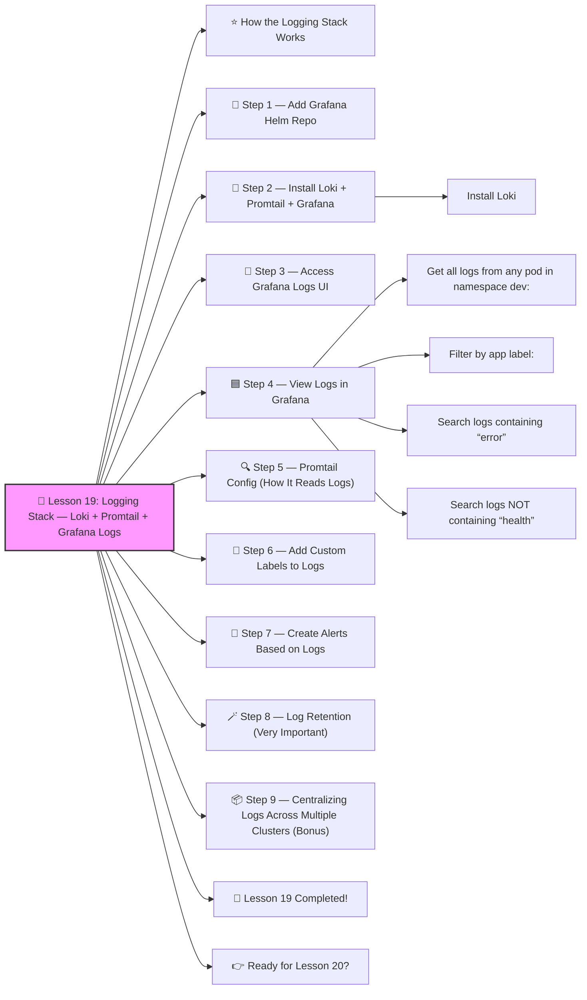

# 📜 Lesson 19: **Logging Stack — Loki + Promtail + Grafana Logs**




Absolutely! ✔️

Welcome to **Lesson 19** — and this one is CRUCIAL for running real production clusters:

Logs are EVERYTHING in DevOps:

- Debugging issues
- Tracking errors
- Auditing
- Tracing user behavior
- Monitoring application crashes
- Supporting SRE on-call

Today, you’re building a **complete production-ready logging system** using:

✔️ **Loki** → log database (like Elasticsearch but 10x cheaper)
 ✔️ **Promtail** → log collector (like Fluentd/Fluentbit)
 ✔️ **Grafana Logs UI** → search, analyze, visualize logs

This stack is used by **Grafana Labs, Red Hat, Cisco, GitLab, and MANY real companies**.
 Let’s build it beginner-friendly 🔨🤖🔧

------

# ⭐ How the Logging Stack Works

```
Pods → Promtail → Loki → Grafana Logs
```

Promtail reads logs from containers → sends them to Loki → Grafana visualizes them.

This is the best modern alternative to ELK (Elasticsearch / Logstash / Kibana).

------

# 🧱 Step 1 — Add Grafana Helm Repo

```bash
helm repo add grafana https://grafana.github.io/helm-charts
helm repo update
```

------

# 🚀 Step 2 — Install Loki + Promtail + Grafana

We will install the full logging stack in a namespace called **logging**:

```bash
kubectl create namespace logging
```

### Install Loki

```bash
helm install loki grafana/loki-stack -n logging
```

This installs:

✔️ Loki
 ✔️ Promtail
 ✔️ Grafana
 ✔️ Loki dashboard integrations

Confirm:

```bash
kubectl get pods -n logging
```

You should see:

- loki
- promtail
- grafana
- other helpers

🎉 Logging system is alive.

------

# 🎨 Step 3 — Access Grafana Logs UI

Port-forward Grafana:

```bash
kubectl port-forward -n logging svc/loki-grafana 3000:80
```

Open:

👉 [http://localhost:3000](http://localhost:3000/)

Login:

- user: `admin`
- password:

```bash
kubectl get secret --namespace logging loki-grafana -o jsonpath="{.data.admin-password}" | base64 --decode
```

Now you’re inside Grafana.

------

# 🟦 Step 4 — View Logs in Grafana

Go to:

**Explore → Logs → Loki**

You can now search ALL Kubernetes logs with real queries.

Example:

### Get all logs from any pod in namespace dev:

```
{namespace="dev"}
```

### Filter by app label:

```
{app="backend"}
```

### Search logs containing “error”

```
{app="backend"} |= "error"
```

### Search logs NOT containing “health”

```
{app="backend"} != "health"
```

Welcome to real log analytics 🔥

------

# 🔍 Step 5 — Promtail Config (How It Reads Logs)

Promtail automatically collects:

- container stdout/stderr
- pod metadata (namespace, labels, container name)
- timestamps

Promtail’s config (auto-installed):

```yaml
scrape_configs:
  - job_name: kubernetes-pods
    pipeline_stages:
      - docker
    kubernetes_sd_configs:
      - role: pod
```

This makes log filtering super powerful.

------

# 🎯 Step 6 — Add Custom Labels to Logs

If your app has labels:

```yaml
metadata:
  labels:
    app: backend
    team: payments
```

Your logs automatically get:

```
app="backend"
team="payments"
namespace="prod"
pod="backend-7c6df76fb"
```

This is incredibly helpful for:

- multi-team clusters
- multi-namespace clusters
- microservices tracing

------

# 🧠 Step 7 — Create Alerts Based on Logs

Example: Alert when “ERROR” appears more than 20 times in 5 minutes.

Grafana → Alerting → New Alert → Query (Logs)

PromQL-style log query:

```
sum(count_over_time({app="backend"} |= "ERROR" [5m])) > 20
```

Notify:

✔️ Slack
 ✔️ Email
 ✔️ PagerDuty
 ✔️ Teams

Production-grade alerting ✔️

------

# 🪄 Step 8 — Log Retention (Very Important)

Loki supports configurable retention:

Example values file:

```yaml
loki:
  retention_period: 7d
```

Apply with Helm upgrade.

------

# 📦 Step 9 — Centralizing Logs Across Multiple Clusters (Bonus)

Loki supports:

- multi-cluster
- multi-tenant
- cross-region log ingestion

You can have:

```
Cluster A (US) → Loki Central  
Cluster B (EU) → Loki Central  
Cluster C (Asia) → Loki Central
```

This is how enterprise systems centralize logs.

------

# 🎉 Lesson 19 Completed!

You now understand how to build a **full logging stack** with:

✔️ Loki (log database)
 ✔️ Promtail (log collector)
 ✔️ Grafana Logs (UI + queries)
 ✔️ Log filtering, searching, tracing
 ✔️ Alerts on log events
 ✔️ Real production log architecture

This skill is **mandatory for SRE and DevOps jobs** — you're doing insanely well 🔥💪

------

# 👉 Ready for Lesson 20?

Choose your next advanced topic:

1. **Advanced Autoscaling — HPA + VPA + KEDA** ⚡
2. **Zero Downtime Deployments — Blue/Green + Canary**
3. **API Gateway + Service Mesh Routing Architecture**
4. **Kubernetes Backups + Disaster Recovery (Velero)**
5. **Cloud-Native GitOps (ArgoCD)**

Which one should we do next?