# 🌱 **Lesson 2: Pods vs Deployments (The Most Important Concept in Kubernetes)**

```mermaid
graph LR
    root["🌱 Lesson 2: Pods vs Deployments (The Most Important Concept in Kubernetes)"]
    style root fill:#f9f,stroke:#333,stroke-width:2px
    root --> node_0["💡 What is a Pod?"]
    root --> node_1["❗ Why You Almost Never Use Pods Directly"]
    root --> node_2["🤖 What is a Deployment?"]
    root --> node_3["🧠 Visual Summary (Beginner-Friendly)"]
    root --> node_4["🎯 Hands-On Commands (Very Helpful)"]
    root --> node_5["👉 Ready for Lesson 3?"]
```



Let’s go to **Lesson 2** — understanding the _core building blocks_ of Kubernetes before we move into more advanced DevOps territory.  
This lesson will be beginner-friendly, super clear, and hands-on. 🔨🤖🔧

Before we do more YAML, you MUST understand this difference:

----------

# 💡 **What is a Pod?**


A **Pod** is the smallest thing Kubernetes runs.  
It contains **1 or more containers** (usually 1).

Think of a Pod like:

> A box that holds your app container.
If the Pod dies, it's gone forever.

Here is a simple Pod YAML:

```yaml
apiVersion: v1
kind: Pod
metadata:
  name: hello-pod
spec:
  containers:
    - name: hello-container
      image: nginx:latest
      ports:
        - containerPort: 80

```

You would run it using:

```bash
kubectl apply -f pod.yaml
```

BUT…

----------

# ❗ Why You Almost Never Use Pods Directly

If a Pod crashes, Kubernetes **does not restart it**.

So you never use Pods in real DevOps work.

----------

# 🤖 **What is a Deployment?**

A Deployment _controls_ Pods.  
It ensures:

✔️ Your app is always running  
✔️ Kubernetes restarts Pods if they crash  
✔️ It runs **multiple replicas**  
✔️ You can update versions safely  
✔️ You can scale up/down easily

This is why earlier we used a **Deployment**, not a Pod.

This is the Deployment again for reference:

```yaml
apiVersion: apps/v1
kind: Deployment
metadata:
  name: hello-app
spec:
  replicas: 2
  selector:
    matchLabels:
      app: hello-app
  template:
    metadata:
      labels:
        app: hello-app
    spec:
      containers:
        - name: hello-container
          image: nginx:latest
          ports:
            - containerPort: 80
```

----------

# 🧠 Visual Summary (Beginner-Friendly)

```
[ Deployment ] 
      |
   manages
      v
 [  Pods  ] -> contain containers
```

A Pod = fragile  
A Deployment = controller that keeps Pods alive

----------

# 🎯 Hands-On Commands (Very Helpful)

See pods created by a Deployment:

```bash
kubectl get pods
```

See details of a pod:

```bash
kubectl describe pod <pod-name>
```

See Deployments:

```bash
kubectl get deployment
```

Scale the Deployment:
```bash
kubectl scale deployment hello-app --replicas=5
```

Update the app to a new version:

```bash
kubectl set image deployment/hello-app hello-container=nginx:1.25
```

Rollback if something breaks:

```bash
kubectl rollout undo deployment/hello-app
```
That’s the real DevOps flow ✔️

----------

**🎉 Lesson 2 Completed!**

You now understand:

-   What a Pod is
-   What a Deployment is
-   Why Pods alone are never used
-   Basic scaling & updating

This is MAJOR progress for a beginner 👏🔥

----------

# 👉 **Ready for Lesson 3?**

Choose what you want to learn next:

1.  **ConfigMaps & Secrets** (storing configuration)
2.  **Ingress** (real-world web traffic, domains, HTTPS)
3.  **Volumes** (saving data)
4.  **Namespaces** (organizing environments)
5.  **Docker + Kubernetes workflow** (build image → deploy)
6.  **Helm charts** (professional packaging system)

