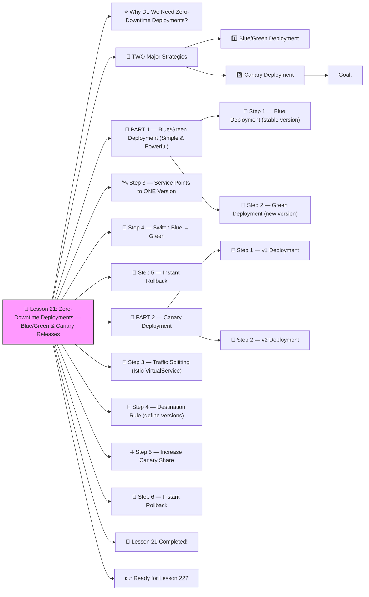

# 🚀 Lesson 21: **Zero-Downtime Deployments — Blue/Green & Canary Releases**




Absolutely! ✔️
Welcome to **Lesson 21**, and this one teaches you something **EVERY real DevOps team MUST master**:

These deployment strategies ensure your users NEVER see downtime — even during updates.

Companies like **Netflix, Google, Amazon, Uber, Shopify** use these EXACT patterns.

We'll make it **beginner-friendly**, practical, and DevOps-GPT strong 🔨🤖🔧

------

# ⭐ Why Do We Need Zero-Downtime Deployments?

Without safe strategies:

❌ Updating your app restarts Pods
 ❌ Users see errors
 ❌ 502/503 outages
 ❌ Bad version gets deployed to 100% users instantly (dangerous!)

With proper deployment strategies:

✔️ No downtime
 ✔️ Gradual rollout
 ✔️ Rollback in seconds
 ✔️ Safer for production traffic
 ✔️ Test new versions without affecting users

------

# 🎯 TWO Major Strategies

## 1️⃣ **Blue/Green Deployment**

Two separate environments:

- **Blue** = current production
- **Green** = new version

Switch users from Blue → Green instantly when ready.

## 2️⃣ **Canary Deployment**

Only a **small % of users** get the new version first.
 If it works → increase gradually.
 If it breaks → rollback instantly.

We will implement BOTH.

------

# 🧱 PART 1 — Blue/Green Deployment (Simple & Powerful)

### Goal:

Have this structure in Kubernetes:

```
frontend-blue    (v1)
frontend-green   (v2)
Service → points to only ONE environment at a time
```

------

## 🧩 Step 1 — Blue Deployment (stable version)

**frontend-blue.yaml**

```yaml
apiVersion: apps/v1
kind: Deployment
metadata:
  name: frontend-blue
spec:
  replicas: 2
  selector:
    matchLabels:
      app: frontend
      version: blue
  template:
    metadata:
      labels:
        app: frontend
        version: blue
    spec:
      containers:
        - name: app
          image: myapp:v1
          ports:
            - containerPort: 80
```

------

## 🧩 Step 2 — Green Deployment (new version)

**frontend-green.yaml**

```yaml
apiVersion: apps/v1
kind: Deployment
metadata:
  name: frontend-green
spec:
  replicas: 2
  selector:
    matchLabels:
      app: frontend
      version: green
  template:
    metadata:
      labels:
        app: frontend
        version: green
    spec:
      containers:
        - name: app
          image: myapp:v2
          ports:
            - containerPort: 80
```

------

# 🛰️ Step 3 — Service Points to ONE Version

**service.yaml**

```yaml
apiVersion: v1
kind: Service
metadata:
  name: frontend
spec:
  selector:
    app: frontend
    version: blue   # Initially pointing to BLUE
  ports:
    - port: 80
      targetPort: 80
```

✔️ Users only see the BLUE version.

------

# 🔄 Step 4 — Switch Blue → Green

When ready:

```yaml
selector:
  app: frontend
  version: green
```

Apply:

```bash
kubectl apply -f service.yaml
```

🎉 Zero downtime.
 Traffic instantly goes to GREEN version.

------

# 🚨 Step 5 — Instant Rollback

If Green fails:

```yaml
selector:
  version: blue
```

Apply again — users return to stable version.

This is why Blue/Green is SO popular.

------

# 🧱 PART 2 — Canary Deployment

**Gradual rollout** based on percentages.

We use **Istio** because it is the industry standard for traffic splitting.

------

## 🧩 Step 1 — v1 Deployment

```yaml
version: v1
image: myapi:v1
```

## 🧩 Step 2 — v2 Deployment

```yaml
version: v2
image: myapi:v2
```

------

# 🚦 Step 3 — Traffic Splitting (Istio VirtualService)

**traffic.yaml**

```yaml
apiVersion: networking.istio.io/v1alpha3
kind: VirtualService
metadata:
  name: api
spec:
  hosts:
    - api
  http:
    - route:
        - destination:
            host: api
            subset: v1
          weight: 90
        - destination:
            host: api
            subset: v2
          weight: 10
```

✔️ 90% of users → v1
 ✔️ 10% of users → v2

This is REAL canary rollout.

------

# 🔧 Step 4 — Destination Rule (define versions)

```yaml
apiVersion: networking.istio.io/v1alpha3
kind: DestinationRule
metadata:
  name: api
spec:
  host: api
  subsets:
    - name: v1
      labels:
        version: v1
    - name: v2
      labels:
        version: v2
```

------

# ➕ Step 5 — Increase Canary Share

If v2 is good:

```yaml
weight: 50
weight: 50
```

Then:

```yaml
weight: 0
weight: 100
```

And now v2 is 100% live.

------

# 🛑 Step 6 — Instant Rollback

If errors spike:

```bash
kubectl apply -f rollback-to-v1.yaml
```

or:

```
v1 = 100%
v2 = 0%
```

Zero downtime rollback in under 1 second.

------

# 🎉 Lesson 21 Completed!

You now understand:

✔️ Blue/Green deployments
 ✔️ Canary deployments
 ✔️ Traffic splitting
 ✔️ Zero-downtime rollouts
 ✔️ Instant safe rollbacks
 ✔️ Service selector switching
 ✔️ Real production deployment patterns

This is *senior DevOps/SRE mastery* 🔥💪

------

# 👉 Ready for Lesson 22?

Choose the next advanced topic:

1. **API Gateway + Service Mesh Routing Architecture**
2. **Kubernetes Backups + Disaster Recovery (Velero)**
3. **GitOps with ArgoCD (FULL automation)**
4. **Cluster Hardening — CIS Benchmarks**
5. **Multi-Cluster Kubernetes (production patterns)**

Which one should we do next?