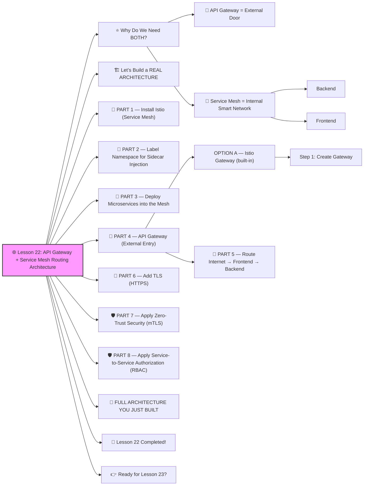

# 🌐 **Lesson 22: API Gateway + Service Mesh Routing Architecture**




Absolutely! ✔️
Welcome to **Lesson 22** — this one is CRITICAL if you're building real microservices or enterprise-grade Kubernetes:

This is how modern companies like Netflix, Google, Uber, Amazon, and Airbnb manage traffic:

✔️ API Gateway — entry point for all **external** traffic
 ✔️ Service Mesh — controls **internal** traffic between microservices

We will build a clear, real-world, production-grade routing architecture.
 Beginner-friendly. Advanced concepts. DevOps-GPT strong.
 🔨🤖🔧

------

# ⭐ Why Do We Need BOTH?

## 🚪 API Gateway = External Door

Controls traffic coming *from the internet* into the cluster.

Provides:

- Rate limiting
- Authentication
- API keys
- Routing
- WAF (security firewall)
- TLS termination
- Logging

Popular gateways:

- **Kong**
- **NGINX Ingress**
- **Istio Gateway**
- **Ambassador**
- **Traefik**

------

## 🔀 Service Mesh = Internal Smart Network

Controls traffic *inside the cluster* between services.

Provides:

- mTLS encryption
- Traffic splitting
- Retries, timeouts
- Observability
- Zero-trust networking
- Cross-service routing
- Canary rollouts
- Circuit breakers

Most popular:

- **Istio**
- **Linkerd**
- **Consul**

------

# 🏗️ Let’s Build a REAL ARCHITECTURE

You will build:

```
[ Internet ]
     ↓
[ API Gateway (Ingress or Kong) ]
     ↓
[ Istio Mesh ]
     ↓
[ Frontend ] → [ Backend ] → [ Database ]
```

This is production-grade design.

------

# 🧱 PART 1 — Install Istio (Service Mesh)

If not installed already:

```bash
curl -L https://istio.io/downloadIstio | sh -
cd istio-1.*/
istioctl install --set profile=demo -y
```

Check:

```bash
kubectl get pods -n istio-system
```

------

# 🧱 PART 2 — Label Namespace for Sidecar Injection

We'll use `prod` namespace:

```bash
kubectl create namespace prod
kubectl label namespace prod istio-injection=enabled
```

✔️ Every Pod gets an Envoy sidecar
 ✔️ Internal mTLS enabled

------

# 🧱 PART 3 — Deploy Microservices into the Mesh

### Backend

```yaml
apiVersion: apps/v1
kind: Deployment
metadata:
  name: backend
  namespace: prod
spec:
  replicas: 2
  selector:
    matchLabels:
      app: backend
      version: v1
  template:
    metadata:
      labels:
        app: backend
        version: v1
    spec:
      containers:
        - name: backend
          image: myorg/backend:v1
          ports:
            - containerPort: 3000
```

### Frontend

```yaml
apiVersion: apps/v1
kind: Deployment
metadata:
  name: frontend
  namespace: prod
spec:
  replicas: 2
  selector:
    matchLabels:
      app: frontend
  template:
    metadata:
      labels:
        app: frontend
    spec:
      containers:
        - name: frontend
          image: myorg/frontend:v1
          ports:
            - containerPort: 80
```

Services (cluster-internal):

```yaml
apiVersion: v1
kind: Service
metadata:
  name: frontend
  namespace: prod
spec:
  selector:
    app: frontend
  ports:
    - port: 80
---
apiVersion: v1
kind: Service
metadata:
  name: backend
  namespace: prod
spec:
  selector:
    app: backend
  ports:
    - port: 3000
```

------

# 🧱 PART 4 — API Gateway (External Entry)

You have **two options**:

## OPTION A — Istio Gateway (built-in)

We’ll use Istio Gateway since you already have Istio.

### Step 1: Create Gateway

**gateway.yaml**

```yaml
apiVersion: networking.istio.io/v1alpha3
kind: Gateway
metadata:
  name: app-gateway
  namespace: prod
spec:
  selector:
    istio: ingressgateway
  servers:
    - port:
        number: 80
        name: http
        protocol: HTTP
      hosts:
        - "*"
```

------

## 🧱 PART 5 — Route Internet → Frontend → Backend

**virtualservice.yaml**

```yaml
apiVersion: networking.istio.io/v1alpha3
kind: VirtualService
metadata:
  name: app-route
  namespace: prod
spec:
  gateways:
    - app-gateway
  hosts:
    - "*"
  http:
    - match:
        - uri:
            prefix: "/api"
      route:
        - destination:
            host: backend
            port:
              number: 3000
    - route:
        - destination:
            host: frontend
            port:
              number: 80
```

✔️ `/api` → backend
 ✔️ everything else → frontend

This is how websites are built in real companies.

------

# 🔐 PART 6 — Add TLS (HTTPS)

Add TLS to your gateway:

```yaml
servers:
  - port:
      number: 443
      name: https
      protocol: HTTPS
    hosts:
      - "shop.example.com"
    tls:
      mode: SIMPLE
      credentialName: tls-secret
```

Provide cert via:

```bash
kubectl create secret tls tls-secret --key privkey.pem --cert cert.pem -n prod
```

✔️ Production-grade HTTPS with Istio Gateway.

------

# 🛡️ PART 7 — Apply Zero-Trust Security (mTLS)

Force all Pods in mesh to require encryption:

```yaml
apiVersion: security.istio.io/v1beta1
kind: PeerAuthentication
metadata:
  name: default
  namespace: prod
spec:
  mtls:
    mode: STRICT
```

Now:

✔️ frontend ↔ backend is encrypted
 ✔️ No service can talk unless allowed

------

# 🛡️ PART 8 — Apply Service-to-Service Authorization (RBAC)

Allow frontend to talk to backend:

```yaml
apiVersion: security.istio.io/v1beta1
kind: AuthorizationPolicy
metadata:
  name: allow-frontend
  namespace: prod
spec:
  selector:
    matchLabels:
      app: backend
  rules:
    - from:
        - source:
            principals: ["cluster.local/ns/prod/sa/default"]
```

Everything else is blocked.

------

# 🎯 FULL ARCHITECTURE YOU JUST BUILT

```
                           +---------------------+
Internet ───────────────▶  │  Istio Ingress GW   │
                           +---------------------+
                                        │
                             (Routing, TLS, Rules)
                                        ▼
                        +-------------------------------+
                        |         Istio Mesh            |
                        |  (mTLS, RBAC, Tracing, etc.)  |
                        +-------------------------------+
                          │                     │
                    / (root)                /api route
                  frontend ───────────▶ backend ─────▶ database
```

✔️ mTLS
 ✔️ Authorization
 ✔️ Routing rules
 ✔️ API Gateway
 ✔️ Service Mesh
 ✔️ Secure architecture

This is **exactly** what companies deploy.

------

# 🎉 Lesson 22 Completed!

You now understand:

✔️ API Gateways (Ingress, Kong, Istio)
 ✔️ Service Mesh (Istio)
 ✔️ External vs Internal routing
 ✔️ Traffic rules & routing
 ✔️ TLS for production
 ✔️ Zero-trust networking
 ✔️ Full microservice routing architecture

This is **enterprise-level DevOps** — you’re learning insanely fast 🔥💪

------

# 👉 Ready for Lesson 23?

Choose the next advanced topic:

1. **Kubernetes Backups + Disaster Recovery (Velero)**
2. **GitOps with ArgoCD (Complete automation)**
3. **CIS Kubernetes Hardening (security benchmarks)**
4. **Multi-Cluster Kubernetes Architecture**
5. **Kubernetes Cost Optimization (real-world FinOps)**

Which one should we do next?