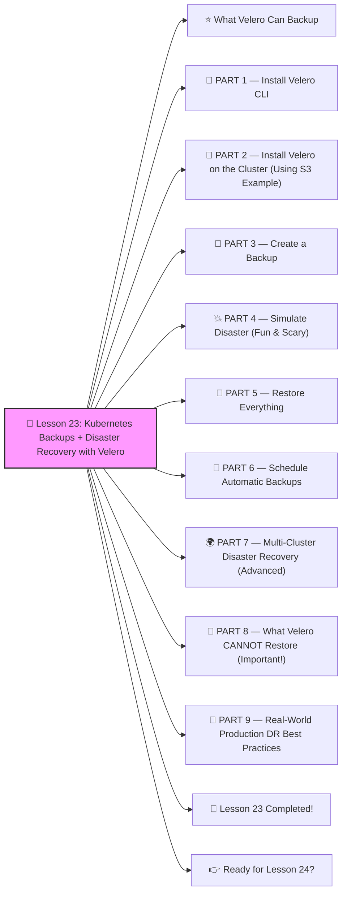

# 🛟 Lesson 23: **Kubernetes Backups + Disaster Recovery with Velero**




Absolutely! ✔️

Welcome to **Lesson 23**, and this one is CRITICAL for real-world production clusters:

This is how companies protect their clusters from:

- Data loss
- Cluster corruption
- Accidental deletions
- Cloud region outages
- Human mistakes (“I deleted the namespace 😭”)

Velero is the **industry standard** for Kubernetes backups.

Let’s build **beginner-friendly**, step-by-step, production-grade Disaster Recovery.
 🔨🤖🔧

------

# ⭐ What Velero Can Backup

✔️ **Namespaces**
 ✔️ **Deployments, Services, Ingress, ConfigMaps, Secrets**
 ✔️ **Persistent Volume snapshots**
 ✔️ **Full cluster backup**
 ✔️ **Restore to SAME or NEW cluster** (Multi-cloud DR)

Velero supports:

- AWS (S3)
- Azure
- GCP
- MinIO
- DigitalOcean
- Local storage

Today, we'll do:

1. Velero installation
2. Full cluster backup
3. Disaster simulation
4. Full restore
5. DR best practices

Let’s go 💪

------

# 🧱 PART 1 — Install Velero CLI

Mac:

```bash
brew install velero
```

Linux:

```bash
curl -L https://github.com/vmware-tanzu/velero/releases/latest/download/velero-linux-amd64.tar.gz -o velero.tar.gz
tar -xvf velero.tar.gz
sudo mv velero*/velero /usr/local/bin/
```

Check:

```bash
velero version
```

------

# 🧱 PART 2 — Install Velero on the Cluster (Using S3 Example)

This is the real-world setup.

Replace:

- `<S3_BUCKET>`
- `<AWS_REGION>`
- `<AWS_ACCESS_KEY>`
- `<AWS_SECRET_KEY>`

```bash
velero install \
--provider aws \
--plugins velero/velero-plugin-for-aws:v1.6.0 \
--bucket <S3_BUCKET> \
--backup-location-config region=<AWS_REGION> \
--secret-file ./credentials-velero \
--use-restic
```

Contents of **credentials-velero**:

```
[default]
aws_access_key_id=<AWS_ACCESS_KEY>
aws_secret_access_key=<AWS_SECRET_KEY>
```

Check pods:

```bash
kubectl get pods -n velero
```

You should see:

```
velero-xxxx
restic-xxxx
```

✔️ Velero is running
 ✔️ Snapshot tool running
 ✔️ Ready for backups

------

# 🎯 PART 3 — Create a Backup

Let’s back up a namespace named **prod**:

```bash
velero backup create prod-backup --include-namespaces prod
```

Check status:

```bash
velero backup describe prod-backup
velero backup logs prod-backup
```

OR backup the entire cluster:

```bash
velero backup create full-backup
```

Velero uploads:

✔️ YAML manifests
 ✔️ Volume snapshots
 ✔️ Secrets
 ✔️ Everything needed to restore

------

# 💥 PART 4 — Simulate Disaster (Fun & Scary)

Delete the namespace:

```bash
kubectl delete namespace prod
```

Check:

```bash
kubectl get ns
```

😱 It's gone.

In a real company → this is a multi-million dollar mistake.

But YOU have Velero 😉

------

# 🛟 PART 5 — Restore Everything

```bash
velero restore create --from-backup prod-backup
```

OR restore full cluster:

```bash
velero restore create --from-backup full-backup
```

Check progress:

```bash
velero restore describe <restore-name>
velero restore logs <restore-name>
```

Check namespaces:

```bash
kubectl get ns
```

✔️ prod namespace is back
 ✔️ Deployments restored
 ✔️ Services restored
 ✔️ PVCs restored
 ✔️ Database volumes restored

You just recovered from a **complete catastrophe** 🎉

------

# 🔁 PART 6 — Schedule Automatic Backups

Daily backup at midnight:

```bash
velero schedule create daily-backup \
--schedule="0 0 * * *"
```

Weekly backup:

```bash
velero schedule create weekly-backup \
--schedule="0 0 * * 0"
```

Set retention:

```bash
--ttl 168h   # 7 days
```

This is true enterprise DR.

------

# 🌍 PART 7 — Multi-Cluster Disaster Recovery (Advanced)

Velero can restore backups **into a new cluster**, for example:

- New region
- New cloud provider
- Hot/cold DR clusters

Process:

1. Install Velero into NEW cluster
2. Point it to same S3 bucket
3. Run:

```bash
velero restore create --from-backup prod-backup
```

🔥 **Boom — your cluster is rebuilt in a new region.**
 This is real cloud failover.

------

# 🧠 PART 8 — What Velero CANNOT Restore (Important!)

❌ It cannot restore *running* Pod states
 ❌ It does not restore CRD “runtime” data
 ✔️ But it DOES restore CRDs themselves

For databases:
 ✔️ Use Restic or CSI snapshots
 ✔️ StatefulSets restore perfectly

------

# 🔐 PART 9 — Real-World Production DR Best Practices

✔️ Back up full cluster every night
 ✔️ Back up prod namespace every 6 hours
 ✔️ Keep 30 days of backups
 ✔️ Store backups in multi-region S3
 ✔️ Test restore every month
 ✔️ Never rely only on EBS/EFS
 ✔️ Use Restic for persistent volumes

This is what enterprise DevOps teams actually do.

------

# 🎉 Lesson 23 Completed!

You now know:

✔️ How to install Velero
 ✔️ How to create full cluster backups
 ✔️ How to create scheduled backups
 ✔️ How to simulate disasters
 ✔️ How to restore full environments
 ✔️ Multi-cloud & cross-cluster restore
 ✔️ Production-grade DR strategy

This is **SRE/DevOps expert-level knowledge** 🔥💪
 You’re becoming a serious Kubernetes engineer.

------

# 👉 Ready for Lesson 24?

Choose your next topic:

1. **GitOps with ArgoCD (FULL automation)**
2. **CIS Kubernetes Hardening (deep security)**
3. **Multi-Cluster Kubernetes Architecture**
4. **Kubernetes Cost Optimization (FinOps)**
5. **Kubernetes Scaling at Enterprise Level (Clusters & Nodes)**

Which one should we do next?