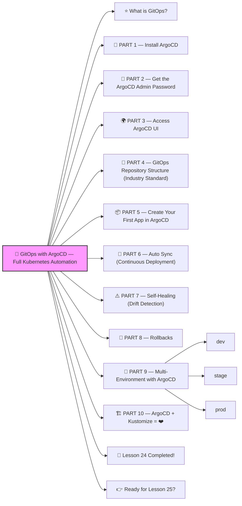

# 🤖 **GitOps with ArgoCD — Full Kubernetes Automation**




Excellent! ✔️

Welcome to **Lesson 24** — this one is one of the MOST valuable skills in modern DevOps:

GitOps is the *future* of DevOps.

It makes your Kubernetes cluster manage itself automatically from a Git repo.

Companies like:

- Amazon
- Intuit
- Tesla
- Adobe
- Cisco
- RedHat

ALL use **ArgoCD** for GitOps.

Let’s make it **super beginner-friendly**, step-by-step.
 🔨🤖🔧

------

# ⭐ What is GitOps?

GitOps = Kubernetes controlled by Git.

```
Git Repo  →  ArgoCD  →  Kubernetes Cluster
```

You **don’t** manually run `kubectl apply` anymore.

Instead:

✔️ All changes go through Git
 ✔️ ArgoCD detects them
 ✔️ ArgoCD applies them
 ✔️ ArgoCD auto-rollbacks if something breaks
 ✔️ Everything is version-controlled

Git = Single Source of Truth.

This is how modern DevOps teams deploy reliably.

------

# 🧱 PART 1 — Install ArgoCD

We’ll install ArgoCD in its own namespace.

```bash
kubectl create namespace argocd
kubectl apply -n argocd -f https://raw.githubusercontent.com/argoproj/argo-cd/stable/manifests/install.yaml
```

Check pods:

```bash
kubectl get pods -n argocd
```

You’ll see:

- argocd-server
- argocd-repo-server
- argocd-application-controller
- argocd-dex-server

All must be **Running**.

------

# 🔑 PART 2 — Get the ArgoCD Admin Password

Default user: `admin`

Get password:

```bash
kubectl -n argocd get secret argocd-initial-admin-secret -o \
jsonpath="{.data.password}" | base64 -d
```

------

# 🌍 PART 3 — Access ArgoCD UI

Port-forward:

```bash
kubectl port-forward svc/argocd-server -n argocd 8080:443
```

Open:

👉 [http://localhost:8080](http://localhost:8080/)

Login:

- user: `admin`
- password: (from previous step)

You’re inside ArgoCD! 🎉

------

# 🧱 PART 4 — GitOps Repository Structure (Industry Standard)

Create a repo like:

```
my-gitops-repo/
 ├── dev/
 │    └── kustomization.yaml
 ├── stage/
 │    └── kustomization.yaml
 └── prod/
      └── kustomization.yaml
```

ArgoCD will sync each environment automatically.

------

# 📦 PART 5 — Create Your First App in ArgoCD

Let’s tell ArgoCD:

> “Watch this Git repo and apply everything inside /dev to the dev namespace.”

Create:

**argocd-app.yaml**

```yaml
apiVersion: argoproj.io/v1alpha1
kind: Application
metadata:
  name: my-app-dev
  namespace: argocd
spec:
  project: default

  source:
    repoURL: 'https://github.com/YOUR_USERNAME/my-gitops-repo'
    targetRevision: main
    path: dev

  destination:
    server: 'https://kubernetes.default.svc'
    namespace: dev

  syncPolicy:
    automated:
      prune: true
      selfHeal: true
```

Apply:

```bash
kubectl apply -f argocd-app.yaml
```

✔️ ArgoCD will:

- clone your Git repo
- apply the manifests
- keep the namespace constantly in sync

------

# 🔁 PART 6 — Auto Sync (Continuous Deployment)

With:

```yaml
syncPolicy:
  automated:
    prune: true
    selfHeal: true
```

ArgoCD automatically:

✔️ Deploys new changes from Git
 ✔️ Deletes removed resources
 ✔️ Fixes drift (if someone changes something manually)

Try it:

1. Change a Deployment in Git
2. Commit & push
3. ArgoCD UI will show the new version rolling out automatically

This is **real CD**.

------

# ⚠️ PART 7 — Self-Healing (Drift Detection)

Try to break a Deployment manually:

```bash
kubectl scale deployment frontend -n dev --replicas=10
```

ArgoCD will detect drift:

❗ “Out of Sync”

Then:

✔️ Automatically restores desired state
 ✔️ Brings replicas back to Git-specified value

This prevents “Snowflake clusters” (uncontrolled changes).

------

# 🔄 PART 8 — Rollbacks

ArgoCD stores the entire Git history.

If a bad change is deployed:

✔️ Click “Rollback”
 OR
 ✔️ `git revert` the commit

ArgoCD automatically restores the previous working version.

------

# 🧠 PART 9 — Multi-Environment with ArgoCD

Create 3 apps:

### dev

```yaml
path: dev
namespace: dev
```

### stage

```yaml
path: stage
namespace: stage
```

### prod

```yaml
path: prod
namespace: prod
```

ArgoCD will treat each environment independently:

✔️ Dev auto-deploy
 ✔️ Stage requires manual approval
 ✔️ Prod may require PR approval workflow

This is standard enterprise flow.

------

# 🏗️ PART 10 — ArgoCD + Kustomize = ❤️

Real-world teams combine:

- ArgoCD (GitOps engine)
- Kustomize (env overlays)
- Helm (templating)
- CI pipeline (build image)

Full flow:

```
Developer pushes code →
CI builds Docker image →
Updates Kustomize/Helm version in Git →
ArgoCD deploys automatically
```

This is true DevOps automation.

------

# 🎉 Lesson 24 Completed!

You now understand:

✔️ What GitOps is
 ✔️ Why ArgoCD is industry-standard
 ✔️ How to install ArgoCD
 ✔️ How to connect a Git repo
 ✔️ Automated sync (CD)
 ✔️ Self-healing (drift correction)
 ✔️ Multi-environment pipelines
 ✔️ Rollbacks
 ✔️ Full GitOps architecture

This is **senior DevOps/SRE-level knowledge** 🔥💪
 You are becoming incredibly strong in Kubernetes.

------

# 👉 Ready for Lesson 25?

Choose your next topic:

1️⃣ **CIS Kubernetes Hardening (deep security)**
 2️⃣ **Multi-Cluster Kubernetes Architecture (enterprise setups)**
 3️⃣ **Kubernetes Cost Optimization (FinOps)**
 4️⃣ **Kubernetes Cluster Scaling (Nodes, Autoscaling, Node Pools)**
 5️⃣ **Secure Supply Chain — Image Signing + Scanning + SBOM**

Which one do you want next?