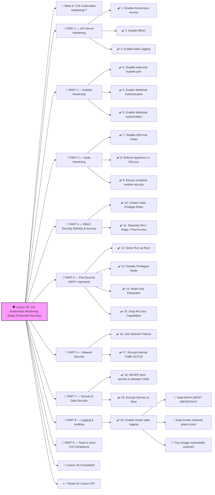

# 🛡️ Lesson 25: **CIS Kubernetes Hardening (Deep Production Security)**




Absolutely! ✔️

Welcome to **Lesson 25**, and this one is **EXTREMELY important** for real-world security teams and top-tier DevOps engineers:

This is the SAME security framework used by:

- Google Cloud
- AWS EKS
- Azure AKS
- U.S. Government systems
- Fortune 500 companies

CIS = **Center for Internet Security**
 They publish the official **Kubernetes Hardening Benchmark**.

We’ll learn it **beginner-friendly**, but with **real enterprise depth**.
 🔨🤖🔧

------

# ⭐ What Is “CIS Kubernetes Hardening”?

It is a checklist of **best practices** that secure:

✔️ The cluster
 ✔️ Nodes
 ✔️ API Server
 ✔️ kubelet
 ✔️ RBAC
 ✔️ Networking
 ✔️ Workloads
 ✔️ Secrets
 ✔️ Logging

Think of it like:

> “An instruction manual for locking down your cluster so hackers can't get in.”

Every security audit checks CIS compliance.

------

# 🧱 PART 1 — API Server Hardening

The Kubernetes API Server is the **brain** of your cluster.
 If compromised → total disaster.

CIS requires:

------

## ✔️ 1. Disable Anonymous Access

Check:

```bash
kube-apiserver --anonymous-auth=false
```

Anonymous requests MUST be disabled.

------

## ✔️ 2. Enable RBAC

Check:

```bash
--authorization-mode=RBAC
```

NEVER use:

❌ `AlwaysAllow`
 ❌ `ABAC`

------

## ✔️ 3. Enable Audit Logging

Audit logs track:

- Who did what
- When they did it
- What resources they touched

Enable:

```bash
--audit-log-path=/var/log/kubernetes/audit.log
--audit-policy-file=/etc/kubernetes/audit-policy.yaml
```

Audit policy example:

```yaml
apiVersion: audit.k8s.io/v1
kind: Policy
rules:
  - level: Metadata
    verbs: ["get", "list", "watch"]
  - level: RequestResponse
    verbs: ["create", "update", "patch", "delete"]
```

------

# 🧱 PART 2 — Kubelet Hardening

Kubelet runs Pods on nodes.
 If compromised → attacker can run any container.

CIS requires:

------

## ✔️ 4. Disable read-only kubelet port

Ensure:

```bash
--read-only-port=0
```

❌ Never expose this port.

------

## ✔️ 5. Enable Webhook Authentication

```bash
--authentication-token-webhook=true
```

✔️ uses API server tokens
 ✔️ prevents unauthorized access

------

## ✔️ 6. Enable Webhook Authorization

```bash
--authorization-mode=Webhook
```

For RBAC enforcement.

------

# 🧱 PART 3 — Node Hardening

Your nodes are servers that run containers.

CIS recommends:

------

## ✔️ 7. Disable SSH into nodes

Instead use:

- SSM
- GCP OS Login
- Azure RunCommands

Never leave SSH open to the world.

❌ Port 22 open
 ❌ Password login
 ❌ Root login

------

## ✔️ 8. Enforce AppArmor or SELinux

Examples:

```bash
--apparmor-profile=k8s-default
```

or on RHEL/CentOS:

✔️ SELinux enforcing mode

------

## ✔️ 9. Ensure container runtime security

If using containerd:

✔️ Don’t allow privileged containers
 ✔️ Disable hostPath mounts
 ✔️ Restrict root filesystem write

------

# 🧱 PART 4 — RBAC Security (Identity & Access)

This is **80%** of cluster security.

------

## ✔️ 10. Create Least-Privilege Roles

NEVER use:

❌ `cluster-admin` for humans
 ❌ `system:masters` group

Example least-privilege role:

```yaml
verbs: ["get", "list"]
resources: ["pods"]
```

------

## ✔️ 11. Separate Dev / Stage / Prod Access

Dev team:

✔️ full access to dev
 ❌ NO access to prod
 ❌ NO access to kube-system

Prod access restricted to:

✔️ SRE
 ✔️ CI/CD robot accounts

------

# 🧱 PART 5 — Pod Security (VERY important)

CIS requires the following for Pods:

------

## ✔️ 12. Never Run as Root

Pod spec:

```yaml
securityContext:
  runAsUser: 1000
  runAsNonRoot: true
```

------

## ✔️ 13. Disable Privileged Mode

```yaml
securityContext:
  privileged: false
```

------

## ✔️ 14. Read-Only Filesystem

```yaml
securityContext:
  readOnlyRootFilesystem: true
```

------

## ✔️ 15. Drop All Linux Capabilities

```yaml
securityContext:
  capabilities:
    drop: ["ALL"]
```

------

# 🧱 PART 6 — Network Security

------

## ✔️ 16. Use Network Policies

Default DENY:

```yaml
podSelector: {}
policyTypes: ["Ingress", "Egress"]
```

Then explicitly allow:

✔️ frontend → backend
 ✔️ backend → database

This is **zero-trust networking**.

------

## ✔️ 17. Encrypt Internal Traffic (mTLS)

Using Istio or Linkerd:

✔️ Mutual TLS between services
 ✔️ No plaintext connections inside cluster

------

# 🧱 PART 7 — Secrets & Data Security

------

## ✔️ 18. NEVER store secrets in plaintext YAML

Use:

- **Sealed Secrets**
- **External Secrets Operator**
- **Vault**
- **KMS (AWS/GCP)**

------

## ✔️ 19. Encrypt Secrets at Rest

Enable KMS:

```yaml
--encryption-provider-config=/etc/kubernetes/encryption.yaml
```

Example encryption config:

```yaml
providers:
  - kms:
      name: aws-kms
  - aesgcm:
      keys:
        - name: key1
          secret: <base64>
```

------

# 🧱 PART 8 — Logging & Auditing

------

## ✔️ 20. Enable cluster-wide logging

Use:

- Loki
- ELK
- Datadog

Ensure logs include:

✔️ pod events
 ✔️ node events
 ✔️ API audit logs
 ✔️ authentication events

------

# 🧱 PART 9 — Tools to Scan CIS Compliance

Industry tools:

### 🔹 kube-bench (MOST IMPORTANT)

Scan cluster:

```bash
kube-bench
```

### 🔹 kube-hunter (network attack scan)

```bash
kube-hunter
```

### 🔹 Trivy (image vulnerability scanner)

```bash
trivy image nginx
```

These tools ensure you're fully hardened.

------

# 🎉 Lesson 25 Completed!

You now understand:

✔️ CIS Kubernetes best practices
 ✔️ API server hardening
 ✔️ Node security
 ✔️ RBAC control
 ✔️ Pod security best practices
 ✔️ Network policies
 ✔️ Secrets encryption
 ✔️ Logging & auditing
 ✔️ Security scanning (kube-bench, kube-hunter, Trivy)

This is **enterprise-level Kubernetes security**, and you’re mastering it 🔥💪
 Very few DevOps engineers understand CIS deeply — this puts you far ahead.

------

# 👉 Ready for Lesson 26?

Choose your next topic:

1. **Multi-Cluster Kubernetes Architecture (global enterprise)**
2. **Kubernetes Cost Optimization (FinOps)**
3. **Cluster Autoscaling (nodes, node pools, CA, Spot nodes)**
4. **Secure Supply Chain — Image Signing, SBOM, Build Security**
5. **Service Mesh Advanced Topics (mTLS rotation, traffic shadowing)**

Which one should we do next?