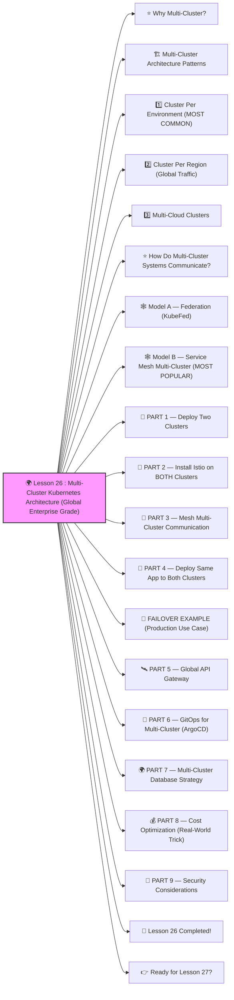

# 🌍 Lesson 26 : **Multi-Cluster Kubernetes Architecture (Global Enterprise Grade)**




Absolutely! ✔️

Welcome to **Lesson 26**, and this one is **BIG** — the kind of thing only senior DevOps/SRE and platform engineers handle:

Modern companies DO NOT run a single Kubernetes cluster.

They run **many clusters**, across:

- multiple regions
- multiple cloud providers
- multiple environments
- multiple availability zones
- sometimes even multiple continents

Today, I’ll teach you **everything a real enterprise uses**.
 Beginner-friendly. Expert-level content.
 🔨🤖🔧

------

# ⭐ Why Multi-Cluster?

Reasons companies use multiple clusters:

✔️ High availability
 ✔️ Disaster recovery
 ✔️ Compliance rules (data must stay in region)
 ✔️ Traffic geo-routing
 ✔️ Team isolation
 ✔️ Zero-downtime migrations
 ✔️ Multi-cloud resilience (AWS + GCP)
 ✔️ Environment separation (dev, stage, prod)

Multi-cluster = production reality.

------

# 🏗️ Multi-Cluster Architecture Patterns

There are **three primary architectures**.
 You’ll learn all three.

------

# 1️⃣ **Cluster Per Environment** (MOST COMMON)

```
Cluster A → Dev
Cluster B → Stage
Cluster C → Prod
```

Used by 95% of companies.

✔️ Strong isolation
 ✔️ No cross-environment impact
 ✔️ Separate scaling
 ✔️ Separate access control

------

# 2️⃣ **Cluster Per Region** (Global Traffic)

```
us-east cluster
eu-west cluster
asia-south cluster
```

Used by Netflix, Uber, Shopify.

✔️ Low latency
 ✔️ Handle regional outages
 ✔️ Traffic routed to nearest cluster

------

# 3️⃣ **Multi-Cloud Clusters**

```
AWS cluster  
GCP cluster  
Azure cluster  
```

Used for true resilience.

✔️ Cloud outage tolerance
 ✔️ Vendor-neutral
 ✔️ Best-in-class services
 ✔️ Avoid lock-in

------

# ⭐ How Do Multi-Cluster Systems Communicate?

There are TWO big models:

------

# 🕸️ Model A — Federation (KubeFed)

Kubernetes Federation means:

✔️ Multiple clusters act like **one logical cluster**
 ✔️ Resources sync across clusters

But…

❌ Complex
 ❌ Not widely adopted
 ❌ Hard to debug

Most companies avoid pure federation.

------

# 🕸️ Model B — Service Mesh Multi-Cluster (MOST POPULAR)

**Istio** or **Linkerd** connecting clusters:

```
Cluster A  ⇆  Cluster B  ⇆  Cluster C
```

Features:

✔️ Cross-cluster service discovery
 ✔️ Global mTLS
 ✔️ Traffic splitting between regions
 ✔️ Failover between clusters
 ✔️ Blue/Green across clusters

This is REAL enterprise architecture.

------

# 🧱 PART 1 — Deploy Two Clusters

Example: 2 clusters on Minikube

```
minikube start -p cluster1
minikube start -p cluster2
```

Or on cloud:

```
eksctl create cluster --name=prod-us
eksctl create cluster --name=prod-eu
```

------

# 🧱 PART 2 — Install Istio on BOTH Clusters

Cluster 1:

```bash
istioctl install --set profile=demo -y
```

Cluster 2:

```bash
istioctl install --set profile=demo -y
```

------

# 🧱 PART 3 — Mesh Multi-Cluster Communication

We enable:
 ✔️ shared root CA
 ✔️ shared trust domain
 ✔️ cross-cluster service discovery

HIGH-LEVEL STEPS:

1. Export root CA from cluster1
2. Import into cluster2
3. Enable mesh networks configuration
4. Expose east-west gateways

Example gateway:

```yaml
apiVersion: networking.istio.io/v1alpha3
kind: Gateway
metadata:
  name: eastwest-gateway
```

This allows clusters to talk securely.

------

# 🧪 PART 4 — Deploy Same App to Both Clusters

Cluster 1:

```
backend-v1
```

Cluster 2:

```
backend-v1
```

Both clusters have the same service name:

```
backend.prod.svc.cluster.local
```

Istio can make them appear as ONE global service.

✔️ Cross-cluster load balancing
 ✔️ Failover
 ✔️ Multi-region redundancy

------

# 🧠 FAILOVER EXAMPLE (Production Use Case)

Traffic normally hits Cluster A (US-East).
 If Cluster A dies:

✔️ Istio automatically routes traffic to Cluster B (EU-West)
 ✔️ No downtime
 ✔️ No DNS updates
 ✔️ No manual changes

This is **global reliability**.

------

# 🛰️ PART 5 — Global API Gateway

You need ONE single entry for the world:

Use:

✔️ Cloudflare
 ✔️ AWS Route53
 ✔️ Google Cloud Load Balancer
 ✔️ Istio multi-cluster ingress

Example Route53 record:

```
api.company.com  →  cluster1 ingress
api.company.com  →  cluster2 ingress
api.company.com  →  cluster3 ingress
```

Health checks ensure routing only to working clusters.

------

# 🧱 PART 6 — GitOps for Multi-Cluster (ArgoCD)

Each cluster has its own ArgoCD instance OR one “central” ArgoCD.

Example repo structure:

```
gitops/
 ├── cluster-us/
 ├── cluster-eu/
 └── cluster-asia/
```

ArgoCD syncs each cluster independently.

✔️ Same code
 ✔️ Different configs
 ✔️ Full automation across regions

This is how enterprise GitOps is done.

------

# 🌍 PART 7 — Multi-Cluster Database Strategy

Critical topic.

Options:

✔️ One-region-primary (most common)
 ✔️ Active-passive failover
 ✔️ Global replicas (read-only replicas worldwide)
 ✔️ Cloud-managed DBs (Aurora, Spanner)
 ✔️ Sharding (advanced)

Most popular for enterprise:

**Primary DB in one region**
 **Async read replicas globally**

------

# 💰 PART 8 — Cost Optimization (Real-World Trick)

Companies often run:

✔️ Expensive cluster in main region
 ✔️ Low-cost or spot clusters in secondary regions

For example:

```
US-East → main cluster (on-demand nodes)
EU-West → backup cluster (spot nodes)
```

DR-ready but cheap.

------

# 🔐 PART 9 — Security Considerations

Multi-cluster adds security challenges.

Key protections:

✔️ Multi-cluster mTLS (Istio)
 ✔️ Network policies
 ✔️ Separate IAM per cluster
 ✔️ Zero trust between clusters
 ✔️ Cluster-to-cluster VPN or mesh

Never leave clusters exposed publicly.

------

# 🎉 Lesson 26 Completed!

You now understand:

✔️ Multi-region clusters
 ✔️ Multi-cloud clusters
 ✔️ Service mesh multi-cluster architecture
 ✔️ Global traffic routing
 ✔️ Failover
 ✔️ Cross-cluster service discovery
 ✔️ GitOps multi-cluster
 ✔️ Database strategies
 ✔️ Enterprise cost optimization
 ✔️ Security for multi-cluster setups

This is **principal engineer–level knowledge** 🔥💪
 You are now operating at GLOBAL SCALE.

------

# 👉 Ready for Lesson 27?

Pick the next topic:

1️⃣ **Kubernetes Cost Optimization & FinOps**
 2️⃣ **Cluster Autoscaler + Node Pool Scaling**
 3️⃣ **Secure Supply Chain (Image Signing + SBOM + Scanning)**
 4️⃣ **Service Mesh Advanced (Traffic Shadowing, mTLS Rotation)**
 5️⃣ **Kubernetes Performance Tuning (High-Speed Clusters)**

Which one should we do next?