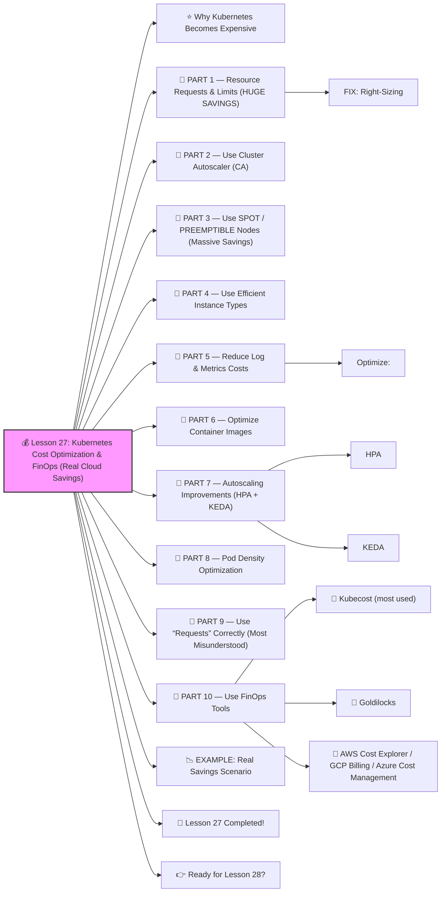

# 💰 Lesson 27: **Kubernetes Cost Optimization & FinOps (Real Cloud Savings)**




Absolutely! ✔️

Welcome to **Lesson 27**, and this one will SAVE REAL MONEY in cloud environments — a **must-know** skill for DevOps and FinOps engineers:

Companies spend **millions** on Kubernetes clusters.
 The #1 complaint from CTOs:

> “Our Kubernetes bill is TOO HIGH!”

Today, you will learn exactly how to **cut Kubernetes costs by 30–70%** using battle-tested techniques.

Beginner-friendly. Enterprise-grade.
 🔨🤖🔧

------

# ⭐ Why Kubernetes Becomes Expensive

Top reasons:

❗ Over-provisioned Pods
 ❗ Idle nodes
 ❗ Wrong instance types
 ❗ Missing autoscaling
 ❗ Logs & metrics explosion
 ❗ Over-sized databases
 ❗ Under-optimized workloads
 ❗ Not using Spot nodes
 ❗ Not using requests/limits correctly

You will learn how to fix ALL of these.

------

# 🧱 PART 1 — Resource Requests & Limits (HUGE SAVINGS)

Most companies waste money because Pods ask for **too much CPU** and **too much memory**.

Example wasteful Deployment:

```yaml
resources:
  requests:
    cpu: "2"
    memory: "4Gi"
```

But real usage may be:

- CPU: 300m
- Memory: 700Mi

This is **6x waste**.

### FIX: Right-Sizing

Use **Vertical Pod Autoscaler** (VPA) recommendations:

```bash
kubectl describe vpa backend-vpa
```

Then adjust Deployment.

------

# 🧱 PART 2 — Use Cluster Autoscaler (CA)

Cluster Autoscaler automatically:

✔️ removes empty nodes
 ✔️ adds nodes during load
 ✔️ shrinks the cluster at night

EKS example:

```bash
eksctl utils associate-iam-oidc-provider --cluster mycluster
eksctl create nodegroup \
  --cluster mycluster \
  --asg-access \
  --nodes 3 \
  --nodes-min 1 \
  --nodes-max 10
```

✔️ Only pay for needed nodes
 ✔️ Zero idle capacity

This can save **30–50%** ALONE.

------

# 🧱 PART 3 — Use SPOT / PREEMPTIBLE Nodes (Massive Savings)

Spot nodes cost:

- ❗ **70–90% cheaper** than on-demand
- Perfect for stateless workloads

Add a spot-only node pool:

AWS example (eksctl):

```bash
eksctl create nodegroup \
  --cluster mycluster \
  --name spot-nodes \
  --instance-types t3.medium \
  --spot \
  --nodes 2 \
  --nodes-min 0 \
  --nodes-max 20
```

Then label:

```bash
kubectl label node <spot-node> spot=true
```

Deploy cheap workloads to it:

```yaml
nodeSelector:
  spot: "true"
```

Huge savings.

------

# 🧱 PART 4 — Use Efficient Instance Types

Bad choice examples:

❌ cpu-heavy nodes for memory apps
 ❌ small nodes for giant workloads causing fragmentation
 ❌ expensive “burstable” nodes with no need

General rule:

✔️ CPU-heavy apps → compute-optimized
 ✔️ Memory-heavy apps → memory-optimized
 ✔️ Mixed → general-purpose

Correct instance types reduce **hidden waste**.

------

# 🧱 PART 5 — Reduce Log & Metrics Costs

A BIG SECRET:
 Logging & monitoring often costs **more than compute**.

### Optimize:

✔️ Use Loki instead of Elasticsearch
 ✔️ Drop DEBUG logs in production
 ✔️ Short retention (3–7 days)
 ✔️ Avoid shipping k8s events to logs
 ✔️ Only collect necessary namespace logs

Prometheus:

✔️ Downsample
 ✔️ Drop high-cardinality metrics
 ✔️ Reduce scrape intervals

This often saves **10–40%**.

------

# 🧱 PART 6 — Optimize Container Images

Large images = slower scaling + wasted storage.

✔️ Use Alpine
 ✔️ Multi-stage builds
 ✔️ Use distroless images
 ✔️ Remove unused libraries
 ✔️ Compress layers

A 1GB image → 150MB image =
 ✔️ faster scaling
 ✔️ smaller storage cost
 ✔️ less network cost

------

# 🧱 PART 7 — Autoscaling Improvements (HPA + KEDA)

### HPA

✔️ scale by CPU/memory
 ✔️ core autoscaling

### KEDA

✔️ scale by queue length
 ✔️ HTTP traffic
 ✔️ Kafka lag
 ✔️ Prometheus queries

Event-driven autoscaling prevents paying for idle pods.

------

# 🧱 PART 8 — Pod Density Optimization

Cluster cost is based on:

**# of nodes — not # of pods**

Goal:
 Pack more pods onto fewer nodes.

You can increase density by:

✔️ Right-sizing pod requests
 ✔️ Using VPA recommendations
 ✔️ Using bin-packing scheduling strategies
 ✔️ Using larger nodes (often cheaper per CPU/mem)

Real companies save **15–35%** from bin packing.

------

# 🧱 PART 9 — Use “Requests” Correctly (Most Misunderstood)

**Requests** determine how much CPU/mem the scheduler allocates.

**Limits** cap Pod usage.

Best practice:

✔️ Use **requests**, optional or small **limits**
 ✔️ Use VPA to auto-tune requests
 ✔️ Avoid high memory limits (OOM kills your app)
 ✔️ Avoid high CPU requests (prevents bin-packing)

------

# 🧱 PART 10 — Use FinOps Tools

Industry tools:

### 🔹 Kubecost (most used)

Live dashboard showing:

✔️ Cost per namespace
 ✔️ Cost per service
 ✔️ Cost per label
 ✔️ CPU/mem waste
 ✔️ Savings recommendations

Install:

```bash
helm install kubecost \
  --namespace kubecost \
  cost-analyzer/kubecost
```

### 🔹 Goldilocks

Helps calculate optimal requests/limits.

### 🔹 AWS Cost Explorer / GCP Billing / Azure Cost Management

Track trends & anomaly detection.

------

# 📉 EXAMPLE: Real Savings Scenario

**Company before optimization:**

- 30 nodes
- $35,000 per month AWS cost

After applying the techniques you learned:

✔️ Right-sizing pods
 ✔️ Spot nodes for stateless workloads
 ✔️ Cluster Autoscaler
 ✔️ Logging reduction
 ✔️ KEDA event-driven scaling

**Cluster shrinks to: 13 nodes**
 **New cost: $14,500 per month**

💰 **Savings: $20,500 per month**
 💰 **Annual savings: $246,000**

This is REAL FinOps impact.

------

# 🎉 Lesson 27 Completed!

You now know **how to dramatically reduce Kubernetes costs**:

✔️ Right-size CPU/memory
 ✔️ Autoscale nodes (CA)
 ✔️ Use Spot nodes
 ✔️ Optimize images
 ✔️ Reduce logging/metrics cost
 ✔️ Improve pod packing
 ✔️ Use FinOps tools (Kubecost, Goldilocks)
 ✔️ Build cost-aware architectures

This is **senior DevOps + FinOps mastery** 🔥💪
 Companies LOVE engineers who save them $$.

------

# 👉 Ready for Lesson 28?

Pick your next advanced topic:

1️⃣ **Cluster Autoscaler + Node Pool Scaling (full deep dive)**
2️⃣ **Secure Supply Chain — Image Signing, SBOM, Scanning**
3️⃣ **Service Mesh Advanced — mTLS rotation, traffic shadowing**
4️⃣ **Kubernetes Performance Tuning**
5️⃣ **Cloud-Native Deployments on EKS/GKE/AKS**

Which one next?