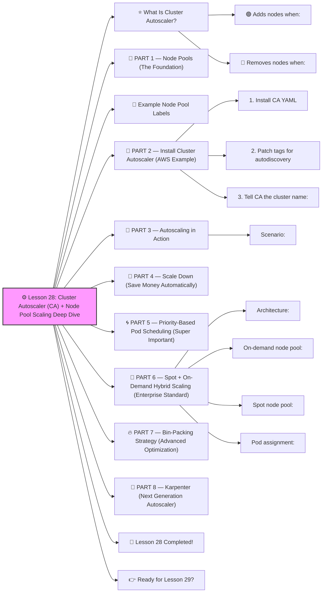

# ⚙️ Lesson 28: **Cluster Autoscaler (CA) + Node Pool Scaling Deep Dive**




Awesome! ✔️

Welcome to **Lesson 28**, and this one is absolutely essential for running **large production Kubernetes clusters**:

This lesson teaches you EXACTLY how companies like Netflix, Shopify, Uber, and Airbnb scale their **worker nodes** automatically to handle real traffic.

By the end, you’ll understand:

✔️ Cluster Autoscaler (CA)
 ✔️ Managed Node Groups (AWS/GCP/Azure)
 ✔️ Multiple Node Pools
 ✔️ Spot + On-Demand hybrid scaling
 ✔️ Priority-based scheduling
 ✔️ Bin-packing (cost optimization)
 ✔️ Real-world autoscaling architecture

DevOps-GPT style: beginner-friendly, enterprise depth.
 🔨🤖🔧

------

# ⭐ What Is Cluster Autoscaler?

Cluster Autoscaler (CA) automatically:

### 🟢 Adds nodes when:

- Pods cannot be scheduled
- Not enough CPU/memory
- Node pool is full

### 🔴 Removes nodes when:

- Nodes are empty
- Pods have moved elsewhere
- The node becomes unnecessary

This saves **HUGE money** 💰 and ensures **zero deployment failures**.

------

# 🧱 PART 1 — Node Pools (The Foundation)

A **Node Pool** (AKA Node Group) is a group of nodes with the same:

✔️ instance type
 ✔️ OS
 ✔️ taints/labels
 ✔️ cost model (spot/on-demand)

Typical enterprise setup:

```
nodepool-general (on-demand)
nodepool-spot (spot instances)
nodepool-memory (memory optimized)
nodepool-gpu (GPU)
```

Pod placement decides where workloads go.

------

# 🧩 Example Node Pool Labels

```
node-type=general
node-type=spot
node-type=memory
env=prod
```

Pod example:

```yaml
nodeSelector:
  node-type: spot
```

This controls which node pool is used.

------

# 🧱 PART 2 — Install Cluster Autoscaler (AWS Example)

### 1. Install CA YAML

```bash
kubectl apply -f https://raw.githubusercontent.com/kubernetes/autoscaler/master/cluster-autoscaler/cloudprovider/aws/examples/cluster-autoscaler-autodiscover.yaml
```

### 2. Patch tags for autodiscovery

Each node group MUST have:

```
k8s.io/cluster-autoscaler/enabled
k8s.io/cluster-autoscaler/CLUSTER_NAME
```

Example (AWS):

```bash
eksctl create nodegroup \
  --cluster mycluster \
  --name ng1 \
  --nodes-min 1 \
  --nodes-max 10 \
  --asg-access \
  --tags k8s.io/cluster-autoscaler/enabled=true
```

### 3. Tell CA the cluster name:

```bash
kubectl patch deployment cluster-autoscaler -n kube-system \
  --type='json' \
  -p='[{"op": "add", "path": "/spec/template/spec/containers/0/args/-", "value": "--node-group-auto-discovery=asg:tag=k8s.io/cluster-autoscaler/enabled=true"}]'
```

✔️ Autoscaler will now automatically discover node groups
 ✔️ and scale them as needed

------

# 🧪 PART 3 — Autoscaling in Action

### Scenario:

You deploy a workload requesting huge memory:

```yaml
resources:
  requests:
    memory: "8Gi"
```

If no node has 8Gi free → **Pod stays Pending**.

CA sees this:

```
Pod cannot be scheduled → Add new node
```

Within 1–2 minutes:

✔️ A new node joins
 ✔️ Pod gets scheduled
 ✔️ Cluster expands automatically

🎉 No human intervention.

------

# 🔄 PART 4 — Scale Down (Save Money Automatically)

When nodes are empty:

✔️ No pods running
 ✔️ Pods moved to other nodes
 ✔️ Node drains safely
 ✔️ Node removed

Example:

```
cluster: 20 nodes → 7 PM → 6 nodes
```

Automatic savings.

------

# 🌀 PART 5 — Priority-Based Pod Scheduling (Super Important)

Pods can have **priorities**:

```yaml
priorityClassName: high-priority
```

Create a priority class:

```yaml
apiVersion: scheduling.k8s.io/v1
kind: PriorityClass
metadata:
  name: high-priority
value: 1000
globalDefault: false
```

Meaning:

✔️ High priority pods preempt low priority pods
 ✔️ Guarantees mission-critical services ALWAYS run
 ✔️ CA will scale nodes to satisfy high-priority pods
 ✔️ Low-priority pods may be evicted

Used by:

- Payment systems
- API gateways
- Databases
- Ingress controllers

------

# 🧠 PART 6 — Spot + On-Demand Hybrid Scaling (Enterprise Standard)

### Architecture:

```
spot-nodes: 70% of workloads
on-demand-nodes: 30% critical workloads
```

Spot nodes are **70–90% cheaper**.

### On-demand node pool:

```bash
eksctl create nodegroup --name on-demand --nodes-min 1 --nodes-max 5
```

### Spot node pool:

```bash
eksctl create nodegroup \
  --name spot \
  --spot \
  --nodes-min 0 \
  --nodes-max 20
```

### Pod assignment:

Critical workloads:

```yaml
nodeSelector:
  node-type: on-demand
```

Non-critical workloads:

```yaml
nodeSelector:
  node-type: spot
```

Result:

✔️ Cheap workloads run on spot
 ✔️ Critical workloads stable
 ✔️ CA scales both pools independently
 ✔️ Massive $$$ savings

------

# 🔥 PART 7 — Bin-Packing Strategy (Advanced Optimization)

Goal:
 Pack pods densely into fewer nodes to save $$.

Enable bin-packing:

```yaml
--balance-similar-node-groups=true
--expendable-pods-priority-cutoff=1000
```

This ensures:

✔️ Nodes get fully utilized
 ✔️ Under-used nodes get drained
 ✔️ Cluster shrinks aggressively

Savings:
 🔥 15–35% average cluster cost reduction

------

# 🧱 PART 8 — Karpenter (Next Generation Autoscaler)

AWS teams created **Karpenter**, a better alternative to CA.

Benefits:

✔️ faster scaling
 ✔️ fewer nodes required
 ✔️ can choose ANY instance type
 ✔️ reacts instantly to pending pods
 ✔️ supports Spot preferences

Example provisioning spec:

```yaml
apiVersion: karpenter.sh/v1alpha5
kind: Provisioner
spec:
  requirements:
    - key: instance-type
      operator: In
      values: ["t3.medium", "t3.large"]
  limits:
    resources:
      cpu: 100
```

Karpenter is becoming the **new industry standard**.

------

# 🎉 Lesson 28 Completed!

You now understand:

✔️ Cluster Autoscaler
 ✔️ Spot + On-Demand hybrid strategy
 ✔️ Node pools & taints
 ✔️ Bin-packing optimization
 ✔️ Priority-based workloads
 ✔️ Autoscaling triggers
 ✔️ Real-world cluster expansion/shrinkage
 ✔️ Karpenter (next-gen autoscaler)

This is **senior platform engineer** knowledge.
 You're becoming dangerously good 😎🔥

------

# 👉 Ready for Lesson 29?

Choose your next topic:

1️⃣ **Secure Supply Chain — Image Signing, SBOM, Scanning**
2️⃣ **Service Mesh Advanced — Traffic Shadowing, mTLS Rotation**
3️⃣ **Kubernetes Performance Tuning**
4️⃣ **Cloud-Native Deployments on EKS/GKE/AKS**
5️⃣ **Kubernetes Networking Deep Dive (CNI plugins, overlay, routing)**

Which one should we do next?