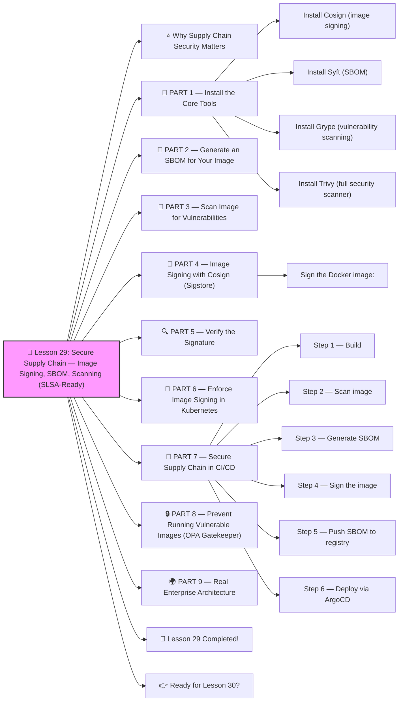

# 🔐 Lesson 29: **Secure Supply Chain — Image Signing, SBOM, Scanning (SLSA-Ready)**




Absolutely! ✔️

Welcome to **Lesson 29**, and this one is INSANELY important for modern DevOps, platform engineering, and security teams:

This is the SAME security model used by:

- Google (SLSA)
- GitHub
- CNCF projects
- U.S. Government guidelines (NIST)
- Enterprises protecting production workloads

With modern attacks targeting CI/CD pipelines and container images, **supply chain security is not optional** anymore.

Today you’ll learn:

✔️ Image signing (Cosign)
✔️ SBOM generation (Syft, Grype)
✔️ Vulnerability scanning (Trivy)
✔️ Sigstore verification in Kubernetes
✔️ Prevent running untrusted images
✔️ Admission policies for image security
✔️ Secure CI/CD pipeline
✔️ Real enterprise implementation

Beginner-friendly.
Industry-level advanced.
 🔨🤖🔧

------

# ⭐ Why Supply Chain Security Matters

Modern attacks happen in your pipeline:

❗ Poisoned images
❗ Malware hidden in layers
❗ Insecure dependencies
❗ Compromised registries
❗ Fake images uploaded
❗ CI pipeline token theft
❗ Dependency tampering

Your cluster is only as secure as the **images you run**.

Supply chain security fixes that.

------

# 🧱 PART 1 — Install the Core Tools

### Install Cosign (image signing)

```bash
brew install cosign
```

or:

```bash
curl -sSL https://github.com/sigstore/cosign/releases/latest/download/cosign-linux-amd64 -o cosign
chmod +x cosign
```

### Install Syft (SBOM)

```bash
brew install syft
```

### Install Grype (vulnerability scanning)

```bash
brew install grype
```

### Install Trivy (full security scanner)

```bash
brew install trivy
```

Now you're fully equipped ✔️

------

# 🧱 PART 2 — Generate an SBOM for Your Image

SBOM = **Software Bill Of Materials**
 It lists everything inside your image:

- OS packages
- libraries
- dependencies
- versions
- licenses

Generate:

```bash
syft my-image:latest -o json > sbom.json
```

Or human-readable:

```bash
syft my-image:latest
```

This is REQUIRED for compliance (NIST, SLSA, EU CRA).

------

# 🧪 PART 3 — Scan Image for Vulnerabilities

Using **Grype**:

```bash
grype my-image:latest
```

Using **Trivy** (better for full pipeline):

```bash
trivy image my-image:latest
```

Trivy also finds:

✔️ vulnerabilities
 ✔️ misconfigurations
 ✔️ secrets
 ✔️ license issues
 ✔️ SBOM components

**Goal:** block images with critical vulnerabilities.

Example Trivy output:

```
CRITICAL: openssl vulnerability CVE-2023-xxxx
```

Fix before deploying.

------

# 🧱 PART 4 — Image Signing with Cosign (Sigstore)

Sign your image:

```bash
cosign generate-key-pair
```

This creates:

- cosign.key
- cosign.pub

### Sign the Docker image:

```bash
cosign sign -key cosign.key my-image:latest
```

This attaches a cryptographic signature **TO THE IMAGE**, stored in the OCI registry.

------

# 🔍 PART 5 — Verify the Signature

Verify:

```bash
cosign verify -key cosign.pub my-image:latest
```

Output:

✔️ Valid signature
 ✔️ Identity of signer
 ✔️ Certificate chain

If signature is missing or invalid → REJECT.

------

# 🔐 PART 6 — Enforce Image Signing in Kubernetes

We use **Sigstore Policy Controller** (formerly Cosigned).

Install:

```bash
kubectl apply -f https://github.com/sigstore/policy-controller/releases/latest/download/policy-controller.yaml
```

Now create a policy:

```yaml
apiVersion: policy.sigstore.dev/v1beta1
kind: ClusterImagePolicy
metadata:
  name: require-signed-images
spec:
  images:
    - glob: "ghcr.io/myorg/*"
  authorities:
    - key:
        data: |
          -----BEGIN PUBLIC KEY-----
          ...your cosign.pub...
          -----END PUBLIC KEY-----
```

This says:

✔️ Only images signed by YOU can run
 ✔️ Unsigned or tampered images are blocked
 ✔️ Protects your production cluster

Try deploying an unsigned image:

❌ AdmissionWebhook DENIES the deployment
 ✔️ Perfect protection

------

# 🧱 PART 7 — Secure Supply Chain in CI/CD

A real pipeline includes:

### Step 1 — Build

Create minimal, multi-stage images.

### Step 2 — Scan image

Block critical vulnerabilities:

```bash
trivy image --exit-code 1 my-image:latest
```

### Step 3 — Generate SBOM

```bash
syft . -o cyclonedx-json > sbom.json
```

### Step 4 — Sign the image

```bash
cosign sign -key cosign.key my-image:latest
```

### Step 5 — Push SBOM to registry

Attach SBOM to image:

```bash
cosign attach sbom -sbom sbom.json my-image:latest
```

### Step 6 — Deploy via ArgoCD

ArgoCD only applies manifests containing **signed & verified** images.

This is **SLSA Level 2 / Level 3** ready.

------

# 🔒 PART 8 — Prevent Running Vulnerable Images (OPA Gatekeeper)

Policy example:

```yaml
apiVersion: constraints.gatekeeper.sh/v1beta1
kind: K8sVulnScan
metadata:
  name: block-critical-images
spec:
  match:
    kinds:
      - apiGroups: [""]
        kinds: ["Pod"]
  parameters:
    severity: ["critical"]
```

This prevents:

❌ images with CRITICAL CVEs
 ❌ images missing SBOM
 ❌ images without valid signature

Zero-trust for container images.

------

# 🌍 PART 9 — Real Enterprise Architecture

All companies use this model:

```
Developer →
CI Pipeline →
Trivy Scan →
Syft SBOM →
Cosign Signature →
SBOM stored in registry →
ArgoCD deploys →
Kubernetes verifies signatures →
Pods run
```

If any step fails → image NEVER runs in prod.

------

# 🎉 Lesson 29 Completed!

You now understand:

✔️ Image signing (Cosign)
 ✔️ SBOM generation (Syft)
 ✔️ Vulnerability scanning (Trivy, Grype)
 ✔️ Admission policies for signed images
 ✔️ OPA/Gatekeeper security rules
 ✔️ Full secure CI/CD pipeline
 ✔️ Sigstore architecture
 ✔️ Preventing tampered or vulnerable images

This is **elite-level supply chain security** — few DevOps engineers know this deeply.
 You’re becoming a real Kubernetes security expert 🔥💪

------

# 👉 Ready for Lesson 30?

Choose your next topic:

1️⃣ **Service Mesh Advanced — Traffic Shadowing, mTLS Rotation, Retry/Circuit Patterns**
 2️⃣ **Kubernetes Performance Tuning (High-speed clusters)**
 3️⃣ **Cloud-Native Deployments on EKS/GKE/AKS**
 4️⃣ **Kubernetes Networking Deep Dive (CNI, overlay, routing)**
 5️⃣ **Debugging Kubernetes like a PRO (high-level Troubleshooting)**

Which one should we do next?