# 🔐  Lesson 3: **ConfigMaps & Secrets (Beginner Friendly!)**

```mermaid
graph LR
    root["🔐  Lesson 3: ConfigMaps & Secrets (Beginner Friendly!)"]
    style root fill:#f9f,stroke:#333,stroke-width:2px
    root --> node_0["🌱 Part 1 — ConfigMap (Safe, Non-Sensitive Config)"]
    root --> node_1["🔌 Use ConfigMap in a Deployment"]
    root --> node_2["🔐 Part 2 — Secrets (Passwords, Tokens, Keys)"]
    node_2 --> node_3["Step 1: Encode the password"]
    node_2 --> node_4["Step 2: Secret YAML"]
    root --> node_5["🔌 Use Secret in Deployment"]
    root --> node_6["🎯 Bonus: You can also mount ConfigMaps & Secrets as files"]
    root --> node_7["🎉 Lesson 3 Completed!"]
    root --> node_8["👉 What should we learn next?"]
```




Great! ✔️
 Moving to **Lesson 3** — one of the most important real-world DevOps skills:

Every real application needs **configuration**:

- environment variables
- URLs
- settings
- API keys
- passwords

In Kubernetes, we NEVER hardcode these inside container images.

Instead, we use:

| Object        | Purpose                                       |
| ------------- | --------------------------------------------- |
| **ConfigMap** | Non-sensitive configuration (public settings) |
| **Secret**    | Sensitive values like passwords, tokens, keys |

Let’s learn both with simple examples. 🔨🤖🔧

------

# 🌱 Part 1 — **ConfigMap (Safe, Non-Sensitive Config)**

Imagine your app needs:

- APP_MODE = production
- APP_COLOR = blue

Here’s the ConfigMap YAML:

```yaml
apiVersion: v1
kind: ConfigMap
metadata:
  name: app-config
data:
  APP_MODE: "production"
  APP_COLOR: "blue"
```

Apply it:

```bash
kubectl apply -f configmap.yaml
```

------

# 🔌 Use ConfigMap in a Deployment

We now plug those variables into a Deployment.

```yaml
apiVersion: apps/v1
kind: Deployment
metadata:
  name: config-demo
spec:
  replicas: 1
  selector:
    matchLabels:
      app: config-demo
  template:
    metadata:
      labels:
        app: config-demo
    spec:
      containers:
        - name: demo
          image: nginx:latest
          env:
            - name: APP_MODE
              valueFrom:
                configMapKeyRef:
                  name: app-config
                  key: APP_MODE
            - name: APP_COLOR
              valueFrom:
                configMapKeyRef:
                  name: app-config
                  key: APP_COLOR
```

Now your container has environment variables from the ConfigMap ✔️

------

# 🔐 Part 2 — Secrets (Passwords, Tokens, Keys)

Secrets are like ConfigMaps, **but encrypted** in Kubernetes storage.

Let’s store a database password:

### Step 1: Encode the password

(Kubernetes requires base64 format.)

Example password:

```
mysecretpassword
```

Encode it:

```bash
echo -n "mysecretpassword" | base64
```

You’ll get something like:

```
bXlzZWNyZXRwYXNzd29yZA==
```

------

### Step 2: Secret YAML

```yaml
apiVersion: v1
kind: Secret
metadata:
  name: db-secret
type: Opaque
data:
  DB_PASSWORD: bXlzZWNyZXRwYXNzd29yZA==
```

Apply it:

```bash
kubectl apply -f secret.yaml
```

------

# 🔌 Use Secret in Deployment

```yaml
apiVersion: apps/v1
kind: Deployment
metadata:
  name: secret-demo
spec:
  replicas: 1
  selector:
    matchLabels:
      app: secret-demo
  template:
    metadata:
      labels:
        app: secret-demo
    spec:
      containers:
        - name: app
          image: nginx:latest
          env:
            - name: DB_PASSWORD
              valueFrom:
                secretKeyRef:
                  name: db-secret
                  key: DB_PASSWORD
```

Now your pod has a secure environment variable `DB_PASSWORD` ✔️

------

# 🎯 Bonus: You can also mount ConfigMaps & Secrets as files

Example (very common in DevOps):

```yaml
volumeMounts:
  - name: config-volume
    mountPath: /etc/config

volumes:
  - name: config-volume
    configMap:
      name: app-config
```

------

# 🎉 Lesson 3 Completed!

You now know:

✔️ ConfigMaps for normal config
 ✔️ Secrets for sensitive values
 ✔️ How to inject variables into Deployments
 ✔️ How to mount configuration into containers

This is a **real-world DevOps skill** that 100% of companies use.

------

# 👉 What should we learn next?

Choose your next lesson:

1. **Ingress (Domains + real web routing + HTTPS)**
2. **Persistent Volumes** (databases, storage)
3. **Docker + Kubernetes Workflow**
4. **Helm Charts** (industry-standard packaging)
5. **Kustomize** (environment overlays: dev/stage/prod)

Which one next? 👀💡