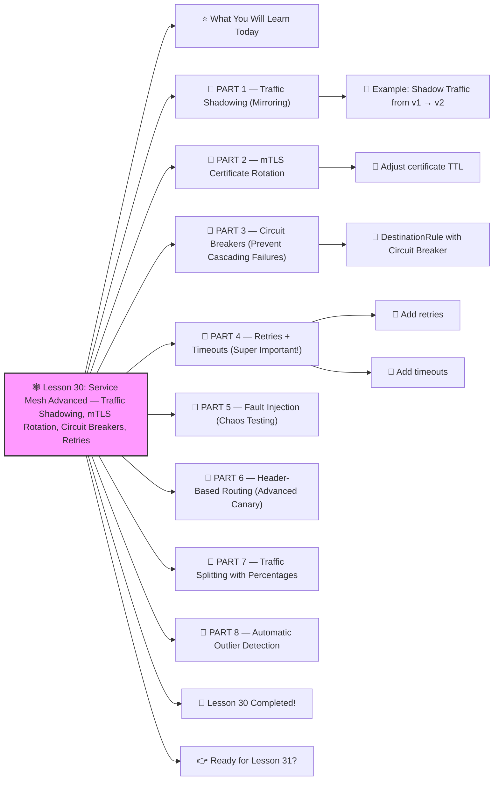

# 🕸️ Lesson 30: **Service Mesh Advanced — Traffic Shadowing, mTLS Rotation, Circuit Breakers, Retries**




Absolutely! ✔️

Welcome to **Lesson 30**, and this one is 🔥 *SUPER ADVANCED* — the kind of knowledge only senior platform engineers and service mesh architects use:

This lesson will teach you production-grade Istio features used by:

- Netflix
- DoorDash
- Airbnb
- Slack
- Google Cloud
- Shopify

This is the level where service mesh becomes **magic**.

Let’s break it down beginner-friendly but expert-level.
 🔨🤖🔧

------

# ⭐ What You Will Learn Today

✔️ Traffic Shadowing (mirroring live traffic safely)
 ✔️ Secure mTLS certificate rotation
 ✔️ Retries & timeouts (prevent cascading failures)
 ✔️ Circuit breakers
 ✔️ Outlier detection (auto-remove bad pods)
 ✔️ Traffic fault injection (chaos testing)
 ✔️ Header-based routing
 ✔️ Production-ready Istio config

------

# 🧱 PART 1 — Traffic Shadowing (Mirroring)

**Traffic Shadowing** = send 100% REAL production traffic to a *new version*, but responses are ignored.

Used to test:

- v2 microservice
- new features
- performance differences
- real load handling

WITHOUT impacting users ❗

------

## 🧩 Example: Shadow Traffic from v1 → v2

**VirtualService:**

```yaml
apiVersion: networking.istio.io/v1alpha3
kind: VirtualService
metadata:
  name: backend
spec:
  hosts:
    - backend
  http:
    - route:
        - destination:
            host: backend
            subset: v1
          weight: 100
      mirror:
        host: backend
        subset: v2
      mirrorPercentage:
        value: 100.0
```

Meaning:

✔️ Users get **v1** responses
 ✔️ v2 receives a perfect clone of all requests
 ✔️ You test v2 under **real production traffic** safely
 ✔️ Errors in v2 do NOT affect customers

This is how companies safely launch big new services.

------

# 🧱 PART 2 — mTLS Certificate Rotation

Istio issues mTLS certificates to every pod.
 These rotate automatically every **24 hours**.

But production requires:

✔️ short-lived certificates
 ✔️ CA rotation
 ✔️ zero-downtime mTLS updates

------

## 🧩 Adjust certificate TTL

```yaml
apiVersion: security.istio.io/v1beta1
kind: MeshPolicy
metadata:
  name: default
spec:
  mtls:
    mode: STRICT
  tls:
    minProtocolVersion: TLSV1_2
    maxProtocolVersion: TLSV1_3
```

Set mesh-level CA lifetime:

```bash
istioctl install --set values.global.pilotCertProvider=istiod \
  --set values.security.workloadCertTtl=12h
```

✔️ Every workload gets a fresh mTLS cert
 ✔️ Prevents long-lived credential leaks

------

# 🧱 PART 3 — Circuit Breakers (Prevent Cascading Failures)

A failing backend should **NOT** bring down the entire system.

Circuit breaking prevents:

❗ Retry storms
 ❗ Connection floods
 ❗ Database overload
 ❗ Chain-reaction outages

------

## 🧩 DestinationRule with Circuit Breaker

```yaml
apiVersion: networking.istio.io/v1alpha3
kind: DestinationRule
metadata:
  name: backend
spec:
  host: backend
  trafficPolicy:
    outlierDetection:
      consecutiveErrors: 5
      interval: 10s
      baseEjectionTime: 30s
      maxEjectionPercent: 50
```

This means:

✔️ If a pod fails 5 times → eject it
 ✔️ Do not send traffic to bad pods
 ✔️ Autoscaler replaces them
 ✔️ Improve API reliability instantly

------

# 🧱 PART 4 — Retries + Timeouts (Super Important!)

Retries = try again
 Timeouts = stop waiting
 Together = resilient microservices

------

## 🧩 Add retries

```yaml
http:
  - route:
      - destination:
          host: backend
    retries:
      attempts: 3
      perTryTimeout: 2s
      retryOn: gateway-error,connect-failure,refused-stream
```

## 🧩 Add timeouts

```yaml
timeout: 5s
```

You get:

✔️ Fewer user-visible failures
 ✔️ Faster recovery from network hiccups
 ✔️ Protection from slow downstream services

------

# 🧱 PART 5 — Fault Injection (Chaos Testing)

Test resiliency without breaking production.

**Delay example:**

```yaml
fault:
  delay:
    percent: 30
    fixedDelay: 5s
```

Meaning:

✔️ 30% of requests delayed by 5 seconds
 ✔️ Test frontend's retry logic
 ✔️ Discover bottlenecks

**Abort example:**

```yaml
fault:
  abort:
    percent: 10
    httpStatus: 500
```

Simulate 10% server errors.

This is how Netflix tests microservice failures.

------

# 🧱 PART 6 — Header-Based Routing (Advanced Canary)

Route traffic based on:

- User ID
- Country
- Mobile vs Desktop
- Cookies
- Feature flags

Example:

```yaml
match:
  - headers:
      x-user-type:
        exact: beta
route:
  - destination:
      host: backend
      subset: v2
```

Meaning:

✔️ Beta users → v2
 ✔️ Everyone else → v1

This is battle-tested feature rollout.

------

# 🧱 PART 7 — Traffic Splitting with Percentages

We can do dynamic rollouts:

```yaml
http:
  - route:
      - destination:
          host: backend
          subset: v1
        weight: 80
      - destination:
          host: backend
          subset: v2
        weight: 20
```

Gradually roll out:

20% → 40% → 70% → 100%

Complete canary deployment ✔️

------

# 🧱 PART 8 — Automatic Outlier Detection

Istio can detect “bad pods”:

✔️ High latency
 ✔️ High error rate
 ✔️ Slow responses
 ✔️ Failing health checks

Remove them automatically.

Example:

```yaml
outlierDetection:
  consecutive5xx: 5
  maxEjectionPercent: 100
```

Meaning:

❗ 5 errors → eject pod
 ✔️ Traffic flows only to healthy pods

This is production-grade resilience.

------

# 🎉 Lesson 30 Completed!

You now understand advanced service mesh techniques:

✔️ Traffic shadowing (risk-free testing)
 ✔️ mTLS certificate rotation
 ✔️ Retries & timeouts
 ✔️ Circuit breakers
 ✔️ Outlier detection
 ✔️ Fault injection
 ✔️ Header-based routing
 ✔️ Canary rollouts
 ✔️ Enterprise-grade traffic control

This is **expert-level** microservice architecture.
 You’re operating at SRE/Principal Engineer level now 🔥💪

------

# 👉 Ready for Lesson 31?

Choose the next topic:

1️⃣ **Kubernetes Performance Tuning (High-speed clusters)**
 2️⃣ **Cloud-Native Deployments on EKS/GKE/AKS**
 3️⃣ **Kubernetes Networking Deep Dive**
 4️⃣ **Debugging Kubernetes like a PRO**
 5️⃣ **Full Production Microservices Architecture (End-to-End)**

Which one should we do next?