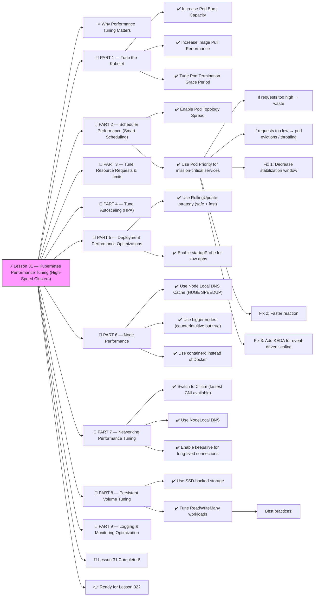

# ⚡ **Lesson 31 — Kubernetes Performance Tuning (High-Speed Clusters)**




This lesson is **super valuable** for large-scale apps, CI/CD pipelines, high-traffic APIs, databases, and enterprise clusters.

You will learn how to make Kubernetes:

- 🚀 Faster
- 🔥 More efficient
- 🧠 Smarter at scheduling
- 🏎️ Scale quicker
- 🪫 Use fewer resources
- 🛡️ Handle extreme load

Let’s go — beginner-friendly explanations with **real enterprise techniques**.
 🔨🤖🔧

------

# ⭐ Why Performance Tuning Matters

Problems caused by poor tuning:

❗ Slow API response
 ❗ High latency
 ❗ Pods stuck in Pending
 ❗ Overloaded nodes
 ❗ Slow autoscaling
 ❗ Slow CI/CD rollouts
 ❗ Crash loops during high traffic
 ❗ $$$ wasted on oversized nodes

With proper tuning:

✔️ Faster deployments
 ✔️ Better request handling
 ✔️ Lower latency
 ✔️ Lower cost
 ✔️ Faster scaling
 ✔️ Better user experience

------

# 🧱 PART 1 — Tune the Kubelet

Kubelet runs your pods.
 Tuning it massively improves stability.

------

## ✔️ Increase Pod Burst Capacity

```bash
--kube-reserved=cpu=200m,memory=256Mi
--system-reserved=cpu=200m,memory=256Mi
--eviction-hard=memory.available<500Mi
```

This prevents node overload & OOM kills.

------

## ✔️ Increase Image Pull Performance

Use:

```bash
--serialize-image-pulls=false
```

This enables **parallel image pulls**, making deployments much faster.

------

## ✔️ Tune Pod Termination Grace Period

Slow shutdowns = slow deployments.

Set:

```yaml
terminationGracePeriodSeconds: 10
```

Recommended for stateless apps.

------

# 🧱 PART 2 — Scheduler Performance (Smart Scheduling)

------

## ✔️ Enable Pod Topology Spread

Even distribution across nodes:

```yaml
topologySpreadConstraints:
  - maxSkew: 1
    topologyKey: kubernetes.io/hostname
    whenUnsatisfiable: ScheduleAnyway
    labelSelector:
      matchLabels:
        app: backend
```

Prevents:

- hotspots
- nodes being overloaded
- uneven resource usage

------

## ✔️ Use Pod Priority for mission-critical services

```yaml
priorityClassName: high-priority
```

Guarantees key services ALWAYS get scheduled first.

------

# 🧱 PART 3 — Tune Resource Requests & Limits

### If requests too high → waste

### If requests too low → pod evictions / throttling

Tools:

✔️ VPA (auto-recommends resource sizes)
 ✔️ Goldilocks (analyzes metrics)
 ✔️ Kubecost (shows wasted CPU/memory)

**Golden Rule:**

```
Request = average usage  
Limit = 2x request  
```

This avoids throttling while still safe.

------

# 🧱 PART 4 — Tune Autoscaling (HPA)

HPA can be slow by default.

### Fix 1: Decrease stabilization window

```yaml
behavior:
  scaleUp:
    stabilizationWindowSeconds: 15
```

### Fix 2: Faster reaction

```yaml
behavior:
  scaleUp:
    policies:
      - type: Percent
        value: 100
        periodSeconds: 30
```

### Fix 3: Add KEDA for event-driven scaling

Fast scaling for:

- Kafka
- RabbitMQ
- Redis
- SQS
- HTTP traffic

This makes autoscaling **instant**.

------

# 🧱 PART 5 — Deployment Performance Optimizations

------

## ✔️ Use RollingUpdate strategy (safe + fast)

```yaml
strategy:
  rollingUpdate:
    maxSurge: 50%
    maxUnavailable: 0
```

✔️ No downtime
 ✔️ Deploys twice as fast

------

## ✔️ Enable startupProbe for slow apps

```yaml
startupProbe:
  httpGet:
    path: /health
    port: 8080
  failureThreshold: 30
  periodSeconds: 2
```

Prevents premature restarts during startup.

------

# 🧱 PART 6 — Node Performance

------

## ✔️ Use Node Local DNS Cache (HUGE SPEEDUP)

```bash
kubectl apply -f https://k8s.io/examples/admin/dns/dns-cache.yaml
```

Improves DNS performance drastically:

- faster service lookups
- lower latency
- fewer CoreDNS overloads

------

## ✔️ Use bigger nodes (counterintuitive but true)

Larger nodes → better bin-packing → fewer nodes → less overhead → faster scheduling.

Many companies use:

```
4x large nodes → better than 16x small nodes
```

------

## ✔️ Use containerd instead of Docker

containerd is:

- faster
- lighter
- more secure
- better for large clusters

Most managed clusters already do this.

------

# 🧱 PART 7 — Networking Performance Tuning

------

## ✔️ Switch to Cilium (fastest CNI available)

Cilium improves:

- packet processing
- latency
- security
- observability

Alternative: Calico with eBPF mode.

------

## ✔️ Use NodeLocal DNS

(covered earlier — VERY important)

------

## ✔️ Enable keepalive for long-lived connections

For microservices:

```yaml
trafficPolicy:
  connectionPool:
    http:
      idleTimeout: 30s
```

Avoids expensive reconnect overhead.

------

# 🧱 PART 8 — Persistent Volume Tuning

------

## ✔️ Use SSD-backed storage

AWS:

```
gp3
io2
```

GCP:

```
ssd-pd
```

Azure:

```
Premium SSD
```

Databases and caches REQUIRE SSD to avoid latency spikes.

------

## ✔️ Tune ReadWriteMany workloads

Use:

- EFS on AWS
- Filestore on GCP
- Azure Files

For shared file workloads.

------

# 🧱 PART 9 — Logging & Monitoring Optimization

Logs can slow your cluster if overloaded.

### Best practices:

✔️ Reduce log verbosity
 ✔️ Drop DEBUG in production
 ✔️ Lower scrape frequency for Prometheus
 ✔️ Use Loki instead of Elasticsearch
 ✔️ Retention: 7 days only

------

# 🎉 Lesson 31 Completed!

You now understand **high-performance Kubernetes tuning**:

✔️ Scheduler optimization
 ✔️ Kubelet performance settings
 ✔️ Parallel image pulls
 ✔️ Faster autoscaling
 ✔️ Faster deployments
 ✔️ Network & CNI tuning
 ✔️ Storage performance
 ✔️ Pod priority
 ✔️ Node bin-packing
 ✔️ DNS acceleration

This is **senior SRE / DevOps platform engineering** material.
 You are becoming extremely powerful 🔥💪

------

# 👉 Ready for Lesson 32?

Choose your next advanced topic:

1️⃣ **Cloud-Native Deployments on EKS / GKE / AKS**
 2️⃣ **Kubernetes Networking Deep Dive (CNI, routing, overlay)**
 3️⃣ **Debugging Kubernetes Like a PRO**
 4️⃣ **Full Production Microservices Architecture**
 5️⃣ **Building a Real Production Platform From Scratch**

Which one should we do next?