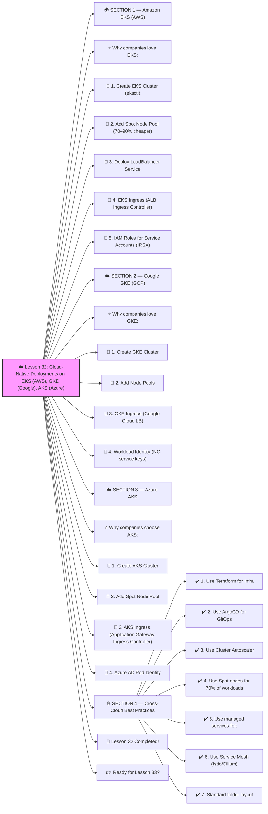

# ☁️ Lesson 32: **Cloud-Native Deployments on EKS (AWS), GKE (Google), AKS (Azure)**




Absolutely! ✔️

Welcome to **Lesson 32**, and this one is MASSIVE — because now we take everything you learned and apply it to **real cloud platforms**:

This lesson teaches you exactly how REAL companies deploy Kubernetes clusters in the cloud — with best practices for each provider.

By the end, you’ll know:

✔️ How to create clusters on AWS, GCP, Azure
 ✔️ Node groups, Spot nodes, autoscaling
 ✔️ IAM integration
 ✔️ Networking, VPC, load balancers
 ✔️ Deploy workloads in each cloud
 ✔️ Production-grade settings

This is *professional-level cloud DevOps*.
 🔨🤖🔧

------

# 🌍 SECTION 1 — Amazon EKS (AWS)

# ⭐ Why companies love EKS:

✔️ Best autoscaling
 ✔️ Best IAM security
 ✔️ Best for hybrid + enterprise
 ✔️ Best for VPC control

------

# 🧱 **1. Create EKS Cluster (eksctl)**

Install eksctl:

```bash
brew install eksctl
```

Create cluster:

```bash
eksctl create cluster \
  --name prod \
  --region us-east-1 \
  --nodes 3 \
  --nodes-min 1 \
  --nodes-max 6 \
  --with-oidc \
  --managed
```

This automatically creates:

- VPC
- Subnets
- Node groups
- IAM integration
- Autoscaling capability

------

# 🧱 **2. Add Spot Node Pool (70–90% cheaper)**

```bash
eksctl create nodegroup \
  --cluster prod \
  --name spot-ng \
  --spot \
  --nodes-min 0 \
  --nodes-max 10 \
  --instance-types t3.medium,t3.large
```

Use for:

- workers
- background jobs
- queue consumers
- non-critical microservices

------

# 🧱 **3. Deploy LoadBalancer Service**

```yaml
apiVersion: v1
kind: Service
metadata:
  name: frontend
spec:
  type: LoadBalancer
  selector:
    app: frontend
  ports:
    - port: 80
```

AWS creates:

✔️ NLB or ALB
 ✔️ Public IP
 ✔️ Auto firewall rules

------

# 🧱 **4. EKS Ingress (ALB Ingress Controller)**

Install ALB controller:

```bash
kubectl apply -k github.com/aws/eks-charts/stable/aws-load-balancer-controller
```

Ingress example:

```yaml
metadata:
  annotations:
    kubernetes.io/ingress.class: alb
```

✔️ WAF supported
 ✔️ HTTPS enforced
 ✔️ Path-based routing

------

# 🧱 **5. IAM Roles for Service Accounts (IRSA)**

This replaces access keys forever.

Example:

```bash
eksctl create iamserviceaccount \
  --name s3-reader \
  --namespace backend \
  --cluster prod \
  --attach-policy-arn arn:aws:iam::aws:policy/AmazonS3ReadOnlyAccess \
  --approve
```

Pods now have **native AWS access** ❗

------

# ☁️ SECTION 2 — Google GKE (GCP)

# ⭐ Why companies love GKE:

✔️ Best cluster stability
 ✔️ Best automatic upgrades
 ✔️ Best performance scheduler
 ✔️ Cheapest per node

------

# 🧱 **1. Create GKE Cluster**

```bash
gcloud container clusters create prod \
  --zone us-central1-a \
  --num-nodes 3 \
  --enable-autoscaling \
  --min-nodes 1 \
  --max-nodes 8
```

✔️ auto-scaling cluster
 ✔️ automatic repair
 ✔️ automatic upgrades

------

# 🧱 **2. Add Node Pools**

General pool:

```bash
gcloud container node-pools create general \
  --cluster prod \
  --num-nodes 2
```

Spot (Preemptible) pool:

```bash
gcloud container node-pools create spot \
  --cluster prod \
  --num-nodes 0 \
  --preemptible
```

------

# 🧱 **3. GKE Ingress (Google Cloud LB)**

Ingress example:

```yaml
metadata:
  annotations:
    kubernetes.io/ingress.class: "gce"
```

GCP creates:

✔️ Global Load Balancer
 ✔️ HTTP/HTTPS routing
 ✔️ SSL termination

------

# 🧱 **4. Workload Identity (NO service keys)**

Link a Kubernetes service account to GCP IAM:

```bash
gcloud iam service-accounts create backend-sa
```

Bind to Kubernetes SA:

```bash
kubectl annotate sa backend \
  iam.gke.io/gcp-service-account=backend-sa@PROJECT.iam.gserviceaccount.com
```

Pods can access GCP APIs securely.

------

# ☁️ SECTION 3 — Azure AKS

# ⭐ Why companies choose AKS:

✔️ Best Windows container support
 ✔️ Best enterprise AD integration
 ✔️ Very easy autoscaling
 ✔️ Cheap spot nodes

------

# 🧱 **1. Create AKS Cluster**

```bash
az aks create \
  --resource-group prod-rg \
  --name prod-cluster \
  --node-count 3 \
  --enable-cluster-autoscaler \
  --min-count 1 \
  --max-count 8
```

------

# 🧱 **2. Add Spot Node Pool**

```bash
az aks nodepool add \
  --resource-group prod-rg \
  --cluster-name prod-cluster \
  --name spotpool \
  --priority Spot \
  --eviction-policy Delete \
  --node-count 0 \
  --max-count 10
```

------

# 🧱 **3. AKS Ingress (Application Gateway Ingress Controller)**

```yaml
metadata:
  annotations:
    kubernetes.io/ingress.class: azure/application-gateway
```

Azure automatically configures:

✔️ WAF
 ✔️ TLS
 ✔️ Global routing

------

# 🧱 **4. Azure AD Pod Identity**

Attach Azure identity to Pod:

```yaml
aadpodidbinding: backend-id
```

This gives Pods access to:

✔️ KeyVault
 ✔️ Storage
 ✔️ Database
 ✔️ EventHub

Without secrets.

------

# 🌐 SECTION 4 — Cross-Cloud Best Practices

Here is what ALL three clouds should share:

------

## ✔️ 1. Use Terraform for Infra

Never click in the UI.

------

## ✔️ 2. Use ArgoCD for GitOps

Declarative, automated, drift-free.

------

## ✔️ 3. Use Cluster Autoscaler

Every cloud supports it.

------

## ✔️ 4. Use Spot nodes for 70% of workloads

Costs drop by 60–80%.

------

## ✔️ 5. Use managed services for:

- DB (Aurora, Cloud SQL, Cosmos)
- Load Balancers
- DNS
- Object Storage

------

## ✔️ 6. Use Service Mesh (Istio/Cilium)

Cross-cluster routing
 mTLS
 Traffic control

------

## ✔️ 7. Standard folder layout

```
infra/
  eks/
  gke/
  aks/
  modules/
apps/
  frontend/
  backend/
  database/
gitops/
  dev/
  stage/
  prod/
```

------

# 🎉 Lesson 32 Completed!

You now understand **cloud-native Kubernetes deployments** across:

✔️ AWS EKS
 ✔️ Google GKE
 ✔️ Azure AKS

Including:

✔️ Node pools
 ✔️ Auto-scaling
 ✔️ IAM/Identity
 ✔️ Load balancers
 ✔️ Ingress
 ✔️ Spot workloads
 ✔️ GitOps integrations
 ✔️ Production best practices

This is **cloud DevOps mastery** 🔥💪
 You’re now operating at a cloud architect level.

------

# 👉 Ready for Lesson 33?

Choose the next topic:

1️⃣ **Kubernetes Networking Deep Dive (CNI, eBPF, routing)**
 2️⃣ **Debugging Kubernetes Like a PRO**
 3️⃣ **Full Production Microservices Architecture (End-to-End)**
 4️⃣ **Build an Internal Developer Platform (IDP)**
 5️⃣ **Kubernetes Security: Runtime Protection (Falco, eBPF)**

Which one next?