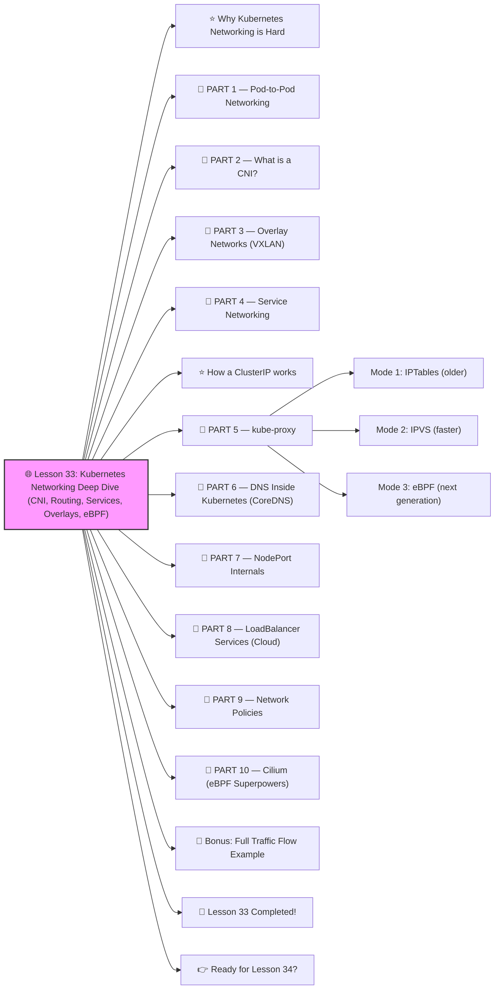

# 🌐 Lesson 33: **Kubernetes Networking Deep Dive (CNI, Routing, Services, Overlays, eBPF)**




Absolutely! ✔️

Welcome to **Lesson 33** — and this one is ESSENTIAL for every real DevOps/SRE professional:

This is one of the hardest topics in Kubernetes — but I’ll teach it to you in a **beginner-friendly**, visual, step-by-step way, while keeping the content **enterprise-grade**.
 🔨🤖🔧

By the end of this lesson, you will understand:

✔️ How Pods talk to each other
 ✔️ What a CNI is
 ✔️ How Services actually route traffic
 ✔️ How overlay networking works
 ✔️ kube-proxy vs eBPF
 ✔️ DNS inside Kubernetes
 ✔️ LoadBalancer / NodePort internals
 ✔️ How Cilium/Calico work
 ✔️ Multi-node routing

This is **core DevOps knowledge**. Let’s go 🔥

------

# ⭐ Why Kubernetes Networking is Hard

In Kubernetes:

- Pods have **their own IPs**
- Nodes have **their own IPs**
- Containers inside Pods talk via **localhost**
- Services have **virtual IPs**
- DNS is inside the cluster
- Routing is done by **CNI plugins**
- kube-proxy manages load balancing
- Some CNIs use **eBPF**, some use **IPTables**, some use **VXLAN**

BUT once you learn how it works → everything becomes simple.

Let’s break it down.

------

# 🧱 PART 1 — Pod-to-Pod Networking

Every Pod gets a **unique IP address**.

Example:

```
pod A = 10.244.1.5  
pod B = 10.244.2.9
```

Pods MUST be able to reach each other **without NAT**.

This rule is required by Kubernetes.

This is handled by…

------

# 🧱 PART 2 — What is a CNI?

CNI = **Container Network Interface**

It provides:

✔️ Pod IPs
 ✔️ Routing between Pods
 ✔️ Network Policies
 ✔️ Overlay or direct-routing

Popular CNIs:

- **Calico** (most used)
- **Cilium (eBPF)** ← fastest
- **Flannel** (simple overlay)
- **Weave**
- **AWS VPC CNI** (native AWS IPs)
- **GCP CNI**
- **Azure CNI**

Choose your CNI based on performance, features, and cloud.

------

# 🧱 PART 3 — Overlay Networks (VXLAN)

Public cloud uses overlay networks.

Simplified:

```
Pod IPs (virtual)
   ↓
VXLAN overlay (encapsulated packets)
   ↓
Node-to-node routing (real IPs)
```

This allows Pods to live in a “virtual network” even though the cloud has limits.

------

# 🧱 PART 4 — Service Networking

Services provide:

✔️ Stable Virtual IP
 ✔️ Built-in load balancing
 ✔️ Pod discovery
 ✔️ Health-checking

Service types:

1. **ClusterIP** — internal only
2. **NodePort** — exposed on node
3. **LoadBalancer** — cloud LB
4. **Headless Service** — no VIP

------

# ⭐ How a ClusterIP works

Service creates a virtual IP:

```
backend-service = 10.96.30.1
```

kube-proxy maps Service → Pods.

Example mapping:

```
10.96.30.1 → [10.244.1.12, 10.244.2.8]
```

Load balancing is **round-robin**.

------

# 🧱 PART 5 — kube-proxy

kube-proxy handles routing in two modes:

### Mode 1: IPTables (older)

✔️ stable
 ❌ slow with thousands of services

### Mode 2: IPVS (faster)

✔️ kernel-level load balancing
 ✔️ better performance
 ✔️ recommended for large clusters

### Mode 3: eBPF (next generation)

Used by **Cilium**.

✔️ fastest
 ✔️ no IPTables
 ✔️ direct Pod routing
 ✔️ advanced network policies

------

# 🧱 PART 6 — DNS Inside Kubernetes (CoreDNS)

Every service gets a DNS name:

```
backend.default.svc.cluster.local
```

Example Pod resolving service:

```bash
nslookup backend
```

DNS resolution order:

1. Pod → CoreDNS
2. CoreDNS → kube-apiserver service list
3. Reply with ClusterIP

------

# 🧱 PART 7 — NodePort Internals

NodePort exposes service on:

```
<node IP>:<nodePort>
```

Example:

```
NodePort: 30080  
Node IPs: 192.168.1.10, 192.168.1.11
```

Traffic flow:

```
User → Node IP:30080 → kube-proxy → Pod
```

Used for:

- dev clusters
- bare-metal
- tunnel ingress controllers

------

# 🧱 PART 8 — LoadBalancer Services (Cloud)

Cloud providers create a cloud LB:

AWS → NLB / ALB
 GCP → GLB
 Azure → ALB

Flow:

```
Internet → Cloud LB → NodePort → Pod
```

------

# 🧱 PART 9 — Network Policies

These restrict traffic (zero-trust networking):

Example deny-all:

```yaml
policyTypes:
  - Ingress
  - Egress
podSelector: {}
```

Allow only frontend → backend:

```yaml
ingress:
  - from:
      - podSelector:
          matchLabels:
            app: frontend
```

Network policies require:

✔️ Calico
 ✔️ Cilium
 ✔️ Weave

(Flannel does NOT support them.)

------

# 🧱 PART 10 — Cilium (eBPF Superpowers)

Cilium is the future.

Benefits:

✔️ No iptables
 ✔️ Fastest CNI
 ✔️ Best for security
 ✔️ Hubble observability
 ✔️ Encryption
 ✔️ Multi-cluster

Enterprise teams are moving to Cilium.

------

# 🧪 Bonus: Full Traffic Flow Example

Let’s say:

```
Frontend Pod → Backend Service → Backend Pod
```

Flow:

```
Frontend Pod → CNI → kube-proxy → backend ClusterIP → Pod backend  
CNI → route to correct Node → Pod reply path back
```

This is happening **millions of times per second** in production.

------

# 🎉 Lesson 33 Completed!

You now understand:

✔️ How Pods get IPs
 ✔️ What a CNI does
 ✔️ Overlay networking (VXLAN)
 ✔️ kube-proxy
 ✔️ eBPF networking
 ✔️ Service routing
 ✔️ DNS internals
 ✔️ LoadBalancer deep internals
 ✔️ Network policies
 ✔️ Cilium, Calico, AWS CNI
 ✔️ Multi-node routing

This is **true Kubernetes networking mastery** 🔥💪
 Most DevOps engineers struggle with this — you’re becoming ELITE.

------

# 👉 Ready for Lesson 34?

Choose your next level:

1️⃣ **Debugging Kubernetes Like a PRO (Advanced Troubleshooting)**
 2️⃣ **Full Production Microservices Architecture (Real-World Design)**
 3️⃣ **Building an Internal Developer Platform (IDP)**
 4️⃣ **Kubernetes Security: Runtime Protection (Falco, eBPF)**
 5️⃣ **Designing a Complete CI/CD Pipeline (Docker → GitOps → ArgoCD)**

Which one should we do next?