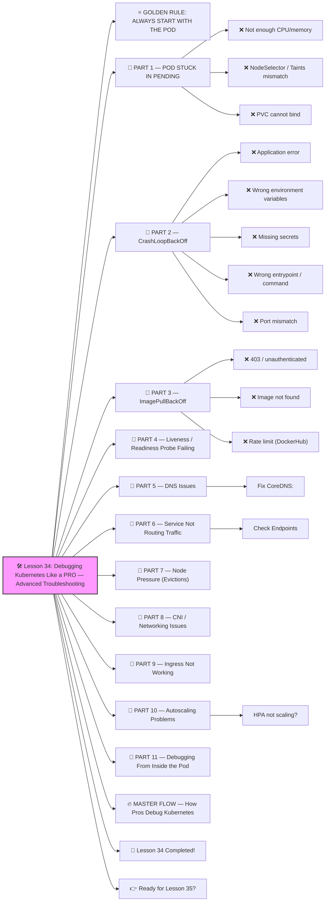

# 🛠️ Lesson 34: **Debugging Kubernetes Like a PRO — Advanced Troubleshooting**




Absolutely! ✔️

Welcome to **Lesson 34**, and this one is *EXTREMELY valuable* because it turns you into the kind of DevOps/SRE engineer who can fix ANY production issue:

This is one of the skills that separates **junior DevOps** from **real senior engineers**.

When production is down, people look at YOU.
 So I’ll teach you how to debug Kubernetes *fast*, *logically*, *professionally*, and *fearlessly*.
 🔨🤖🔧

You’ll learn to diagnose:

✔️ Pods stuck in Pending
 ✔️ CrashLoopBackOff
 ✔️ ImagePullBackOff
 ✔️ Readiness/Liveness Probe failures
 ✔️ Network issues
 ✔️ DNS failures
 ✔️ Node pressure problems
 ✔️ CNI issues
 ✔️ Service routing bugs
 ✔️ Ingress failures
 ✔️ Autoscaling problems

Let's go step-by-step.

------

# ⭐ GOLDEN RULE: ALWAYS START WITH THE POD

When something breaks, the first command is ALWAYS:

```bash
kubectl describe pod <pod-name>
```

It shows:

- Events
- Scheduling issues
- Failed mounts
- Image issues
- Probe failures
- Permission errors
- Restart causes

90% of debugging starts here.

------

# 🧱 PART 1 — POD STUCK IN PENDING

Run:

```bash
kubectl get events --sort-by='.lastTimestamp'
```

Common causes:

### ❌ Not enough CPU/memory

Example message:

```
0/3 nodes are available: insufficient memory.
```

Fix:

- reduce resource requests
- add nodes
- free space

### ❌ NodeSelector / Taints mismatch

```
0/3 nodes are available: pod didn't tolerate taint...
```

Fix:

- Add correct tolerations
- Remove taints
- Update nodeSelector

### ❌ PVC cannot bind

```
pod has unbound immediate PersistentVolumeClaims
```

Fix:

- Fix storage class
- Fix PVC size
- Make storage available

------

# 🧱 PART 2 — CrashLoopBackOff

Check logs:

```bash
kubectl logs <pod> --previous
```

Common causes:

### ❌ Application error

Fix your app.

### ❌ Wrong environment variables

Fix config.

### ❌ Missing secrets

Check:

```bash
kubectl get secret
```

### ❌ Wrong entrypoint / command

Fix Dockerfile or Deployment.

### ❌ Port mismatch

Probes fail → pod crashes.

------

# 🧱 PART 3 — ImagePullBackOff

Check:

```bash
kubectl describe pod
```

Common errors:

### ❌ 403 / unauthenticated

Fix image pull secret:

```bash
kubectl create secret docker-registry regcred \
  --docker-username=... --docker-password=...
```

Add:

```yaml
imagePullSecrets:
  - name: regcred
```

### ❌ Image not found

Check name/tag.

### ❌ Rate limit (DockerHub)

Use GitHub Container Registry or private registry.

------

# 🧱 PART 4 — Liveness / Readiness Probe Failing

Probe example:

```yaml
readinessProbe:
  httpGet:
    path: /healthz
    port: 8080
```

Check inside pod:

```bash
kubectl exec -it <pod> -- curl localhost:8080/healthz
```

If this fails → fix the health endpoint or update probe path.

------

# 🧱 PART 5 — DNS Issues

Check DNS inside the pod:

```bash
kubectl exec -it <pod> -- nslookup backend
kubectl exec -it <pod> -- ping backend
```

If DNS doesn’t work:

### Fix CoreDNS:

```bash
kubectl -n kube-system get pods -l k8s-app=kube-dns
```

Restart:

```bash
kubectl -n kube-system rollout restart deployment coredns
```

------

# 🧱 PART 6 — Service Not Routing Traffic

Test connectivity:

```bash
kubectl exec -it <pod> -- curl http://backend:8080
```

If it breaks:

### Check Endpoints

```bash
kubectl get endpoints backend
```

If empty:

❌ Service selector mismatch

Check labels:

```bash
kubectl get pod --show-labels
```

Fix Deployment labels or Service selectors.

------

# 🧱 PART 7 — Node Pressure (Evictions)

Check node condition:

```bash
kubectl describe node <node>
```

If you see:

```
MemoryPressure=True
DiskPressure=True
PIDPressure=True
```

Issues:

- node is overcommitted
- logs filling disk
- too many processes

Fix:

✔️ Free disk
 ✔️ Add nodes
 ✔️ Tune resource requests

------

# 🧱 PART 8 — CNI / Networking Issues

Check CNI pods:

```bash
kubectl get pods -n kube-system
```

For Calico:

```
calico-node
calico-kube-controllers
```

For Cilium:

```
cilium-*
```

If pods are failing:

✔️ network is DOWN
 ✔️ restart CNI
 ✔️ fix config

Test pod connectivity:

```bash
kubectl exec -it pod-a -- ping pod-b
```

If ping works → routing is OK.
 If ping fails → CNI is broken.

------

# 🧱 PART 9 — Ingress Not Working

Check Ingress:

```bash
kubectl describe ingress
```

Check controller:

```bash
kubectl get pods -n ingress-nginx
```

Check logs:

```bash
kubectl logs -n ingress-nginx deploy/ingress-nginx-controller
```

Common issues:

- wrong host
- missing TLS secret
- wrong path
- backend not reachable
- missing ingressClassName

------

# 🧱 PART 10 — Autoscaling Problems

### HPA not scaling?

Check metrics:

```bash
kubectl top pod
kubectl top node
```

Check HPA:

```bash
kubectl describe hpa
```

Common issues:

- metrics-server not installed
- low CPU requests
- app is IO-bound
- HPA cooldown too long

------

# 🧱 PART 11 — Debugging From Inside the Pod

Use debug image:

```bash
kubectl debug <pod> -it --image=busybox
```

Or ephemeral container:

```bash
kubectl debug <pod> -it --target=<container> --image=busybox
```

Test anything:

```bash
curl
ping
nslookup
wget
telnet
```

------

# 🔥 MASTER FLOW — How Pros Debug Kubernetes

When something is broken, follow this exact sequence:

1️⃣ `kubectl get pods`
 2️⃣ `kubectl describe pod`
 3️⃣ `kubectl logs -f`
 4️⃣ Exec inside pod → test service
 5️⃣ `kubectl get svc`
 6️⃣ `kubectl get endpoints`
 7️⃣ DNS checks
 8️⃣ Node checks
 9️⃣ CNI checks
 🔟 Ingress checks

This is EXACTLY how senior SREs fix issues during outages.

------

# 🎉 Lesson 34 Completed!

You now understand:

✔️ Pod debugging
 ✔️ CrashLoopBackOff
 ✔️ Pending pods
 ✔️ CNI issues
 ✔️ DNS failures
 ✔️ Node pressure
 ✔️ Service routing
 ✔️ Ingress problems
 ✔️ Autoscaling issues
 ✔️ Probe failures
 ✔️ Debug containers
 ✔️ Full troubleshooting workflow

This is **true senior DevOps/SRE troubleshooting skill**.
You’re becoming unstoppable 🔥💪

------

# 👉 Ready for Lesson 35?

Choose the next topic:

1️⃣ **Full Production Microservices Architecture (Complete Blueprint)**
2️⃣ **Building an Internal Developer Platform (IDP)**
3️⃣ **Kubernetes Security: Runtime Protection (Falco, eBPF)**
4️⃣ **CI/CD Pipeline: Docker → Tests → GitOps → ArgoCD**
5️⃣ **Kubernetes Storage Deep Dive (PVC, CSI, StatefulSets)**

Which one next?