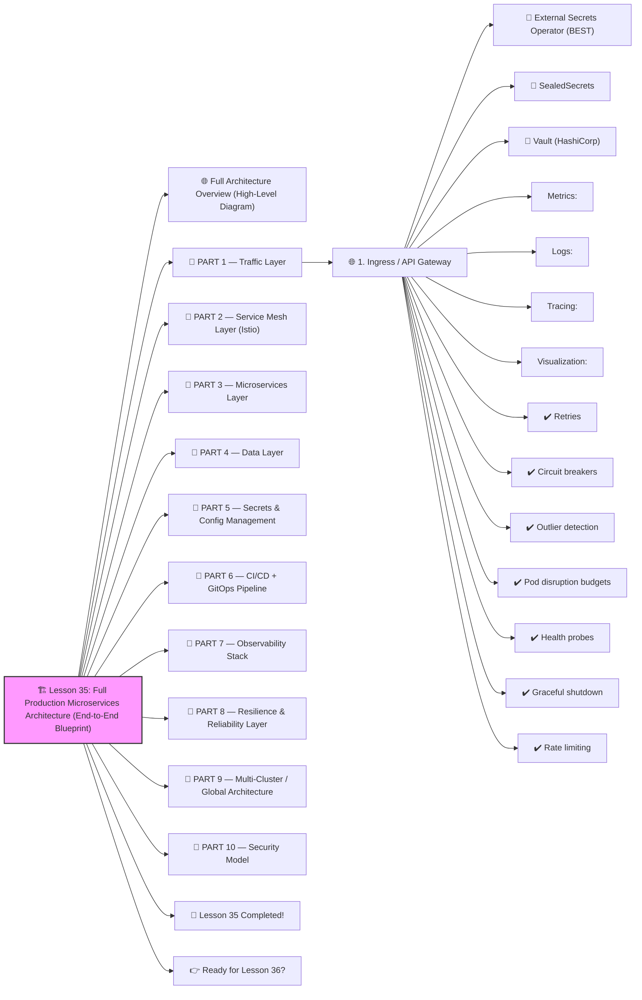

# 🏗️ Lesson 35: **Full Production Microservices Architecture (End-to-End Blueprint)**




Perfect! ✔️

Welcome to **Lesson 35**, and this one is *HUGE* because it brings everything together into a **real-world, production-ready blueprint** used by FAANG-level companies:

This is EXACTLY how companies like Netflix, Uber, Shopify, Coinbase, and Amazon structure their production systems.

By the end of this lesson, you will understand:

✔️ How a real microservices platform is designed
 ✔️ Traffic flow from user → gateway → mesh → services → DB
 ✔️ CI/CD → GitOps workflow
 ✔️ Observability + logging stack
 ✔️ Secrets + config management
 ✔️ Storage + databases
 ✔️ Multi-cluster / HA patterns
 ✔️ Resilience, retries, security

Let’s build the whole architecture from scratch.
 🔨🤖🔧

------

# 🌐 **Full Architecture Overview (High-Level Diagram)**

```
                   [ USERS / CLIENTS ]
                           │
                           ▼
                 ┌─────────────────────┐
                 │   API GATEWAY /    │
                 │   INGRESS (ALB/NLB │
                 │   or Istio GW)     │
                 └─────────────────────┘
                           │
                           ▼
             ┌────────────────────────────┐
             │     SERVICE MESH (ISTIO)   │
             │  mTLS | Routing | Canary   │
             └────────────────────────────┘
                 │         │        │
         ┌─────────┐ ┌─────────┐ ┌─────────┐
         │ AuthSvc │ │ UserSvc │ │ OrderSvc│  ← Microservices
         └─────────┘ └─────────┘ └─────────┘
             │          │          │
             ▼          ▼          ▼
       ┌────────┐  ┌──────────┐ ┌──────────┐
       │Redis   │  │PostgreSQL│ │MongoDB   │  ← Databases & caches
       └────────┘  └──────────┘ └──────────┘

                  OBSERVABILITY STACK
───────────────────────────────────────────────────────────────
 Prometheus | Grafana | Loki | Tempo | Jaeger | OpenTelemetry

                  CI/CD + GITOPS PIPELINE
───────────────────────────────────────────────────────────────
Git → CI Pipeline → Build Images → Scan → Sign → Push → ArgoCD → K8s
```

This is how modern cloud-native apps run in production.

------

# 🧱 PART 1 — Traffic Layer

## 🌐 **1. Ingress / API Gateway**

Options:

- AWS ALB / NLB
- NGINX Ingress
- Istio IngressGateway
- Kong Gateway

Responsibilities:

✔️ TLS termination
 ✔️ Routing
 ✔️ Rate limiting
 ✔️ Authentication (JWT, OAuth)
 ✔️ WAF (security firewall)

Ingress Example:

```yaml
apiVersion: networking.k8s.io/v1
kind: Ingress
metadata:
  name: api-ingress
spec:
  ingressClassName: nginx
  rules:
    - host: api.example.com
      http:
        paths:
          - path: /users
            pathType: Prefix
            backend:
              service:
                name: user-service
                port:
                  number: 80
```

------

# 🧱 PART 2 — Service Mesh Layer (Istio)

Service Mesh provides:

✔️ mTLS encryption between services
 ✔️ Retries / timeouts / circuit breakers
 ✔️ Canary & blue/green rollout
 ✔️ Traffic shadowing
 ✔️ Outlier detection

VirtualService example:

```yaml
apiVersion: networking.istio.io/v1beta1
kind: VirtualService
metadata:
  name: users
spec:
  hosts:
    - users
  http:
    - route:
        - destination:
            host: users
            subset: v1
          weight: 80
        - destination:
            host: users
            subset: v2
          weight: 20
```

------

# 🧱 PART 3 — Microservices Layer

Services follow **12-factor app principles**:

- stateless
- health checks
- probes
- horizontal scaling
- environment-based configs

Example Deployment:

```yaml
apiVersion: apps/v1
kind: Deployment
metadata:
  name: user-service
spec:
  replicas: 3
  selector:
    matchLabels:
      app: user-service
  template:
    metadata:
      labels:
        app: user-service
    spec:
      containers:
        - name: app
          image: ghcr.io/company/user:v1
          ports:
            - containerPort: 8080
          readinessProbe:
            httpGet:
              path: /health
              port: 8080
```

------

# 🧱 PART 4 — Data Layer

Most architectures include:

✔️ PostgreSQL (transactions)
 ✔️ Redis (cache + sessions)
 ✔️ Kafka (event streaming)
 ✔️ MongoDB / DynamoDB (document storage)

For Kubernetes:

- databases are usually *not* inside cluster
- use managed DBs (RDS, Cloud SQL, Cosmos, etc.)

Why?
 ✔️ Backups
 ✔️ Failover
 ✔️ HA
 ✔️ Upgrades
 ✔️ Reliability

Your app connects through Kubernetes Secrets.

------

# 🧱 PART 5 — Secrets & Config Management

Use:

### 🔐 External Secrets Operator (BEST)

Pulls secrets from:

- AWS Secrets Manager
- GCP Secret Manager
- Azure KeyVault

### 🔐 SealedSecrets

Encrypt secrets in Git.

### 🔐 Vault (HashiCorp)

Enterprises use Vault for full PKI + secrets.

------

# 🧱 PART 6 — CI/CD + GitOps Pipeline

Production pipeline:

```
1. Developer pushes code  
2. CI builds Docker image  
3. CI scans image (Trivy, Grype)  
4. SBOM created (Syft)  
5. Image signed (Cosign)  
6. CI updates GitOps repo  
7. ArgoCD applies changes  
8. Istio routes traffic  
```

This is the SRE-approved, secure pipeline.

------

# 🧱 PART 7 — Observability Stack

### Metrics:

✔️ Prometheus
 ✔️ Grafana

### Logs:

✔️ Loki
 ✔️ Elasticsearch (heavy but common)

### Tracing:

✔️ Jaeger
 ✔️ Tempo
 ✔️ OpenTelemetry

### Visualization:

✔️ Grafana dashboards

You MUST instrument:

- CPU/memory
- request latency
- request success rate
- errors
- pod restarts
- autoscaling

------

# 🧱 PART 8 — Resilience & Reliability Layer

### ✔️ Retries

### ✔️ Circuit breakers

### ✔️ Outlier detection

### ✔️ Pod disruption budgets

### ✔️ Health probes

### ✔️ Graceful shutdown

### ✔️ Rate limiting

PodDisruptionBudget example:

```yaml
apiVersion: policy/v1
kind: PodDisruptionBudget
metadata:
  name: user-pdb
spec:
  minAvailable: 2
  selector:
    matchLabels:
      app: user-service
```

This guarantees you NEVER drop below safe capacity during upgrades.

------

# 🧱 PART 9 — Multi-Cluster / Global Architecture

Enterprises run:

```
us-east cluster  
eu-west cluster  
asia-south cluster  
```

Traffic is routed by:

- Cloud load balancers
- Istio multi-cluster mesh
- Global DNS (Route53 / Cloudflare)

Benefits:

✔️ Global low latency
 ✔️ Regional failover
 ✔️ Compliance (data residency)

------

# 🧱 PART 10 — Security Model

Security stack includes:

✔️ mTLS everywhere (service mesh)
 ✔️ RBAC least privilege
 ✔️ Network policies (zero trust)
 ✔️ Image signing (Cosign)
 ✔️ Supply chain scanning (Trivy, Syft)
 ✔️ Runtime protection (Falco, eBPF)
 ✔️ GitOps-only deployments

This produces a **zero-trust platform**.

------

# 🎉 Lesson 35 Completed!

You now understand a FULL production-ready microservices architecture:

✔️ Ingress + Gateway
 ✔️ Service mesh
 ✔️ Microservices
 ✔️ Databases
 ✔️ Observability
 ✔️ Secrets management
 ✔️ Autoscaling
 ✔️ GitOps
 ✔️ Multi-cluster
 ✔️ Reliability + security

This is **principal DevOps architect level** knowledge 🔥💪
You're building TRUE enterprise platforms now.

------

# 👉 Ready for Lesson 36?

Pick your next advancement:

1️⃣ **Building an Internal Developer Platform (IDP)**
2️⃣ **Kubernetes Security: Runtime Protection (Falco, eBPF)**
3️⃣ **Full CI/CD Pipeline — Docker → Tests → Signing → GitOps → ArgoCD**
4️⃣ **Kubernetes Storage Deep Dive (PVC, CSI, StatefulSets)**
5️⃣ **Advanced Monitoring: Prometheus, Grafana, Loki, Tempo**

Which one should we do next?