# 🌍 Lesson 4:— Ingress (Real Web Access + Domains + HTTPS)

```mermaid
graph LR
    root["🌍 Lesson 4:— Ingress (Real Web Access + Domains + HTTPS)"]
    style root fill:#f9f,stroke:#333,stroke-width:2px
    root --> node_0["💡 What Is Ingress?"]
    root --> node_1["🧱 Ingress Requires an Ingress Controller"]
    root --> node_2["🧪 Example App Setup (Service + Deployment)"]
    node_2 --> node_3["Deployment:"]
    node_2 --> node_4["Service:"]
    root --> node_5["🚀 Now the Important Part: The Ingress"]
    node_5 --> node_6["Ingress YAML:"]
    root --> node_7["🧪 Test It (Minikube)"]
    root --> node_8["🔥 Bonus: Route Multiple Apps With One Ingress"]
    root --> node_9["🔐 HTTPS (TLS) with Cert-Manager (Next Level)"]
    root --> node_10["🎉 Lesson 4 Completed!"]
    root --> node_11["👉 Ready for Lesson 5?"]
```




Perfect! ✔️
 Welcome to **Lesson 4**, and this one is a BIG milestone in becoming a real DevOps engineer 🔨🤖🔧

So far, we deployed apps and exposed them using **NodePort**, but NodePort is NOT used in real companies.

Why?
 Because NodePort is slow, insecure, and hard to manage.

Instead, we use **Ingress**.

------

# 💡 What Is Ingress?

Ingress is a **smart router** inside Kubernetes.
 It lets you:

✔️ Use real domain names
 ✔️ Use HTTP/HTTPS
 ✔️ Route traffic to different services
 ✔️ Enable TLS (SSL certificate)
 ✔️ Expose internal microservices publicly

Think of Ingress like:

> “All your apps share ONE entry point (a single Load Balancer). Ingress decides which app gets which request.”

------

# 🧱 Ingress Requires an Ingress Controller

Common ones:

- **NGINX Ingress Controller** (most popular)
- Traefik
- HAProxy
- AWS/GCP native controllers

For beginners, we use **NGINX Ingress**.

In Minikube:

```bash
minikube addons enable ingress
```

✔️ That’s it — Ingress controller created.

------

# 🧪 Example App Setup (Service + Deployment)

Before using Ingress, we need a service.

### Deployment:

```yaml
apiVersion: apps/v1
kind: Deployment
metadata:
  name: web-app
spec:
  replicas: 1
  selector:
    matchLabels:
      app: web-app
  template:
    metadata:
      labels:
        app: web-app
    spec:
      containers:
        - name: web
          image: nginx:latest
          ports:
            - containerPort: 80
```

### Service:

```yaml
apiVersion: v1
kind: Service
metadata:
  name: web-service
spec:
  selector:
    app: web-app
  ports:
    - port: 80
      targetPort: 80
```

Apply them:

```bash
kubectl apply -f deployment.yaml
kubectl apply -f service.yaml
```

------

# 🚀 Now the Important Part: The Ingress

This exposes your app at:

👉 `http://example.com/`
 (or localhost with host override)

### Ingress YAML:

```yaml
apiVersion: networking.k8s.io/v1
kind: Ingress
metadata:
  name: web-ingress
  annotations:
    nginx.ingress.kubernetes.io/rewrite-target: /
spec:
  rules:
    - host: example.com
      http:
        paths:
          - path: /
            pathType: Prefix
            backend:
              service:
                name: web-service
                port:
                  number: 80
```

Apply it:

```bash
kubectl apply -f ingress.yaml
```

------

# 🧪 Test It (Minikube)

Get ingress IP:

```bash
kubectl get ingress
```

Add to your hosts file:

```
127.0.0.1 example.com
```

Then open:

👉 [http://example.com](http://example.com/)

You will see the NGINX welcome page ✔️

------

# 🔥 Bonus: Route Multiple Apps With One Ingress

This is how companies route microservices.

Example:

- `/api` → backend service
- `/app` → frontend service

```yaml
apiVersion: networking.k8s.io/v1
kind: Ingress
metadata:
  name: multi-ingress
spec:
  rules:
    - host: mysite.com
      http:
        paths:
          - path: /api
            pathType: Prefix
            backend:
              service:
                name: api-service
                port:
                  number: 80

          - path: /app
            pathType: Prefix
            backend:
              service:
                name: frontend-service
                port:
                  number: 80
```

Now 1 domain → many apps ✔️

------

# 🔐 HTTPS (TLS) with Cert-Manager (Next Level)

We can add:

```yaml
tls:
  - hosts:
      - example.com
    secretName: tls-secret
```

Later when you're ready, we can install **cert-manager** and automatically generate free LetsEncrypt TLS certificates 😎

------

# 🎉 Lesson 4 Completed!

You now understand:

✔️ What Ingress is
 ✔️ How to expose real web apps
 ✔️ How to use hostnames
 ✔️ How to route multiple apps
 ✔️ How Ingress replaces NodePort
 ✔️ How to prepare for HTTPS

This is **senior-level Kubernetes knowledge**, taught simply.
 You’re truly leveling up 💪🔥

------

# 👉 Ready for Lesson 5?

Choose one:

1. **Persistent Volumes (Storage for Databases & Apps)**
2. **Docker + Kubernetes Workflow (Build → Push → Deploy)**
3. **Helm Charts (Advanced DevOps packaging)**
4. **Namespaces (Organizing Dev/Stage/Prod)**
5. **Autoscaling (HPA + Resource Limits)**

Which one should we attack next? ✔️