# 🗄️  Lesson 5: Persistent Volumes (Storage for Databases & Apps)

```mermaid
graph LR
    root["🗄️  Lesson 5: Persistent Volumes (Storage for Databases & Apps)"]
    style root fill:#f9f,stroke:#333,stroke-width:2px
    root --> node_0["💡 Why Do We Need Storage?"]
    root --> node_1["🌱 Part 1 — Create a PVC (Beginner Way)"]
    root --> node_2["⚙️ Part 2 — Use PVC in a Pod (Beginner Example)"]
    root --> node_3["🎉 Let’s Test If It Works"]
    root --> node_4["🔥 Part 3 — Real-World Example: MySQL Database"]
    node_4 --> node_5["Step 1 — PVC"]
    node_4 --> node_6["Step 2 — MySQL Deployment"]
    root --> node_7["🧠 Summary (Beginner-Friendly)"]
    root --> node_8["🎉 Lesson 5 Completed!"]
    root --> node_9["👉 Ready for Lesson 6?"]
```




Great! ✔️

Time for **Lesson 5** — a MAJOR real-world DevOps skill:

This lesson teaches how to store data *permanently* in Kubernetes — something every real application needs.
 Without this, **your data is gone if the Pod restarts** ❗

Let’s make this super beginner-friendly 🔨🤖🔧

------

# 💡 Why Do We Need Storage?

Example apps that need permanent data:

- MySQL / PostgreSQL
- Redis
- MongoDB
- WordPress
- Upload systems
- Any app that writes files or databases

If you store data *inside* a Pod → when that Pod dies, **your data disappears**.

So Kubernetes uses:

| Component                       | Purpose                      |
| ------------------------------- | ---------------------------- |
| **PersistentVolume (PV)**       | Actual storage (like a disk) |
| **PersistentVolumeClaim (PVC)** | A request for storage        |
| **Pod**                         | Uses the PVC                 |

This separation makes Kubernetes portable and flexible.

------

# 🌱 Part 1 — Create a PVC (Beginner Way)

Most clusters auto-provision storage.
 So instead of making your own PV, we usually make JUST the PVC.

Here’s a simple PVC:

```yaml
apiVersion: v1
kind: PersistentVolumeClaim
metadata:
  name: mypvc
spec:
  accessModes:
    - ReadWriteOnce
  resources:
    requests:
      storage: 1Gi
```

✔️ This asks Kubernetes:

> “Please give me 1GB of persistent storage.”

Apply it:

```bash
kubectl apply -f pvc.yaml
```

Check if it's created:

```bash
kubectl get pvc
```

------

# ⚙️ Part 2 — Use PVC in a Pod (Beginner Example)

Let’s attach this storage to an NGINX container:

```yaml
apiVersion: v1
kind: Pod
metadata:
  name: nginx-pv-demo
spec:
  containers:
    - name: nginx
      image: nginx:latest
      volumeMounts:
        - mountPath: "/usr/share/nginx/html"
          name: demo-volume
  volumes:
    - name: demo-volume
      persistentVolumeClaim:
        claimName: mypvc
```

✔️ Whatever you store in `/usr/share/nginx/html` **stays forever**, even if the Pod dies.

Run it:

```bash
kubectl apply -f pod.yaml
```

------

# 🎉 Let’s Test If It Works

Open a shell into the Pod:

```bash
kubectl exec -it nginx-pv-demo -- /bin/bash
```

Inside:

```bash
echo "Hello Kubernetes Storage!" > /usr/share/nginx/html/index.html
```

Exit Pod.

**Now delete the Pod:**

```bash
kubectl delete pod nginx-pv-demo
```

Recreate it:

```bash
kubectl apply -f pod.yaml
```

Open the file again — and you will still see:

```
Hello Kubernetes Storage!
```

✔️ **This proves real persistent storage is working.**

------

# 🔥 Part 3 — Real-World Example: MySQL Database

This is where DevOps magic happens.

### Step 1 — PVC

```yaml
apiVersion: v1
kind: PersistentVolumeClaim
metadata:
  name: mysql-pvc
spec:
  accessModes:
    - ReadWriteOnce
  resources:
    requests:
      storage: 5Gi
```

### Step 2 — MySQL Deployment

```yaml
apiVersion: apps/v1
kind: Deployment
metadata:
  name: mysql
spec:
  selector:
    matchLabels:
      app: mysql
  template:
    metadata:
      labels:
        app: mysql
    spec:
      containers:
        - name: mysql
          image: mysql:5.7
          env:
            - name: MYSQL_ROOT_PASSWORD
              value: "rootpass"
          ports:
            - containerPort: 3306
          volumeMounts:
            - name: mysql-storage
              mountPath: /var/lib/mysql
      volumes:
        - name: mysql-storage
          persistentVolumeClaim:
            claimName: mysql-pvc
```

Even if MySQL Pod restarts → **your database stays safe** ✔️

------

# 🧠 Summary (Beginner-Friendly)

```
PVC <—— Your app uses this storage
PV  <—— Kubernetes disk that fulfills the PVC
```

✔️ PVC = request
 ✔️ PV = actual data disk
 ✔️ Pod uses the PVC

This is **essential** for any modern application.

------

# 🎉 Lesson 5 Completed!

You learned:

✔️ Why Pods lose data
 ✔️ What PV and PVC are
 ✔️ How to create a PVC
 ✔️ How to attach storage to Pods
 ✔️ Real example: MySQL database storage
 ✔️ How real DevOps teams manage stateful workloads

You're becoming seriously skilled 🚀🔥

------

# 👉 Ready for Lesson 6?

Choose one:

1. **Docker → Build → Push → Deploy to Kubernetes**
2. **Helm Charts (Enterprise-level packaging)**
3. **Horizontal Autoscaling (HPA)**
4. **Namespaces (Dev/Stage/Prod separation)**
5. **Kustomize (environment overlays)**
6. **StatefulSets (databases done right)**

Tell me which one you want next!