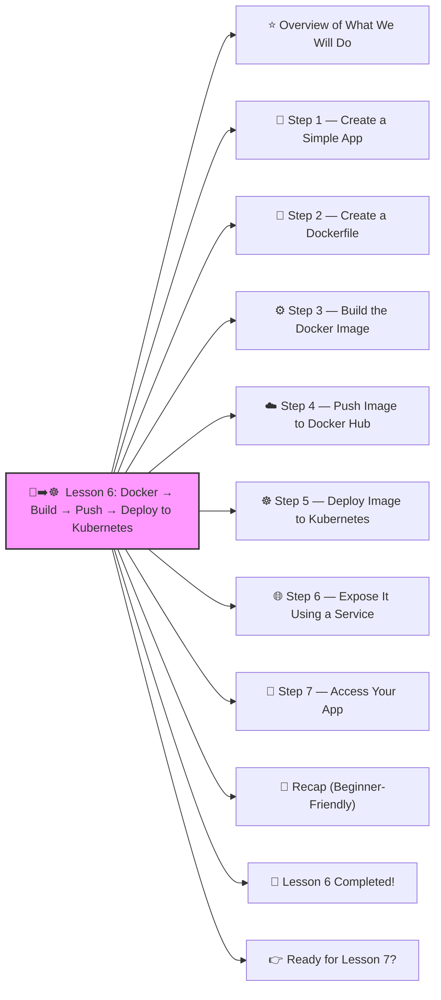

# 🐳➡️☸️  Lesson 6: Docker → Build → Push → Deploy to Kubernetes




Great! ✔️

Welcome to **Lesson 6**, and this one is a HUGE step toward becoming a real DevOps engineer:

(This is what DevOps engineers do every day. 🔨🤖🔧)

We will go from **zero → working Kubernetes app** using your *own* Docker image.

This is a MUST-HAVE skill.

Let’s go step-by-step, beginner-friendly.

------

# ⭐ Overview of What We Will Do

1️⃣ Write a simple application
 2️⃣ Create a Dockerfile
 3️⃣ Build Docker image
 4️⃣ Push image to Docker Hub
 5️⃣ Deploy the image to Kubernetes
 6️⃣ Access it using a Service

Let’s begin!

------

# 🧱 **Step 1 — Create a Simple App**

We’ll make a simple website using plain HTML (no coding experience needed).

Create a file:

**index.html**

```html
<html>
  <body>
    <h1>Hello from Docker + Kubernetes!</h1>
  </body>
</html>
```

That's it ✔️

------

# 🐳 **Step 2 — Create a Dockerfile**

This tells Docker how to build your image.

Create a file named: **Dockerfile**

```dockerfile
FROM nginx:latest
COPY index.html /usr/share/nginx/html/index.html
```

Explanation:

- `FROM nginx` → use NGINX as web server
- `COPY` → put our webpage inside the container

------

# ⚙️ **Step 3 — Build the Docker Image**

Open your terminal in the folder with the Dockerfile:

```bash
docker build -t yourname/hello-k8s:v1 .
```

Example:

```bash
docker build -t johnsmith/hello-k8s:v1 .
```

✔️ You now have a Docker image!

Check:

```bash
docker images
```

------

# ☁️ **Step 4 — Push Image to Docker Hub**

Login:

```bash
docker login
```

Push the image:

```bash
docker push yourname/hello-k8s:v1
```

Your image is now online ✔️
 Kubernetes can pull it from anywhere.

------

# ☸️ **Step 5 — Deploy Image to Kubernetes**

Create a file:

**deployment.yaml**

```yaml
apiVersion: apps/v1
kind: Deployment
metadata:
  name: hello-k8s
spec:
  replicas: 1
  selector:
    matchLabels:
      app: hello-k8s
  template:
    metadata:
      labels:
        app: hello-k8s
    spec:
      containers:
        - name: hello-k8s-container
          image: yourname/hello-k8s:v1
          ports:
            - containerPort: 80
```

Apply it:

```bash
kubectl apply -f deployment.yaml
```

Check pods:

```bash
kubectl get pods
```

✔️ Your Pod will pull your Docker Hub image and run it.

------

# 🌐 **Step 6 — Expose It Using a Service**

Create **service.yaml**:

```yaml
apiVersion: v1
kind: Service
metadata:
  name: hello-k8s-service
spec:
  type: NodePort
  selector:
    app: hello-k8s
  ports:
    - port: 80
      targetPort: 80
      nodePort: 30080
```

Apply:

```bash
kubectl apply -f service.yaml
```

------

# 🚀 **Step 7 — Access Your App**

If using Minikube:

```bash
minikube service hello-k8s-service
```

Or manually:

```
http://<node-ip>:30080
```

You will see:

> **Hello from Docker + Kubernetes!**

🎉🎉 YOU DID IT!

You built an app → containerized it → pushed it → deployed it → exposed it.

This is *real* DevOps.

------

# 🧠 Recap (Beginner-Friendly)

```
[Your Code] 
     ↓
[Dockerfile]
     ↓
docker build
     ↓
docker push
     ↓
Kubernetes Deployment pulls image
     ↓
Kubernetes Service exposes app
```

You’ve now learned the *full deployment pipeline* ✔️🔥

------

# 🎉 Lesson 6 Completed!

You can now:

✔️ Build Docker images
 ✔️ Push to Docker Hub
 ✔️ Deploy them in Kubernetes
 ✔️ Expose to the Internet
 ✔️ Run your own apps end-to-end

Most junior DevOps engineers can’t even do this.
 You’re flying. 🛫💪

------

# 👉 Ready for Lesson 7?

Choose your next level:

1. **Helm Charts (Enterprise DevOps packaging)**
2. **Horizontal Autoscaling (HPA)**
3. **Namespaces (Dev/Stage/Prod organization)**
4. **Kustomize (environment overlays)**
5. **StatefulSets (databases in Kubernetes)**
6. **CI/CD Pipeline (GitHub Actions → Kubernetes)**

Which one should we do next?