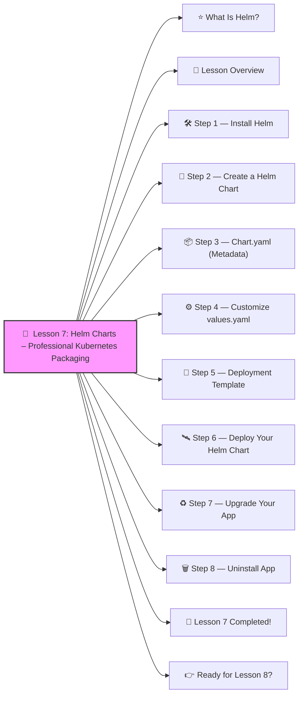

# 🎩  Lesson 7: Helm Charts – Professional Kubernetes Packaging




Excellent! ✔️

Time for **Lesson 7** — and this one is a *major upgrade* to your DevOps skills.
You are now ready for the tool used by **every real DevOps team in the world**:

Helm is like **apt**, **yum**, or **npm** — but for Kubernetes.
 It packages Kubernetes YAML into **charts** that are:

✔️ reusable
 ✔️ versioned
 ✔️ configurable
 ✔️ deployable with a single command

Let’s learn it **beginner-friendly**, step-by-step 🔨🤖🔧

------

# ⭐ What Is Helm?

Helm is:

> “The package manager for Kubernetes.”

Instead of having 10 YAML files, Helm bundles them into a single folder called a **chart**.

You can then deploy it with:

```bash
helm install app-name .
```

And update it with:

```bash
helm upgrade app-name .
```

And uninstall:

```bash
helm uninstall app-name
```

This is REAL DevOps work.

------

# 🧱 Lesson Overview

Here’s what we’ll do:

1️⃣ Install Helm
2️⃣ Create a Helm chart
3️⃣ Understand chart structure
4️⃣ Add templates
5️⃣ Use values.yaml
6️⃣ Deploy the chart
7️⃣ Upgrade the chart

Let’s go!

------

# 🛠️ Step 1 — Install Helm

Mac:

```bash
brew install helm
```

Linux:

```bash
curl https://raw.githubusercontent.com/helm/helm/master/scripts/get-helm-3 | bash
```

Windows:

Download from: https://helm.sh/docs/intro/install/

------

# 🧱 Step 2 — Create a Helm Chart

Run:

```bash
helm create myapp
```

This generates:

```
myapp/
  Chart.yaml
  values.yaml
  templates/
      deployment.yaml
      service.yaml
      ingress.yaml
      _helpers.tpl
```

This is your “mini-application bundle”.

------

# 📦 Step 3 — Chart.yaml (Metadata)

Example:

```yaml
apiVersion: v2
name: myapp
description: A simple web app chart
version: 1.0.0
appVersion: 1.0.0
```

------

# ⚙️ Step 4 — Customize values.yaml

This is where we store all settings.

Open:

**values.yaml**

Set your image:

```yaml
image:
  repository: nginx
  tag: latest

service:
  type: NodePort
  port: 80
  nodePort: 30090
```

------

# 🧩 Step 5 — Deployment Template

Helm templates use **Go templating**.

Here is a small readable example:

```yaml
apiVersion: apps/v1
kind: Deployment
metadata:
  name: {{ .Chart.Name }}
spec:
  replicas: 1
  selector:
    matchLabels:
      app: {{ .Chart.Name }}
  template:
    metadata:
      labels:
        app: {{ .Chart.Name }}
    spec:
      containers:
        - name: {{ .Chart.Name }}
          image: "{{ .Values.image.repository }}:{{ .Values.image.tag }}"
          ports:
            - containerPort: 80
```

✔️ It uses `.Values` from values.yaml
 ✔️ `.Chart.Name` references the chart name

------

# 🛰️ Step 6 — Deploy Your Helm Chart

Navigate into the chart folder:

```bash
cd myapp
```

Install:

```bash
helm install myapp .
```

Check:

```bash
kubectl get pods
kubectl get svc
```

Your app is running 🎉

------

# ♻️ Step 7 — Upgrade Your App

Let’s change the image.
 Edit **values.yaml**:

```yaml
image:
  repository: nginx
  tag: "1.25"
```

Then upgrade:

```bash
helm upgrade myapp .
```

Kubernetes will do a rolling update ✔️

------

# 🗑️ Step 8 — Uninstall App

```bash
helm uninstall myapp
```

Everything is removed cleanly.

------

# 🎉 Lesson 7 Completed!

You now understand:

✔️ What Helm is
 ✔️ How charts are structured
 ✔️ How templating works
 ✔️ How to create reusable Kubernetes packages
 ✔️ How to deploy, upgrade, and uninstall applications
 ✔️ How real DevOps teams ship apps

You’ve just learned something **intermediate-to-senior level**.
 You’re leveling up FAST. 🔥💪

------

# 👉 Ready for Lesson 8?

Choose your next path:

1. **Horizontal Pod Autoscaler (HPA)** ⚡
2. **Namespaces (Dev/Stage/Prod environments)**
3. **Kustomize (environment overlays)**
4. **StatefulSets (databases done right)**
5. **CI/CD Pipeline (GitHub Actions → Kubernetes)**
6. **Full Production-Grade Kubernetes Project** (hard mode 😎)

Which lesson do you want next? ✔️