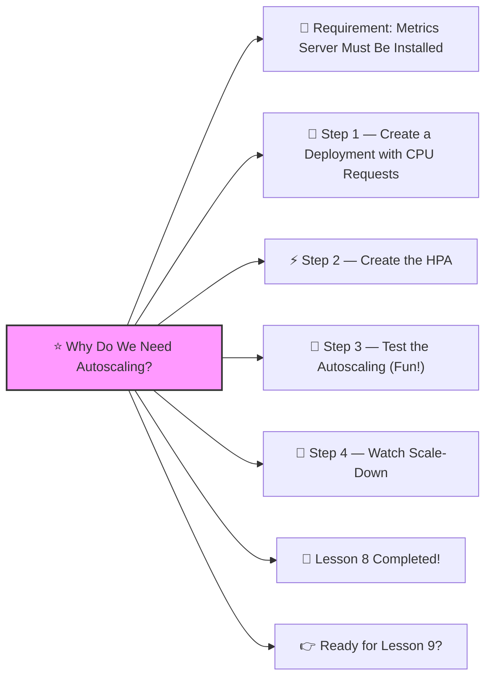

⚡ Lesson 8: **Horizontal Pod Autoscaler (HPA)**

Great! ✔️
Welcome to **Lesson 8**, and this one teaches you something **every production Kubernetes cluster uses**:


HPA makes your app **scale automatically** based on CPU, memory, or custom metrics.

Think of it like:

> “If your app gets busy → add more Pods.
>  If it gets quiet → remove Pods.”

This is a core DevOps skill. Let’s make it *super beginner-friendly*.
 🔨🤖🔧

------

# ⭐ Why Do We Need Autoscaling?




Imagine your website suddenly gets:

- 10,000 users
- CPU hits 90%
- Traffic spikes

If you only have **1 Pod**, your application crashes ❗

HPA prevents this:

✔️ Adds Pods during high traffic
 ✔️ Removes Pods when load decreases
 ✔️ Keeps your app responsive and efficient
 ✔️ Saves money (only use what you need)

This is **cloud-native magic** ✨

------

# 🧱 Requirement: Metrics Server Must Be Installed

HPA needs metrics (CPU usage).

Install in Minikube:

```bash
minikube addons enable metrics-server
```

Check:

```bash
kubectl get pods -n kube-system
```

You should see `metrics-server`.

------

# 🧪 Step 1 — Create a Deployment with CPU Requests

Autoscaling requires CPU requests, otherwise Kubernetes doesn’t know “what 80% means”.

Here is a simple deployment:

```yaml
apiVersion: apps/v1
kind: Deployment
metadata:
  name: hpa-demo
spec:
  replicas: 1
  selector:
    matchLabels:
      app: hpa-demo
  template:
    metadata:
      labels:
        app: hpa-demo
    spec:
      containers:
        - name: hpa-demo-container
          image: nginx:latest
          ports:
            - containerPort: 80
          resources:
            requests:
              cpu: "100m"
            limits:
              cpu: "200m"
```

Apply:

```bash
kubectl apply -f deployment.yaml
```

------

# ⚡ Step 2 — Create the HPA

This is the magic file:

```yaml
apiVersion: autoscaling/v2
kind: HorizontalPodAutoscaler
metadata:
  name: hpa-demo
spec:
  scaleTargetRef:
    apiVersion: apps/v1
    kind: Deployment
    name: hpa-demo
  minReplicas: 1
  maxReplicas: 10
  metrics:
    - type: Resource
      resource:
        name: cpu
        target:
          type: Utilization
          averageUtilization: 50
```

Meaning:

✔️ Start with 1 pod
 ✔️ Can go up to 10 pods
 ✔️ If CPU > 50% → scale up
 ✔️ If CPU < 50% → scale down

Apply:

```bash
kubectl apply -f hpa.yaml
```

Check status:

```bash
kubectl get hpa
```

You’ll see:

```
TARGETS: 10%/50%
```

This means:

- CPU currently 10%
- Target is 50%

------

# 🤖 Step 3 — Test the Autoscaling (Fun!)

We want to generate CPU load so HPA reacts.

Start a shell inside the pod:

```bash
kubectl exec -it deploy/hpa-demo -- /bin/bash
```

Install a load tool (nginx container → busybox not included).
 Let’s use a simple infinite loop that burns CPU:

Inside the container:

```bash
while true; do :; done
```

This creates 100% CPU load.

Leave it running.

Now in another terminal:

```bash
kubectl get hpa -w
```

You will see:

```
TARGET: 120%/50% → scaling up
REPLICAS: 1 → 2 → 3 → 4...
```

Pods increase automatically ✔️🔥

------

# 🌙 Step 4 — Watch Scale-Down

Stop the load generator (Ctrl + C inside pod).

Check HPA again:

```bash
kubectl get hpa -w
```

You will see replicas decrease:

```
4 → 3 → 2 → 1
```

This may take ~5 minutes.

------

# 🎉 Lesson 8 Completed!

You now know:

✔️ How HPA works
 ✔️ How to install metrics-server
 ✔️ How to configure CPU thresholds
 ✔️ How to autoscale Pods
 ✔️ How to generate load to test autoscaling
 ✔️ How scale up/down works in real time

This is **true Kubernetes engineering** ✔️🔥
 You’re doing fantastic.

------

# 👉 Ready for Lesson 9?

Choose your next:

1. **Namespaces (Dev, Stage, Prod environments)**
2. **Kustomize (different configs per environment)**
3. **StatefulSets (real databases like MySQL, Redis)**
4. **CI/CD Pipeline (GitHub Actions → Kubernetes)**
5. **Full Production-Grade Kubernetes Project (hard mode)**

Which one do you want next?