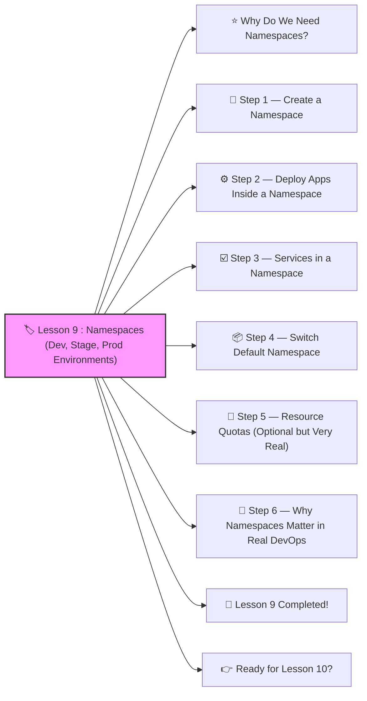

# 🏷️ Lesson 9 : **Namespaces (Dev, Stage, Prod Environments)**




Awesome! ✔️

Welcome to **Lesson 9**, and this one is ESSENTIAL for every real DevOps engineer:

Namespaces let you **organize**, **separate**, and **isolate** different environments inside a Kubernetes cluster.

This lesson is SUPER beginner-friendly, but also VERY important in real companies.
 🔨🤖🔧

------

# ⭐ Why Do We Need Namespaces?

Think of Kubernetes as a big apartment building.

**Namespaces are apartments**:

- Dev team works in *dev*
- Testers work in *stage*
- Live customers use *prod*
- Everyone is separated, safe, isolated

Namespaces help with:

✔️ Separation of environments
 ✔️ Preventing conflicts
 ✔️ Organizing resources
 ✔️ Setting limits (quotas)
 ✔️ RBAC access control (permissions)

------

# 🧱 Step 1 — Create a Namespace

Create a file:

**dev-namespace.yaml**

```yaml
apiVersion: v1
kind: Namespace
metadata:
  name: dev
```

Apply:

```bash
kubectl apply -f dev-namespace.yaml
```

Do the same for staging and prod:

**stage-namespace.yaml**

```yaml
apiVersion: v1
kind: Namespace
metadata:
  name: stage
```

**prod-namespace.yaml**

```yaml
apiVersion: v1
kind: Namespace
metadata:
  name: prod
```

Apply all:

```bash
kubectl apply -f stage-namespace.yaml
kubectl apply -f prod-namespace.yaml
```

Check namespaces:

```bash
kubectl get ns
```

You will see:

```
dev
stage
prod
default
kube-system
```

✔️ You now have environment separation.

------

# ⚙️ Step 2 — Deploy Apps *Inside* a Namespace

A Deployment inside `dev` namespace:

```yaml
apiVersion: apps/v1
kind: Deployment
metadata:
  name: app-demo
  namespace: dev
spec:
  replicas: 1
  selector:
    matchLabels:
      app: app-demo
  template:
    metadata:
      labels:
        app: app-demo
    spec:
      containers:
        - name: app
          image: nginx:latest
          ports:
            - containerPort: 80
```

Apply:

```bash
kubectl apply -f deployment.yaml
```

View pods in dev:

```bash
kubectl get pods -n dev
```

✔️ Your app stays inside the dev environment.

------

# ☑️ Step 3 — Services in a Namespace

Services must be in the same namespace as their Pods:

```yaml
apiVersion: v1
kind: Service
metadata:
  name: app-demo-service
  namespace: dev
spec:
  selector:
    app: app-demo
  ports:
    - port: 80
      targetPort: 80
```

Apply:

```bash
kubectl apply -f service.yaml
```

Check dev services:

```bash
kubectl get svc -n dev
```

------

# 📦 Step 4 — Switch Default Namespace

Instead of typing `-n dev` every time, you can set your context:

```bash
kubectl config set-context --current --namespace=dev
```

Now:

```bash
kubectl get pods
```

automatically looks in dev.

------

# 🧠 Step 5 — Resource Quotas (Optional but Very Real)

Companies use namespaces with quotas to control resource usage.

Example:

```yaml
apiVersion: v1
kind: ResourceQuota
metadata:
  name: dev-quota
  namespace: dev
spec:
  hard:
    requests.cpu: "1"
    limits.cpu: "2"
    requests.memory: 1Gi
    limits.memory: 2Gi
    pods: "10"
```

This means:

✔️ Dev namespace can’t use too much CPU
 ✔️ Dev namespace can’t use too many Pods
 ✔️ Helps avoid breaking the cluster

Apply:

```bash
kubectl apply -f quota.yaml
```

------

# 🧩 Step 6 — Why Namespaces Matter in Real DevOps

Namespaces help teams isolate:

- **dev** → developers experiment
- **stage** → QA tests builds
- **prod** → the real, stable environment
- **monitoring** → Prometheus, Grafana
- **logging** → ELK, Loki
- **security** → policies

Namespaces also integrate deeply with:

✔️ RBAC (role-based access control)
 ✔️ Network policies
 ✔️ CI/CD workflows
 ✔️ Helm releases
 ✔️ Kustomize overlays

Now you understand the foundation.

------

# 🎉 Lesson 9 Completed!

You’ve learned:

✔️ What namespaces are
 ✔️ How to create dev/stage/prod
 ✔️ How to deploy inside a namespace
 ✔️ How to switch default namespace
 ✔️ How resource quotas work
 ✔️ Why namespaces are used in production

This is professional DevOps knowledge — nicely done! 🔥💪

------

# 👉 Ready for Lesson 10?

Choose the next topic:

1. **Kustomize (Dev/Stage/Prod configuration overlays)**
2. **StatefulSets (proper way to run real databases)**
3. **CI/CD Pipeline – GitHub Actions → Docker → Kubernetes**
4. **Network Policies (security firewalls inside Kubernetes)**
5. **Full Production-Grade Deployment Project** (big, fun, advanced)

Which one should we do next?